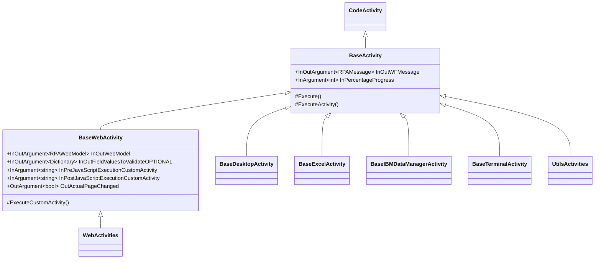

# Activities del Core

## Framework de Activities del Core

### Jerarquía



### BaseActivity

- Obtiene y valida `RPAMessage`.
- Asigna `StepName` desde `DisplayName`.
- Registra inicio y fin.
- Configura timeout predeterminado.
- Valida y reporta progreso.
- Actualiza estado en Shell.
- Ejecuta lógica solo si `IsSuccessful` sigue verdadero.
- Mide tiempo por Activity en debug.
- Propaga error si el mensaje termina fallido.

La opción `IsStopActivityWhenTimeOut` intenta ejecutar la Activity en una tarea separada. En el código, llamadas de espera y propagación aparecen comentadas; el comportamiento debe verificarse con pruebas porque podría iniciar lógica asíncrona sin bloquear de forma correcta.

### BaseWebActivity

- Contexto `RPAWebModel` con navegador y metadatos de sesión.
- Diccionario de validaciones opcionales.
- JavaScript previo y posterior.
- Foco opcional de ventana.
- Control de carga, forms/frames y cambio de página.
- Manejo diferenciado de excepciones COM.
- Creación, validación, reinicio y limpieza de Selenium Edge.
- Cierre de procesos `msedge` y `msedgedriver` cuando se fuerza limpieza.

### Otras clases base

| Clase | Contexto | Capacidades |
|---|---|---|
| `BaseDesktopActivity` | `AutomationElement` | Búsqueda por Id/nombre/propiedades, click, lectura y escritura nativa. |
| `BaseExcelActivity` | `RPAExcelModel` | Workbook y cierre de instancia Excel. |
| `BaseIBMDataManagerActivity` | `RPAIBMDataModel` | Contexto de IBM Data Manager. |
| `BaseTerminalActivity` | `RPATerminalModel` | Contexto de terminal. |
| `BaseExternalWebActivity` | No implementado | Placeholder/compatibilidad. |

### Patrón de una CustomActivity

```csharp
public sealed class ExampleActivity : BaseActivity
{
    public InArgument<string> InValue { get; set; }
    public OutArgument<bool> OutResult { get; set; }

    public ExampleActivity() : base() { }
    internal ExampleActivity(RPAMessage pMessage) : base(pMessage) { }

    protected override void ExecuteActivity(CodeActivityContext pContext)
    {
        RunContext(pContext.GetValue(InValue), out bool vResult);
        pContext.SetValue(OutResult, vResult);
    }

    internal void RunContext(string pValue, out bool pResult)
    {
        pResult = !string.IsNullOrWhiteSpace(pValue);
    }
}
```

El estándar separa la adaptación WWF (`ExecuteActivity`/`ExecuteCustomActivity`) de la lógica testeable (`RunContext`), con constructor público vacío y constructor `internal` para pruebas.
