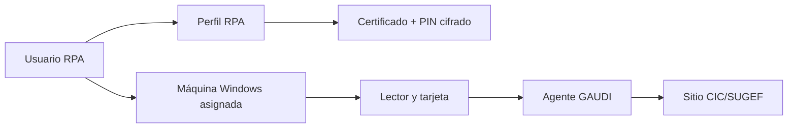

# Automatización web y autenticación externa

## Automatización web y ciclo de vida del navegador

### Modos de navegador

| Modo | Evidencia | Estado |
|---|---|---|
| Selenium Edge | `OpenQA.Selenium`, `WebDriver`, helpers Selenium y EdgeDriver | Mecanismo principal actual. |
| IE/MSHTML/SHDocVw | `mshtml`, `Interop.SHDocVw`, helpers y BAT heredados | Compatibilidad histórica. |
| Navegador interno | `RPAHelperBrowserInternal` | Disponible según UDC/robot. |

### Creación y limpieza de Edge

1. Construir `RPAWebModel` con tipo Selenium Edge.
2. Invocar helper de creación y capturar IDs de procesos.
3. Reintentar y distinguir errores de driver.
4. Al limpiar: `Quit`, `Dispose`, liberar COM y eliminar procesos residuales.

El changelog confirma actualización automática de EdgeDriver y una fuente alternativa administrada. La versión mayor del driver debe coincidir con la versión mayor de Edge.

### Interacción con el DOM

- Identificación por Id, atributo, XPath, regex y HTML/iframe.
- Click con espera, click sin espera y click con validación.
- Lectura y escritura de valores.
- Selección de checkbox.
- Extracción de tablas, imágenes, HTML, XML y regex.
- JavaScript antes y después de la Activity.
- Control de alertas, popups, campos dinámicos y título.
- Validación del documento y del sitio.

### Cambios externos y robustez

Un cambio externo puede afectar identificadores, DOM, autenticación, sesión expirada, popups, formularios o reportes. La mitigación combina selectores configurables por UDC, regex tolerantes, errores conocidos, reintentos, recarga de URL y recuperación de sesión.

## Captcha y aprovisionamiento

### Modos

| Modo | Componentes | Comportamiento |
|---|---|---|
| Manual | `WaitUntilCaptchaResolvedActivity` | El usuario resuelve y confirma; puede existir timeout o cierre automático. |
| Automático directo | `ResolveCaptchaActivity`, Decaptcha | Captura metadata/imagen, consume servicio y escribe solución. |
| Aprovisionado | Enqueue/Get/Process/SetProvisioning | Encola captcha, un proceso lo resuelve y el robot consulta/actualiza estado. |

### Parámetros y seguridad

- Compañía/owner y service key.
- Reintentos y mayúsculas.
- OperationId y RPA.
- URL y site key obtenidos del DOM.
- Imagen Base64 y propiedades extendidas.
- Feedback de solución correcta/incorrecta.

Service keys y credenciales deben enmascararse y nunca aparecer en logs de texto plano.

## Certificados, firma digital y Agente GAUDI

### Componentes externos

Agente GAUDI es una aplicación del Banco Central de Costa Rica utilizada por los procesos CIC para autenticar mediante firma digital. No pertenece a Apptividad.

- Tarjeta o dispositivo de firma digital.
- Lector y controladores.
- Certificado personal visible en la sesión Windows.
- Ventanas de Windows Security.
- PIN asociado al usuario/certificado.
- Sitio CIC/SUGEF que solicita autenticación.

### Relación usuario-máquina-certificado

La capacitación describe un patrón de una máquina por usuario y por certificado. Ejecutar el perfil en otra máquina con otra tarjeta puede impedir la autenticación.

### Automatización y PIN

- `LoadUrlAndCertificateSelectionActivity` carga URL y automatiza selección de certificado.
- `AuthenticateDigitalSignatureActivity` opera GAUDI con UI Automation.
- `UpdateWebCertificatePINActivity` actualiza el PIN cuando está permitido.
- `SignFileActivity` firma PDF con certificado.
- Subworkflows GAUDI validan conexión, autenticación y estado.

El changelog indica validación de cifrado de `RPA_WEBCERTIFICATE_PIN`: texto plano genera alerta, cifrado permite inicio y ausencia se trata como opcional.
