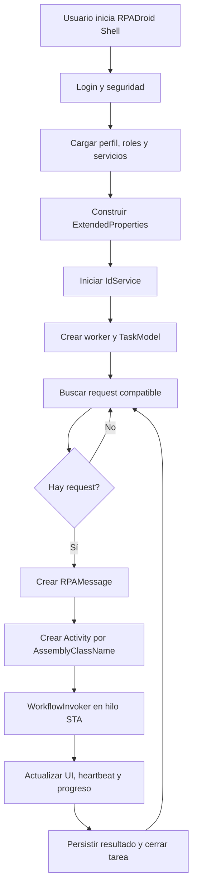

# RPADroid Shell

## RPADroid Shell y gestor de tareas

### Naturaleza del componente

`Apptividad.Ozono.RPA.UI.exe` es una aplicación Windows Forms que hospeda el runtime RPA en la máquina de ejecución.

- Login y validación de credenciales/SSO.
- Carga de privilegios, servicios y configuración del perfil.
- Inicio y detención de instancias por `IdService`.
- Gestión de tareas normales y KeepAlive.
- Visualización de logs, navegadores, settings y estado.
- Recuperación de requests pendientes.
- Ejecución de workflows por reflexión.
- Heartbeat hacia Monitor Room.
- Recepción de acciones remotas del Command Center.
- Envío de logs, capturas y mensajes.
- Validación y actualización de versión del Shell.

### Inicio de una instancia

### Reflexión y carga del workflow

`TaskManager` utiliza `ASSEMBLY_CLASS_NAME`:

1. Valida formato `Clase, Ensamblado`.
2. Usa `Activator.CreateInstance(assemblyName, typeName).Unwrap()`.
3. Confirma que el objeto sea `System.Activities.Activity`.
4. Busca la propiedad `rpaMessage` y le inyecta `InArgument<RPAMessage>`.
5. Invoca `WorkflowInvoker.Invoke` en un hilo STA.

Esto permite desplegar nuevos workflows sin modificar el Shell, siempre que el ensamblado exista y la UDC apunte a la clase correcta.

### Modelo de tareas

| Tipo | Comportamiento | Uso |
|---|---|---|
| **Normal** | Toma un request, ejecuta, persiste y finaliza. | Consultas o transacciones independientes. |
| **KeepAlive** | Conserva navegador/sesión y atiende múltiples requests. | Autenticación costosa, certificado o sesión persistente. |
| **Acción Monitor Room** | Ejecuta una orden remota sobre Shell o tarea. | Reinicio, cancelación, logs, captura o mensaje. |

### Hilos y cancelación

El Shell combina `BackgroundWorker`, `Thread`, `Task`, eventos de progreso y banderas de cancelación. El workflow se ejecuta en un hilo separado y el código puede usar abortado abrupto al exceder timeout.

- `Thread.Abort` puede dejar COM, archivos o sesiones inconsistentes.
- La mezcla de modelos de concurrencia aumenta la complejidad.
- WebDriver, COM y UI deben crearse y liberarse en contexto apropiado.
- Recovery debe cerrar navegador, liberar request y limpiar sesiones guardadas.
