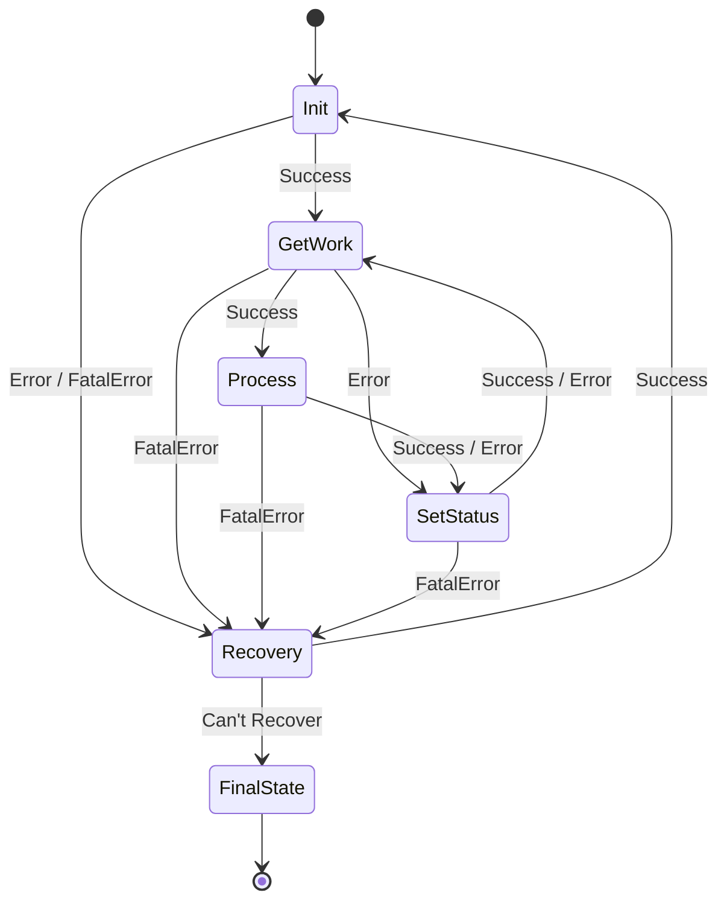

# Workflows y máquina de estados

## Windows Workflow Foundation, XAML y máquinas de estados

### Modelo de ejecución

Cada robot es una `Activity` raíz compilada desde XAML. Los XAML declaran:
- Argumentos `InArgument`, `OutArgument` e `InOutArgument`.
- Variables locales.
- Activities estándar: `Sequence`, `Assign`, `If`, `While`, `TryCatch`, `Throw`, `InvokeMethod` y `StateMachine`.
- Activities personalizadas del Core.
- Expresiones C# mediante `Microsoft.CSharp.Activities`.
- Referencias de ensamblado necesarias para compilación y diseño.

### Convención de argumentos

| Dirección | Convención | Semántica |
|---|---|---|
| Entrada | `InNombre` | Consume un valor. |
| Salida | `OutNombre` | Produce un valor. |
| Entrada/salida | `InOutNombre` | Comparte y modifica un valor. |
| Opcional | sufijo `OPTIONAL` | Puede omitirse y requiere valor seguro. |

### Patrón de máquina de estados

Las transiciones anteriores están confirmadas contra la implementación (por ejemplo, `ConsultaCCSS_SM\Main.xaml`) y contra el documento de diseño de robots. Cada transición lleva el nombre `Success`, `Error`, `FatalError` o `Can't Recover`. Conviene destacar tres reglas que suelen malinterpretarse:

- Un **error no fatal** en `GetWork` o `Process` no va a `Recovery`, sino a `SetStatus`. De esta forma el robot registra el desenlace de la transacción y vuelve a `GetWork` para continuar con la siguiente.
- Solo el **error fatal** (`FatalError`) escala a `Recovery`, que intenta recrear el contexto y, si lo logra (`Success`), regresa a `Init`.
- El estado final (`FinalState`) se alcanza únicamente desde `Recovery` cuando la recuperación no es posible (`Can't Recover`).

El sub-workflow `KeepAlive` opera dentro de `GetWork`: la instancia mantiene el navegador y la sesión mientras espera nuevas solicitudes, sin abandonar el estado. Algunos robots sencillos (por ejemplo, DOWNLOAD_FILES y EMAIL_ALERT) inician directamente en `GetWork`.

### Responsabilidad de los estados

| Estado | Responsabilidad típica |
|---|---|
| Init | Cargar UDC, crear/reutilizar contexto, abrir navegador, autenticar y validar sitio. |
| GetWork | Keep-alive, consultar cola y cargar request en `RPAMessage`. |
| Process | Ejecutar negocio, extraer datos, cargar archivos y formar resultado. |
| SetStatus | Persistir resultado, cerrar request y decidir continuidad. |
| Recovery | Registrar excepción, limpiar/recrear contexto, reautenticar y reintentar. |
| FinalState | Liberar recursos y finalizar. |
