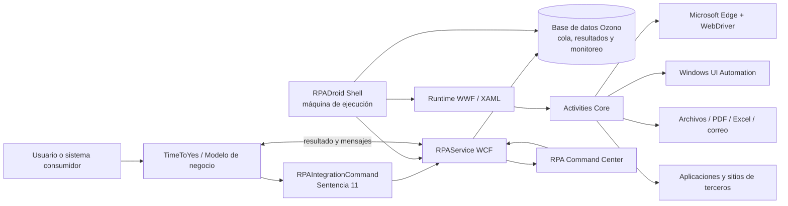
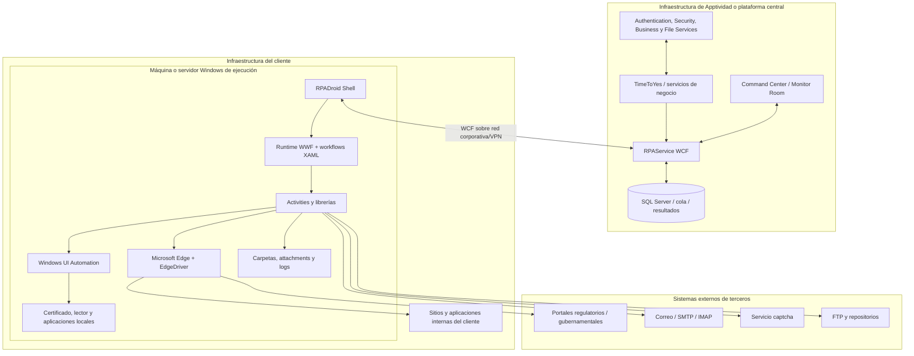

# Contexto del sistema

## Glosario tecnológico y separación de responsabilidades

| Tecnología o concepto | Qué es | Papel en el Core | Qué no es |
|---|---|---|---|
| C# | Lenguaje de programación administrado. | Implementa servicios, Shell, Activities, utilidades, integración TTY y acceso a datos. | No es el runtime ni el motor de workflows. |
| .NET Framework 4.8 | Runtime y biblioteca de clases de Microsoft para Windows. | Ejecuta C#, WCF, WinForms, System.Activities, IO, networking y criptografía. | No es lo mismo que .NET moderno/.NET Core. |
| CLR 4.x | Máquina virtual administrada de .NET Framework. | Carga ensamblados, administra memoria, excepciones, hilos y tipos. | No contiene por sí sola la lógica RPA. |
| Windows Workflow Foundation (WF/WWF) | Framework de composición y ejecución de workflows. | Ejecuta Activities, argumentos, variables, secuencias, Try/Catch y máquinas de estados. | No es una aplicación independiente. |
| XAML | Formato XML declarativo. | Serializa workflows, Activities, argumentos, expresiones C# y diseño de estados. | No reemplaza el código C# de las Activities. |
| WCF | Windows Communication Foundation. | Expone contratos y operaciones del backend RPA mediante servicios `.svc` y proxies. | No es una API REST moderna, aunque puede ofrecer endpoints web. |
| Windows Forms | Framework de interfaz gráfica de escritorio. | Implementa RPADroid Shell, login, settings, tareas, logs y keep-alive. | No es el motor de automatización web. |
| Selenium WebDriver | API de automatización de navegadores. | Controla Edge Chromium, ventanas, DOM, JavaScript y navegación. | No controla por sí solo diálogos nativos. |
| Microsoft Edge WebDriver | Driver compatible con la versión mayor de Edge. | Intermedia entre Selenium y el navegador. | No pertenece a Apptividad. |
| Windows UI Automation | API de accesibilidad y automatización de controles nativos. | Opera certificados, carga de archivos, GAUDI y diálogos de escritorio. | No opera directamente el DOM web. |
| SQL Server y procedimientos almacenados | Motor y lógica de persistencia. | Implementan cola durable, requests, resultados, estados, históricos y monitoreo. | No ejecutan el workflow XAML. |
| UDC | Catálogo dinámico de parámetros de TimeToYes/Ozono. | Configura servicios y parámetros globales sin recompilar. | No es un archivo local tradicional. |
| XML/XPath/XSLT | Formatos y lenguajes de transformación/consulta. | Representan request, response, resultado, propiedades y validaciones. | No son una base de datos. |
| Regex | Expresiones regulares. | Localizan contenido, errores, nombres de archivos y condiciones. | No sustituyen selectores estables cuando estos existen. |

## Vista de contexto y arquitectura por capas

### Diagrama de contexto

El ecosistema tiene dos planos:

1. **Plano de control y datos:** TTY, RPAService, base de datos, seguridad y monitoreo.
2. **Plano de ejecución:** RPADroid Shell, runtime WWF, workflows, Activities, navegador y aplicaciones externas.

### Arquitectura por capas

| Capa | Componentes | Responsabilidad | Acoplamiento |
|---|---|---|---|
| Canal/negocio | UI TTY, procesos SQL, SOAP-UI u otros consumidores | Iniciar análisis o consumir un servicio RPA. | CQCommand y XML. |
| Orquestación TTY | Modelos, operaciones, sentencias y contexto | Controlar el proceso de negocio y decidir cuándo invocar RPA. | Configuración de modelo. |
| Adaptación RPA | `RPAIntegrationCommand` | Construir request, validar disponibilidad, aplicar expiración, llamar al servicio y normalizar respuesta. | WCF + UDC + XML. |
| Servicios | `IRPAService`, `RPAService`, proxy y API | Exponer request, resultado, agentes, seguridad, monitoreo y versionado. | Contratos WCF. |
| Dominio/persistencia | `RpaProcess`, DataContext, SPs | Implementar cola, polling, resultados, históricos y transacciones. | LINQ-to-SQL/SP. |
| Host de ejecución | RPADroid Shell WinForms | Autenticar, iniciar agentes, recuperar solicitudes y ejecutar workflows. | WCF + reflexión + hilos. |
| Workflow | XAML + `System.Activities` | Modelar estados, secuencias, decisiones, recuperación y subprocesos. | Arguments/Activities. |
| Activities | BaseActivities, WebActivities, UtilsActivities | Proveer capacidades técnicas reutilizables. | C# y contratos WWF. |
| Adaptadores externos | Selenium, UI Automation, correo, FTP, PDF, Excel | Interactuar con sistemas y recursos externos. | Protocolos/librerías. |
| Observabilidad | Logs, correo, heartbeat, Monitor Room e históricos | Diagnóstico, alertas, control remoto y trazabilidad. | Eventos, tablas y archivos. |

### Principios arquitectónicos observados

- **Desacoplamiento mediante cola durable:** TTY no controla directamente el navegador.
- **Configuración sobre código:** gran parte del comportamiento se obtiene desde UDC y perfil de usuario.
- **Reutilización por composición:** los robots combinan Activities y subworkflows.
- **Host local cercano al recurso:** el robot se ejecuta donde existen navegador, certificado, red y aplicaciones.
- **Trazabilidad por RequestId, IdService, RPA y TaskId.**
- **Recuperación explícita:** los workflows modernos contienen un estado `Recovery` y políticas de reintento.
- **Compatibilidad progresiva:** conviven soporte actual Edge/Selenium y componentes heredados IE/MSHTML.

### Topología física y fronteras de confianza

Las fronteras de confianza relevantes son:

- **Plataforma central ↔ máquina de ejecución:** autenticación, autorización, WCF, TLS/red corporativa y correlación del agente.
- **Máquina de ejecución ↔ sistema externo:** credenciales, certificado, sesión, navegador, VPN y políticas del tercero.
- **Workflow ↔ recursos locales:** permisos de carpetas, UI interactiva, procesos, certificados y secretos.
- **Command Center ↔ Shell:** acciones administrativas remotas que requieren auditoría y mínimo privilegio.

La ubicación de cada componente puede variar por cliente. La arquitectura funcional permanece: el backend central coordina y persiste; la máquina Windows ejecuta la interacción visual cerca del recurso automatizado.

## Sistemas de terceros y dependencias

### Aplicaciones y plataformas que no pertenecen a Apptividad

| Sistema | Propietario/tipo | Interacción | Impacto |
|---|---|---|---|
| Microsoft Windows | Microsoft | SO, sesiones, certificados, UI Automation y Task Scheduler. | Base obligatoria. |
| Microsoft Edge | Microsoft | Navegador Selenium. | Actualizaciones afectan driver/selectores. |
| Edge WebDriver | Microsoft | Puente WebDriver. | Debe alinearse con Edge. |
| SQL Server | Microsoft | Persistencia y SP. | Disponibilidad/rendimiento críticos. |
| IIS/WAS | Microsoft; hosting inferido | Alojamiento de `.svc`. | Bindings, timeouts y AppPool. |
| Agente GAUDI | Banco Central de Costa Rica | Autenticación/firma digital. | Aplicación, tarjeta, lector y sesión. |
| CIC/SUGEF | SUGEF/entidades regulatorias | Autorizaciones y reportes. | Cambios externos pueden detener robots. |
| SVI Tribunal Electoral Panamá | Tribunal Electoral | Validación de identidad. | Certificados, acceso y restricciones. |
| ETAX | Sistema tributario externo | Consulta de contribuyente. | Captcha y cambios de DOM. |
| SMTP/IMAP/Gmail | Proveedor de correo | Alertas y lectura de buzones. | TLS, credenciales y límites. |
| FTP | Servidor externo/cliente | Transferencia de archivos. | Red, credenciales y seguridad. |
| Sitios internos de clientes | Cliente | Procesos propios. | Disponibilidad y cambios externos. |

### Librerías de terceros observadas

| Librería | Función |
|---|---|
| Selenium/WebDriver | Automatización Edge. |
| HtmlAgilityPack | Procesamiento HTML. |
| Newtonsoft.Json | JSON/JObject. |
| iTextSharp | PDF y firma. |
| UglyToad.PdfPig | Extracción/análisis PDF. |
| ExpertPdf.HtmlToPdf | HTML a PDF. |
| BouncyCastle | Certificados y criptografía. |
| FlexCel | Excel. |
| MailKit y S22.Imap | Correo/IMAP. |
| Telerik WinControls | Controles UI. |
| Microsoft.Win32.TaskScheduler | Tareas programadas. |
| DeathByCaptcha | Referencia heredada/alternativa de captcha. |

### Servicios internos indirectos

- AuthenticationService y SecurityService.
- BusinessService para UDC.
- FileService para archivos y paquetes.
- Watchman y Logging.
- DecaptchaService.
- CrediQuick/TimeToYes BusinessProcessService.
