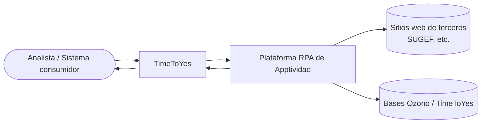
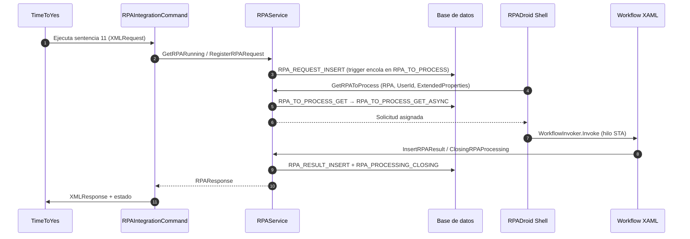
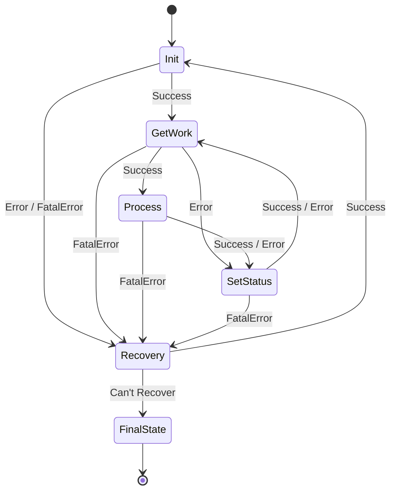
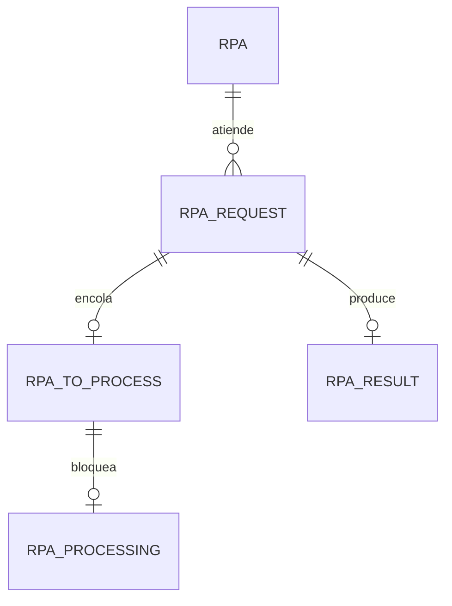

# Diagramas

Todos los diagramas del sitio están en **Markdown + Mermaid** para que se mantengan junto al
contenido y evolucionen con él. Esta página reúne los diagramas transversales; los específicos
de cada sección aparecen dentro de su página correspondiente.

## Contexto del sistema

Representa la solución como una caja y sus relaciones con actores y sistemas externos. Debe leerse
de izquierda a derecha: el analista inicia el análisis en TimeToYes, que orquesta el RPA; el RPA
opera sobre sitios de terceros y devuelve el resultado.

Detalle en [Contexto del sistema](/01-arquitectura/contexto-sistema).

## Orquestación end-to-end

Muestra el orden temporal de una solicitud desde TimeToYes hasta el resultado y su retorno. Cada
flecha indica quién inicia la interacción y qué información viaja.

Detalle en [Flujo end-to-end](/01-arquitectura/flujo-end-to-end).

## Máquina de estados del robot

Transiciones confirmadas contra la implementación (`ConsultaCCSS_SM\Main.xaml`). Un error no fatal
en `GetWork` o `Process` va a `SetStatus` (registra el desenlace y continúa); solo el error fatal
escala a `Recovery`.

Detalle en [Workflows y máquina de estados](/01-arquitectura/componentes/workflows-estados).

## Modelo de datos de la cola

Relación entre las tablas confirmadas por DDL. `RPA_TO_PROCESS` es la cola; `RPA_PROCESSING` evita
la doble toma; `RPA_RESULT` guarda el desenlace.

Detalle en [Persistencia y cola](/02-referencia/persistencia-cola).
