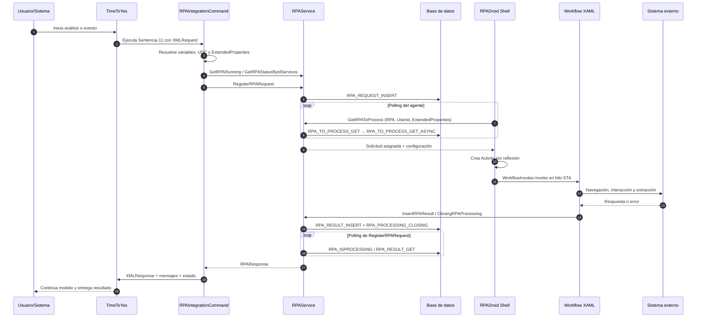
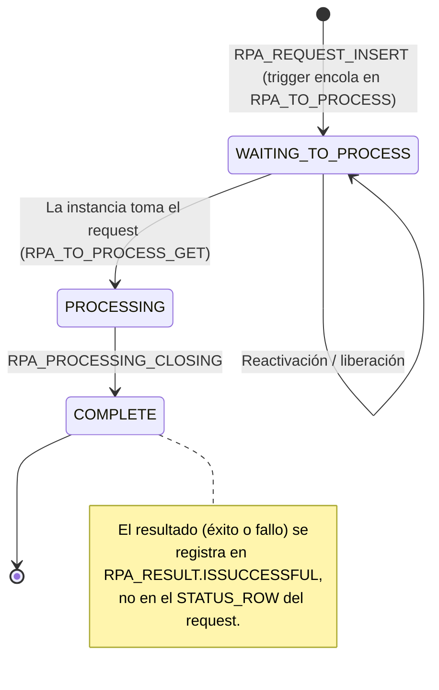
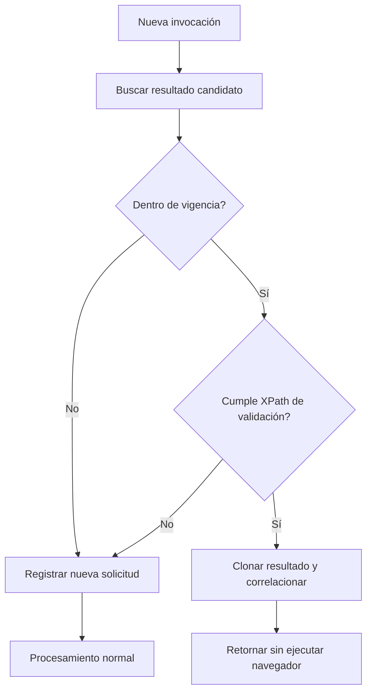

# Flujo end-to-end

## Flujo end-to-end de una solicitud RPA

### Secuencia principal



Puntos clave:
- `RegisterRPARequest` prepara el XML operativo desde UDC, inserta la solicitud y llama a `WaitAndGetRPAResponse`.
- `WaitAndGetRPAResponse` consulta aproximadamente cada cinco segundos si la solicitud sigue procesándose.
- El agente obtiene trabajo por polling; TTY no realiza una llamada directa al navegador.
- La selección de trabajo entra por el procedimiento `RPA_TO_PROCESS_GET`, que delega el algoritmo de selección en `RPA_TO_PROCESS_GET_ASYNC` (ver sección 9.2).
- El workflow se ejecuta en un hilo **STA**, relevante para COM, WinForms, WebDriver y UI Automation.
- El resultado se persiste en `RPA_RESULT` antes de ser retornado a TTY. Del lado de TimeToYes, el resultado se consume mediante los sinónimos `RPA_RESULT` (que apunta a la vista `VW_RPA_RESULT` de la base Ozono) y `SYNONYM_OZONO_RPA_RESULT`, lo que permite correlacionar el resultado con la operación de análisis sin acoplar ambas bases directamente.

### Estructura lógica del request

El XML que viaja en la columna `XMLREQUEST` usa como raíz `CQCommandParameterList` con un bloque `RPAParameters`. Los procedimientos de cola y selección leen valores concretos mediante XPath sobre esta estructura, por lo que su forma es estable y verificable.

```xml
<CQCommandParameterList>
  <RPAParameters>
    <RPAConfiguration>
      <RPAIdService>SERVICIO_RPA</RPAIdService>
    </RPAConfiguration>
    <ProcessIdentifiers>
      <row IDOPERATION="..." BATCHID="..." BATCHTYPE="..."
           CUSTOMERID="..." CREATEDDATE="..." USERID="usuario.analista"
           MODELID="..." />
    </ProcessIdentifiers>
    <RPAQueryParameters>
      <row ID="..." TYPEID="..." USERID="usuario.analista"
           TIMEOUT_SECONDS="..." BATCHTYPE="..." />
    </RPAQueryParameters>
    <ExtendedProperties>
      <RpaRequestFilters>
        <ROW Path="(/CQCommandParameterList/RPAParameters/RPAConfiguration/RPAIdService/node())[1]"
             Operator="EQUALS" Value="SERVICIO_RPA" />
      </RpaRequestFilters>
    </ExtendedProperties>
  </RPAParameters>
</CQCommandParameterList>
```

- **RPAConfiguration/RPAIdService:** identifica el servicio RPA requerido; es la clave que usa el filtro de seguridad por roles.
- **ProcessIdentifiers/row:** correlación de negocio (operación, lote, cliente, usuario y modelo) como atributos de la fila.
- **RPAQueryParameters/row:** datos funcionales que el robot necesita, incluidos `TIMEOUT_SECONDS` y el identificador de proceso.
- **ExtendedProperties/RpaRequestFilters:** reglas dinámicas para que una instancia tome únicamente las solicitudes compatibles (ver sección 15.4).

> **Nota sobre `USERID`.** El atributo `USERID` aparece tanto en `ProcessIdentifiers/row` como en `RPAQueryParameters/row`. Su valor debe corresponder al usuario analista real de la operación, porque el filtro de seguridad por roles del procedimiento de selección deriva de él los roles autorizados para el servicio. Una solicitud con un `USERID` cuyos roles no incluyan el servicio no será tomada por ninguna instancia, aun cuando existan instancias en ejecución.

### Ciclo de estados lógico



El valor de `STATUS_ROW` en la tabla `RPA_REQUEST` sigue una secuencia confirmada por el DDL y los procedimientos: `WAITING_TO_PROCESS` al registrarse, `PROCESSING` al ser tomado por una instancia y `COMPLETE` al cerrarse mediante `RPA_PROCESSING_CLOSING`. El request se cierra como `COMPLETE` con independencia del desenlace; el éxito o el error del robot se guarda en `RPA_RESULT` (`ISSUCCESSFUL`, `USERMESSAGE`, `TECHNICALMESSAGE`).

Conviene distinguir estos estados del request de los **estados de instancia** de la tabla `RPA` (`STATUS`), que reflejan la disponibilidad del agente —por ejemplo `RUNNING` y `BUSY`— y son los que consulta la verificación de disponibilidad previa. La liberación, la reactivación y las acciones del Command Center gestionan las transiciones de recuperación.

## Capa TimeToYes y RPAIntegrationCommand

### Responsabilidad

`RPAIntegrationCommand` hereda de `CQCommandDataSource` y adapta el motor TTY al servicio RPA. No opera el navegador; prepara, valida y consume.

- Obtener XML request desde la sentencia o configuración predeterminada.
- Resolver variables del contexto y propiedades dinámicas.
- Leer UDC de definición, seguridad, timeout, respuesta y notificaciones.
- Validar `IdService` y `EXECUTE_RPA_SERVICE`.
- Consultar agentes activos y cantidad de requests pendientes.
- Registrar solicitud mediante `RegisterRPARequest`.
- Aplicar expiración y clonación de resultados previos.
- Normalizar `XMLRESPONSE`, `UserMessage`, `TechnicalMessage` y estado.
- Enviar alertas cuando no hay agentes o falla el servicio.
- Registrar trazas cuando `RPA_SERVICE_DEBUG_ENABLE` está activo.

### Disponibilidad y timeout

TTY verifica disponibilidad antes de registrar el request. Un agente `RUNNING` puede estar ocupado y la existencia de una instancia no garantiza atención inmediata.

| Capa | Parámetro | Efecto |
|---|---|---|
| Sentencia/TTY | `TIMEOUT_SECONDS` | Tiempo lógico de la operación de modelo. |
| RPAService | `WaitingInterval` | Cantidad de ciclos de polling; cada ciclo utiliza aproximadamente cinco segundos. |
| RPADroid | `TimeOutTimeSeconds` | Tiempo máximo del workflow en el hilo. |
| Activity | `WAIT_ACTIVITY_TIMEOUT_SECONDS` | Tiempo base de operaciones individuales. |
| Sitio externo | reintentos/esperas UDC | Tiempo de navegación, captcha, sesión o diálogo. |

Los timeouts deben dimensionarse de afuera hacia adentro: consumidor > servicio > workflow > Activity. Una configuración incoherente puede hacer que TTY expire mientras el robot continúa procesando.

### Expiración y clonación

El Core puede reutilizar resultados exitosos existentes mediante UDC `[SERVICIO]_RPA_RESULTVALIDATION` y políticas de expiración.


