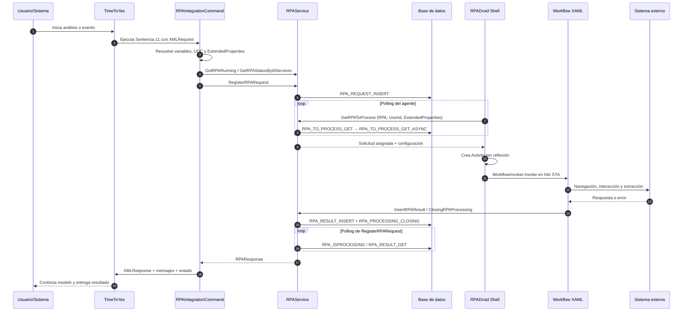
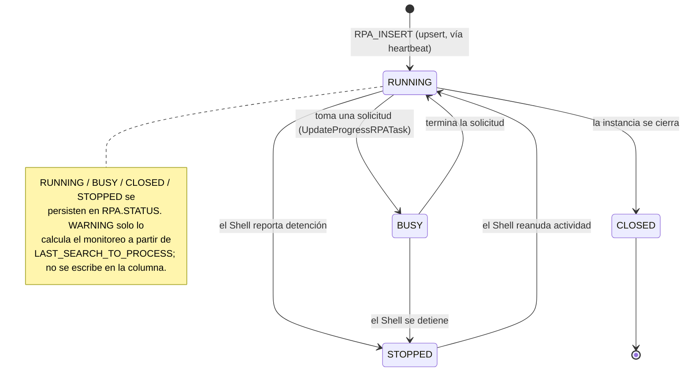
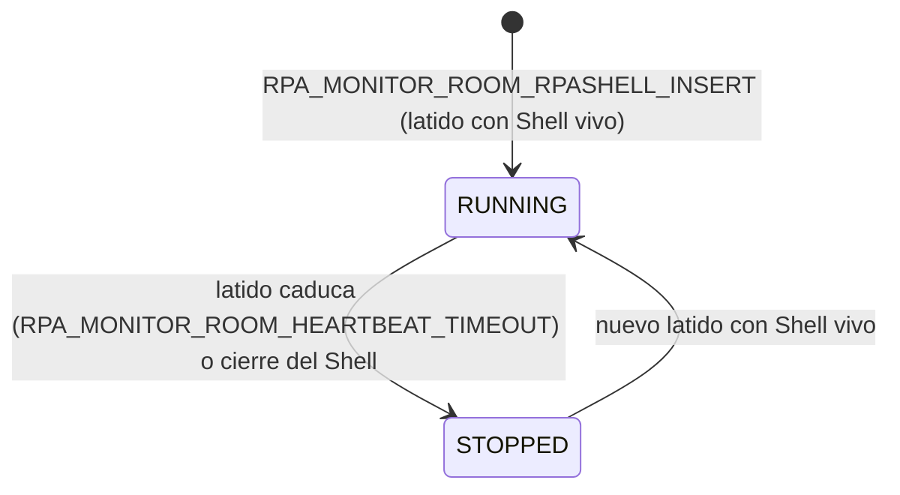
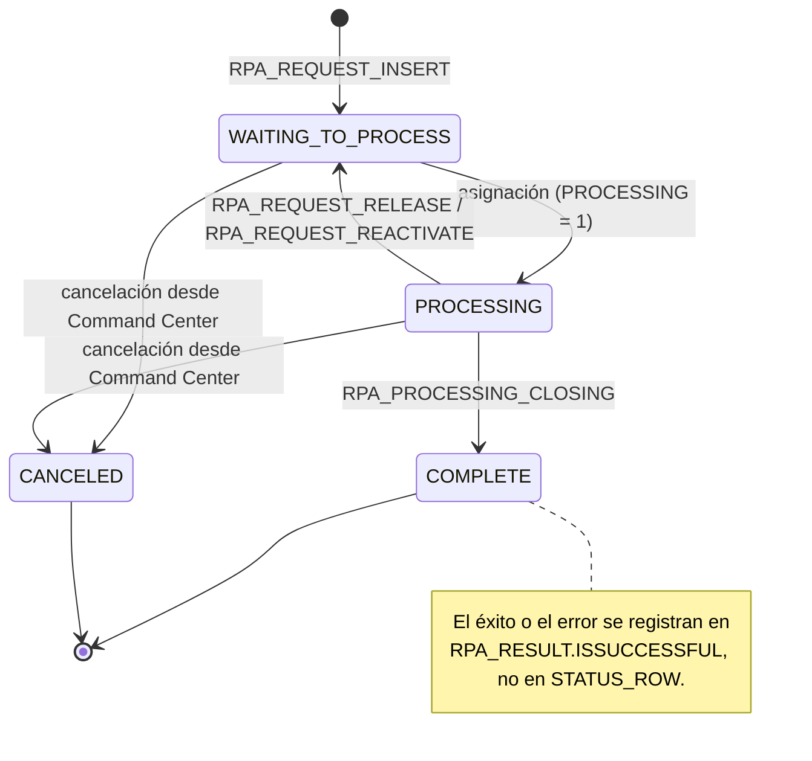
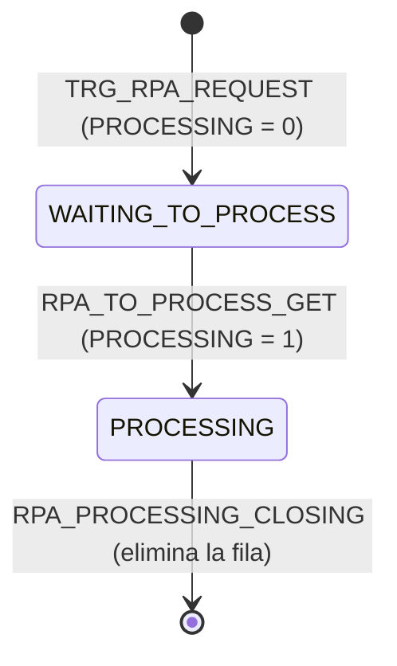
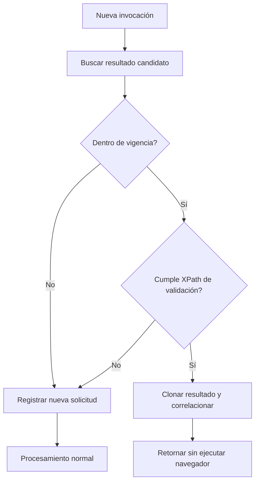

# Flujo end-to-end

## Flujo end-to-end de una solicitud RPA

### Secuencia principal



Puntos clave:
- `RegisterRPARequest` prepara el XML operativo desde UDC, inserta la solicitud y llama a `WaitAndGetRPAResponse`.
- `WaitAndGetRPAResponse` consulta aproximadamente cada cinco segundos si la solicitud sigue procesándose.
- El agente obtiene trabajo por polling; TTY no realiza una llamada directa al navegador.
- La selección de trabajo entra por el procedimiento `RPA_TO_PROCESS_GET`, que delega el algoritmo de selección en `RPA_TO_PROCESS_GET_ASYNC` (ver sección 9.2).
- El workflow se ejecuta en un hilo **STA**, relevante para COM, WinForms, WebDriver y UI Automation.
- El resultado se persiste en `RPA_RESULT` antes de ser retornado a TTY. Del lado de TimeToYes, el resultado se consume mediante los sinónimos `RPA_RESULT` (que apunta a la vista `VW_RPA_RESULT` de la base Ozono) y `SYNONYM_OZONO_RPA_RESULT`, lo que permite correlacionar el resultado con la operación de análisis sin acoplar ambas bases directamente.

### Estructura lógica del request

El XML que viaja en la columna `XMLREQUEST` usa como raíz `CQCommandParameterList` con un bloque `RPAParameters`. Los procedimientos de cola y selección leen valores concretos mediante XPath sobre esta estructura, por lo que su forma es estable y verificable.

```xml
<CQCommandParameterList>
  <RPAParameters>
    <RPAConfiguration>
      <RPAIdService>SERVICIO_RPA</RPAIdService>
    </RPAConfiguration>
    <ProcessIdentifiers>
      <row IDOPERATION="..." BATCHID="..." BATCHTYPE="..."
           CUSTOMERID="..." CREATEDDATE="..." USERID="usuario.analista"
           MODELID="..." />
    </ProcessIdentifiers>
    <RPAQueryParameters>
      <row ID="..." TYPEID="..." USERID="usuario.analista"
           TIMEOUT_SECONDS="..." BATCHTYPE="..." />
    </RPAQueryParameters>
    <ExtendedProperties>
      <RpaRequestFilters>
        <ROW Path="(/CQCommandParameterList/RPAParameters/RPAConfiguration/RPAIdService/node())[1]"
             Operator="EQUALS" Value="SERVICIO_RPA" />
      </RpaRequestFilters>
    </ExtendedProperties>
  </RPAParameters>
</CQCommandParameterList>
```

- **RPAConfiguration/RPAIdService:** identifica el servicio RPA requerido; es la clave que usa el filtro de seguridad por roles.
- **ProcessIdentifiers/row:** correlación de negocio (operación, lote, cliente, usuario y modelo) como atributos de la fila.
- **RPAQueryParameters/row:** datos funcionales que el robot necesita, incluidos `TIMEOUT_SECONDS` y el identificador de proceso.
- **ExtendedProperties/RpaRequestFilters:** reglas dinámicas para que una instancia tome únicamente las solicitudes compatibles (ver sección 15.4).

> **Nota sobre `USERID`.** El atributo `USERID` aparece tanto en `ProcessIdentifiers/row` como en `RPAQueryParameters/row`. Su valor debe corresponder al usuario analista real de la operación, porque el filtro de seguridad por roles del procedimiento de selección deriva de él los roles autorizados para el servicio. Una solicitud con un `USERID` cuyos roles no incluyan el servicio no será tomada por ninguna instancia, aun cuando existan instancias en ejecución.

### Ciclos de estados por tabla

No existe un único ciclo de estados global. En el dominio RPA intervienen cuatro tablas con **ciclos independientes**, cada uno con su propia responsabilidad. Algunas comparten el nombre de un valor —por ejemplo `RUNNING` o `PROCESSING`— pero ese nombre **no significa lo mismo** en cada tabla ni pertenece al mismo ciclo. Esta sección documenta los cuatro ciclos por separado y cierra con las relaciones que sí están demostradas entre ellos.

Cada ciclo se sustenta en la estructura (DDL) de su tabla, en los procedimientos almacenados que la modifican desde `RpaProcess` y en los valores realmente presentes en operación.

#### `RPA` — ciclo de la instancia (agente)

La tabla `RPA` registra cada instancia de robot por nombre (`RPA_NAME`). Su estado reside en la columna `STATUS`.

- **Valores persistidos:** `RUNNING` (instancia activa y disponible), `BUSY` (instancia activa procesando una solicitud), `CLOSED` (cerrada) y `STOPPED` (detenida). Los cuatro son valores vigentes y en uso.
- **Quién lo escribe:** el estado lo mantiene el Shell mediante `RPA_INSERT`, que opera como *upsert* (alta o actualización por nombre). Lo invoca `RPAHeartBeat.InsertRPAStatusByName` desde dos orígenes: el hilo de latido del Shell (`RPADroid.RPAMonitorRoomRequestTask`, cada `HeartBeatTimeOut`, con un mínimo de 30 s) y `UpdateProgressRPATask`, que se ejecuta en cada actividad del workflow. El procedimiento `RPA_STATUSBYNAME_UPDATE` existe en el código pero no tiene invocadores. Las consultas de disponibilidad usan `RPA_RUNNING_LIST_GET`.
- **`BUSY` — instancia ocupada (estado vigente y en uso):** mientras la instancia tiene una solicitud asignada, `UpdateProgressRPATask` (clase `RPAUtils`) escribe `BUSY` en `dbo.RPA` a través de `RPA_INSERT`, en cada actividad del workflow; al quedar libre, el latido vuelve a `RUNNING`. Es un estado funcional del ciclo de la instancia: la verificación de disponibilidad previa al encolado considera disponibles tanto `RUNNING` como `BUSY` (UDC `RPA_STATUS_AVAILABLE`, por defecto `RUNNING,BUSY`), y el monitoreo por Shell lista las instancias en `RUNNING` o `BUSY`. Que un muestreo puntual capte `BUSY` depende de cuántas instancias estén procesando en ese instante.
- **Estado calculado (no persistido):** la capa de monitoreo deriva en memoria un estado de presentación (`STARTING`, `RUNNING`, `WARNING`, `CLOSED`) combinando `STATUS` con la antigüedad de `LAST_SEARCH_TO_PROCESS` frente al umbral del UDC `VALIDATE_SECONDS_TO_SHELL_RUN`. Estos valores **no se guardan** en la columna: `WARNING` solo existe como valor calculado, mientras que `STARTING` es además el estado inicial que `RPA_INSERT` asigna en el primer alta (transitorio; pasa a `RUNNING` en el siguiente latido).



El Shell escribe `RUNNING`/`BUSY` mientras late y `STOPPED` al cerrarse. El procedimiento `RPA_INSERT` es un *upsert* por nombre que, además de fijar `STATUS`, actualiza `LAST_SEARCH_TO_PROCESS = GETDATE()` (la marca de actividad o *keepalive*); en el primer alta de una instancia asigna `STATUS = 'STARTING'` por defecto. El mismo procedimiento realiza mantenimiento de estado: marca `CLOSED` las instancias cuyo último sondeo superó el umbral del UDC `VALIDATE_SECONDS_TO_SHELL_RUN` y `RUNNING` las recientes. Por tanto, `CLOSED` es tanto un valor persistido (por ese mantenimiento) como un valor que el monitoreo puede rederivar.

#### `RPA_MONITOR_ROOM_RPASHELL` — ciclo del latido (heartbeat) del Shell

Esta tabla registra el latido del RPADroid Shell. Cada latido inserta una fila mediante `RPA_MONITOR_ROOM_RPASHELL_INSERT`, con el usuario, el equipo, la IP, la versión, la lista de servicios y una columna `STATUS`. El Command Center la consulta con `RPA_MONITOR_ROOM_RPASHELL_GET` (por estado), `_GET_PAGINATION` y `_GET_HISTORICAL`.

- **Valores persistidos observados:** `RUNNING` (Shell vivo) y `STOPPED` (Shell detenido).
- **Naturaleza del ciclo:** es un registro por latido; el estado vigente de un Shell es el de su último latido.
- **Caducidad automática (confirmada):** la consulta de paginación del Command Center (`RPA_MONITOR_ROOM_RPASHELL_GET_PAGINATION`) marca `STOPPED` los Shells cuyo último latido superó el tiempo de espera del UDC `RPA_MONITOR_ROOM_HEARTBEAT_TIMEOUT` (por defecto 30 s). El estado `STOPPED` no requiere un latido explícito de detención: se deriva por caducidad del latido.
- **Advertencia de nomenclatura:** `RUNNING`/`STOPPED` coinciden en nombre con los de la tabla `RPA`, pero pertenecen a un ciclo distinto. Aquí describen la vitalidad del **proceso Shell**; en `RPA` describen el estado del **agente lógico**. No deben tratarse como el mismo estado.



#### `RPA_REQUEST` — ciclo de la solicitud

`RPA_REQUEST` es el registro maestro e histórico de cada solicitud. Su estado combina la columna de texto `STATUS_ROW` con la bandera booleana `PROCESSING`.

- **Valores de `STATUS_ROW` observados:** `WAITING_TO_PROCESS` (registrada), `PROCESSING` (en atención), `COMPLETE` (cerrada) y `CANCELED FROM RPA COMMAND CENTER BY <usuario>` (cancelada manualmente).
- **Transiciones y procedimientos:** `RPA_REQUEST_INSERT` crea la solicitud en `WAITING_TO_PROCESS`; la asignación la lleva a `PROCESSING`; `RPA_PROCESSING_CLOSING` la cierra en `COMPLETE`. `RPA_REQUEST_RELEASE` y `RPA_REQUEST_REACTIVATE` devuelven a la cola las solicitudes retenidas.
- **Desenlace separado del estado:** la solicitud se cierra como `COMPLETE` con independencia del resultado del robot. El éxito o el error se guardan en `RPA_RESULT` (`ISSUCCESSFUL`, `USERMESSAGE`, `TECHNICALMESSAGE`), no en `STATUS_ROW`.
- **`PROCESSING` como bandera operativa:** es independiente de `STATUS_ROW` y sirve como control de toma. En operación puede quedar desincronizada; por ello el estado funcional debe leerse de `STATUS_ROW`.



#### `RPA_TO_PROCESS` — ciclo de la cola de trabajo

`RPA_TO_PROCESS` es la cola de trabajo pendiente. Comparte columnas con `RPA_REQUEST` (`STATUS_ROW`, `PROCESSING`), pero cada fila representa un elemento **de cola**, no el histórico de la solicitud.

- **Alta en la cola:** el trigger `TRG_RPA_REQUEST` copia cada solicitud nueva con `PROCESSING = 0` y `STATUS_ROW = 'WAITING_TO_PROCESS'`.
- **Toma:** `RPA_TO_PROCESS_GET` selecciona la siguiente fila y la marca `PROCESSING = 1` / `STATUS_ROW = 'PROCESSING'`. Al cerrar, `RPA_PROCESSING_CLOSING` elimina la fila de la cola.
- **Valores observados:** `WAITING_TO_PROCESS` y `PROCESSING`. En una base se observaron filas `COMPLETE` retenidas en la cola (política de purga distinta) y, en otras, filas atascadas en `PROCESSING` sin instancia activa que las drene. Son anomalías operativas, no estados adicionales del ciclo.



#### Relaciones demostradas entre los ciclos

Los cuatro ciclos son independientes, pero participan en la misma operación. Solo se documentan las relaciones respaldadas por el trigger, los procedimientos y los registros.

- **Solicitud ↔ cola.** Cada fila de `RPA_REQUEST` origina, vía el trigger `TRG_RPA_REQUEST`, una fila en `RPA_TO_PROCESS`. La toma (`RPA_TO_PROCESS_GET`) marca `STATUS_ROW = 'PROCESSING'` en **ambas** tablas; el cierre (`RPA_PROCESSING_CLOSING`) elimina la fila de la cola y deja la solicitud en `COMPLETE`. La cola es transitoria; la solicitud permanece como histórico.
- **Solicitud ↔ resultado.** Al finalizar, `RPA_RESULT_INSERT` guarda el desenlace en `RPA_RESULT`. El estado `COMPLETE` de la solicitud es independiente del éxito (`ISSUCCESSFUL`).
- **Instancia ↔ latido.** Una misma máquina Shell actualiza `RPA` (agente) y `RPA_MONITOR_ROOM_RPASHELL` (latido). Ambos pueden mostrar `RUNNING` a la vez, pero describen cosas distintas: el agente lógico y la vitalidad del proceso.
- **Instancia ↔ latido y disponibilidad.** La vitalidad de la instancia (`RPA.STATUS` y `LAST_SEARCH_TO_PROCESS`) la mantiene el mecanismo de latido: el hilo `RPADroid.RPAMonitorRoomRequestTask` y `UpdateProgressRPATask` invocan `RPA_INSERT` (upsert). Ese estado es el que consultan las verificaciones de disponibilidad previas al encolado (`GetRPARunning` → `RPA_RUNNING_LIST_GET`). La actualización de `LAST_SEARCH_TO_PROCESS` sucede dentro del procedimiento (inferencia).

## Capa TimeToYes y RPAIntegrationCommand

### Responsabilidad

`RPAIntegrationCommand` hereda de `CQCommandDataSource` y adapta el motor TTY al servicio RPA. No opera el navegador; prepara, valida y consume.

- Obtener XML request desde la sentencia o configuración predeterminada.
- Resolver variables del contexto y propiedades dinámicas.
- Leer UDC de definición, seguridad, timeout, respuesta y notificaciones.
- Validar `IdService` y `EXECUTE_RPA_SERVICE`.
- Consultar agentes activos y cantidad de requests pendientes.
- Registrar solicitud mediante `RegisterRPARequest`.
- Aplicar expiración y clonación de resultados previos.
- Normalizar `XMLRESPONSE`, `UserMessage`, `TechnicalMessage` y estado.
- Enviar alertas cuando no hay agentes o falla el servicio.
- Registrar trazas cuando `RPA_SERVICE_DEBUG_ENABLE` está activo.

### Disponibilidad y timeout

TTY verifica disponibilidad antes de registrar el request. Un agente `RUNNING` puede estar ocupado y la existencia de una instancia no garantiza atención inmediata.

| Capa | Parámetro | Efecto |
|---|---|---|
| Sentencia/TTY | `TIMEOUT_SECONDS` | Tiempo lógico de la operación de modelo. |
| RPAService | `WaitingInterval` | Cantidad de ciclos de polling; cada ciclo utiliza aproximadamente cinco segundos. |
| RPADroid | `TimeOutTimeSeconds` | Tiempo máximo del workflow en el hilo. |
| Activity | `WAIT_ACTIVITY_TIMEOUT_SECONDS` | Tiempo base de operaciones individuales. |
| Sitio externo | reintentos/esperas UDC | Tiempo de navegación, captcha, sesión o diálogo. |

Los timeouts deben dimensionarse de afuera hacia adentro: consumidor > servicio > workflow > Activity. Una configuración incoherente puede hacer que TTY expire mientras el robot continúa procesando.

### Expiración y clonación

El Core puede reutilizar resultados exitosos existentes mediante UDC `[SERVICIO]_RPA_RESULTVALIDATION` y políticas de expiración.


