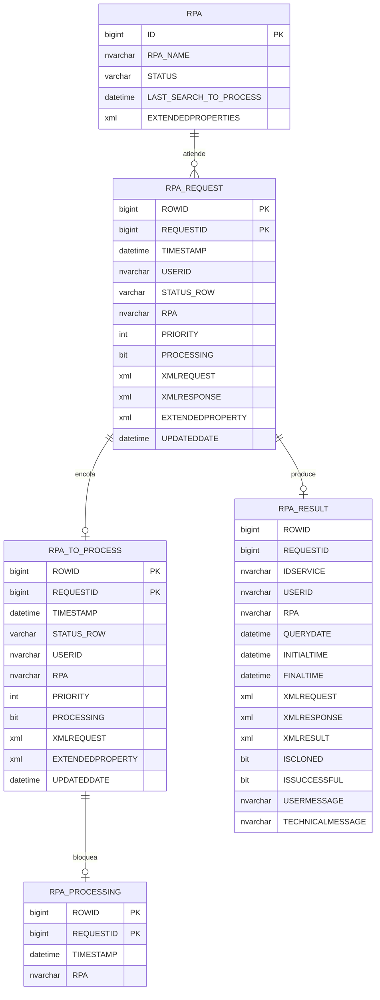

# Persistencia y cola de solicitudes

## Persistencia, cola y procedimientos almacenados

### Modelo lógico de datos

La estructura anterior corresponde al esquema (DDL) de las tablas. Cada tabla cumple un rol distinto y complementario:

- **`RPA_REQUEST`** conserva el registro maestro de cada solicitud. Su clave es la pareja `ROWID` (identidad autoincremental) y `REQUESTID` (identificador de la operación de negocio).
- **`RPA_TO_PROCESS`** es la cola de trabajo pendiente. Comparte clave con `RPA_REQUEST` y es la tabla que consultan las instancias para tomar trabajo.
- **`RPA_PROCESSING`** es una tabla de control que evita que dos instancias tomen la misma solicitud. Se inserta al asignar y se elimina al cerrar el procesamiento.
- **`RPA_RESULT`** almacena el resultado final: `ISSUCCESSFUL`, `XMLRESULT`, `USERMESSAGE`, `TECHNICALMESSAGE` y las marcas de tiempo `INITIALTIME`/`FINALTIME`. `ISCLONED` indica si el resultado se reutilizó de una ejecución previa.
- **`RPA`** es el registro de instancias. Cada fila representa una instancia por nombre (`RPA_NAME`), su `STATUS` y sus `EXTENDEDPROPERTIES` de filtrado.

> **Nota.** La tabla `RPA_REQUEST` no contiene una columna `IDSERVICE`; el servicio requerido viaja dentro de `XMLREQUEST`, en `RPAConfiguration/RPAIdService`. Solo `RPA_RESULT` materializa `IDSERVICE` como columna.

### Funciones de la cola

- **Registro:** `RPA_REQUEST_INSERT` inserta la solicitud únicamente en `RPA_REQUEST` con prioridad, estado inicial `WAITING_TO_PROCESS`, XML de configuración y propiedades extendidas. El trigger `TRG_RPA_REQUEST` (AFTER INSERT sobre `RPA_REQUEST`) copia automáticamente la fila a la cola `RPA_TO_PROCESS` con `PROCESSING = 0`.
- **Selección:** la instancia llama a `RPA_TO_PROCESS_GET`, que recibe el nombre de la instancia, el usuario y sus `ExtendedProperties`, y delega la selección en `RPA_TO_PROCESS_GET_ASYNC` (descrito abajo).
- **Asignación:** al seleccionar una fila, el procedimiento la marca `PROCESSING = 1` y `STATUS_ROW = 'PROCESSING'` en `RPA_TO_PROCESS` y `RPA_REQUEST`, e inserta la pareja `ROWID`/`REQUESTID` en `RPA_PROCESSING` para impedir una segunda toma.
- **Finalización:** `RPA_RESULT_INSERT` guarda el resultado y `RPA_PROCESSING_CLOSING` actualiza el request y elimina el registro de `RPA_TO_PROCESS` y `RPA_PROCESSING`.
- **Liberación/reactivación:** `RPA_REQUEST_RELEASE` y `RPA_REQUEST_REACTIVATE` devuelven solicitudes bloqueadas o las reabren; existe además un job `REACTIVATE_RPA_REQUEST`.
- **Limpieza:** Command Center cancela solicitudes antiguas y conserva histórico en `RPA_REQUEST_HISTORICAL`.
- **Consulta:** filtros, paginación, conteos por servicio e histórico.

**Algoritmo de selección (`RPA_TO_PROCESS_GET_ASYNC`).** El procedimiento aplica, en orden, los siguientes criterios sobre `RPA_TO_PROCESS`:

1. **Estado y ventana temporal.** Considera únicamente filas con `STATUS_ROW = 'WAITING_TO_PROCESS'` y `TIMESTAMP` dentro de una ventana reciente. Ambos valores provienen del UDC `OZONO_RPA_CONFIG` (`PARAMETROS_RPA_TO_PROCESS` y `PARAMETROS_RPA_TO_PROCESS_FILTER`).
2. **Orden de atención.** Ordena por `TIMESTAMP DESC, PRIORITY DESC, ID ASC, TYPEID ASC`. La prioridad de una solicitud que superó su `TIMEOUT_SECONDS` se reduce a `-1`.
3. **Horario de masivos.** El procedimiento `GET_TYPE_TO_PROCESS_NEXTID` define si en ese momento solo se atienden solicitudes individuales o también lotes (`BATCHTYPE`).
4. **Filtros de la instancia (`ExtendedProperties`).** Convierte los `RpaRequestFilters` recibidos en condiciones sobre `XMLREQUEST`, evaluando `Path`, `Operator` (`EQUALS` → `IN`, `NOT_EQUALS` → `NOT IN`) y `Value`. También excluye las solicitudes que corresponden a los filtros de **otras** instancias en ejecución, para no tomar trabajo dirigido a ellas.
5. **Seguridad por roles.** A partir del usuario (`GET_ROLES_BY_USERNAME`), obtiene sus roles y exige que el `RPAIdService` de la solicitud figure entre los servicios permitidos para esos roles en el UDC `OZONO_RPA_SECURITY_CONFIG` (`UDCVALUEA` = servicio, `UDCVALUEB` = roles autorizados). El comodín `*` habilita todos los servicios.
6. **Anti-duplicado y concurrencia.** Descarta filas ya presentes en `RPA_PROCESSING` y protege la sección crítica con `sp_getapplock`. El número de hilos concurrentes lo define el UDC `RPA_TO_PROCESS_THREAD` (valor por defecto 4).
7. **Registro de la instancia.** Como último paso llama a `RPA_INSERT` para registrar o actualizar la instancia solicitante en la tabla `RPA`.

### Idempotencia y correlación

- `RequestId`: operación o consumo de negocio.
- `RowId`: identificador interno de la cola.
- `IdService`: tipo de robot requerido.
- `RPA`: instancia que tomó el trabajo.
- `TaskId`: tarea local dentro del Shell.
- `UserId`, `ModelId`, `BatchId`, `BatchType` y `CustomerId`: dimensiones de negocio.

Para evitar duplicados, el consumidor debe usar un `RequestId` estable y el Core debe validar requests existentes, clonación y estados antes de insertar o reactivar.

## Modelo de datos y contexto de ejecución

| Objeto | Papel | Datos observados |
|---|---|---|
| `RPAMessage` | Contexto mutable del workflow/tarea | RPAInfo, éxito, mensajes, step, debug, retries, timeout, keep-alive, cancelación, progreso y navegador. |
| `RPAInfoRequest` | DTO interno de solicitud | RowId, RequestId, IdService, prioridad, estado, XMLRequest, XMLResponse, XmlResult, ExtendedProperty, usuario y tiempos. |
| `RPAInfoResponse` | DTO de respuesta de cola | Correlación, estado, código y mensajes. |
| `RPARequest` | Contrato público de registro | IdService, RequestId, UserId, ProcessIdentifiers, QueryParameters, Priority y WaitingInterval. |
| `RPAResponse` | Respuesta pública | RowId, RequestId, IdService, XmlResult, IsSuccessful, Code, UserMessage y TechnicalMessage. |
| `RPAWebModel` | Contexto de navegador | Tipo, flag externo, WebDriver, procesos y estado. |
| `RPAContextModel` | Contenedor de contexto | TaskId, tipo y objeto para reutilización/limpieza. |
| `RPAUserShellInfo` | Identidad y diagnóstico | Usuario, certificado, custom credentials, ExtendedProperties, versión, equipo, IP, CPU, RAM, red, SO y ambiente. |

### RPAMessage como bus de contexto

`RPAMessage` es un **context object** compartido. Las Activities lo reciben por `InOutArgument`, lo actualizan y permiten que el Shell observe progreso y errores sin acoplar cada Activity a la interfaz.

- No debe ser `null`.
- Mensajes funcionales y técnicos deben mantenerse separados.
- `IsSuccessful` controla la continuidad.
- Cancelación y working state deben ser consistentes.
- El XML result debe permanecer válido incluso ante error.
- Datos sensibles deben excluirse de logs.
