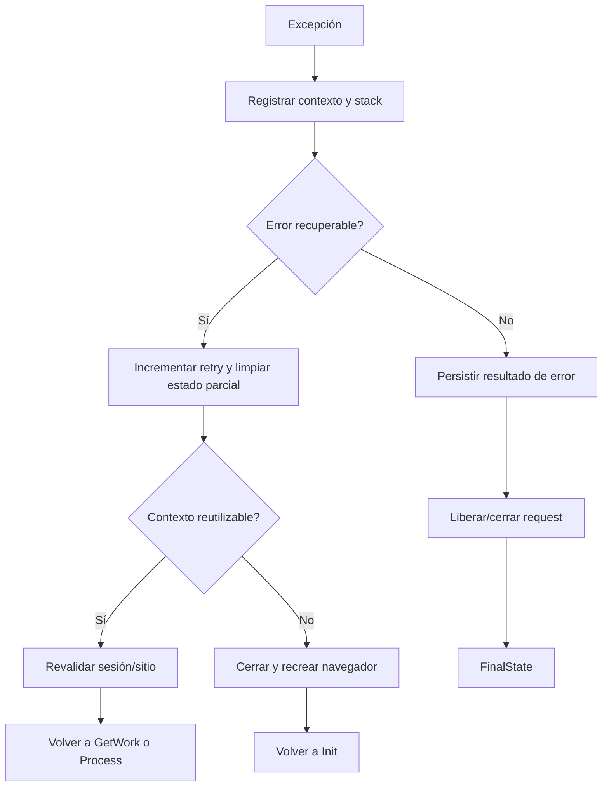

# Errores, resiliencia y recuperación

## Errores, resiliencia, reintentos y recuperación

### Taxonomía

| Categoría | Ejemplos | Tratamiento |
|---|---|---|
| Configuración | UDC faltante, clase inválida, perfil sin rol | Fallar temprano y no tomar request. |
| Infraestructura | WCF, DNS, VPN, SQL o disco | Reintento limitado, alerta y diagnóstico. |
| Navegador/driver | Driver incompatible o proceso huérfano | Recrear, actualizar y limpiar. |
| Sitio externo | HTTP, DOM, indisponibilidad o sesión | Validar, recargar, reautenticar o detener. |
| Certificado/GAUDI | Tarjeta, PIN o certificado | Pausa asistida, detener y alertar. |
| Captcha | Servicio, solución o site key | Reintentar, feedback o modo manual. |
| Datos/attachments | Archivo, tamaño, extensión o ruta | Validación previa y error funcional. |
| Workflow | Excepción, timeout o IsSuccessful=false | Recovery, persistir y liberar. |
| Concurrencia | Duplicado, sesión compartida o lock | Correlación, filtros y límites. |

### Excepciones especializadas

El Core define excepciones específicas para timeout, certificados, worker cancelado, negocio, desktop/excel/web activities, EdgeDriver, mensajes nulos, configuración crítica, captcha, sesiones, Shell, navegador, sitio no disponible, usuario no autorizado y workflow. Esto permite recuperación dirigida y mensajes más precisos.

### Patrón de Recovery

`ValidateWorkingCorrectly` conserva la hora inicial de un error repetitivo y envía alerta cuando supera `MaxTimeRetryErrors`. El changelog también contempla notificaciones de recuperación.
