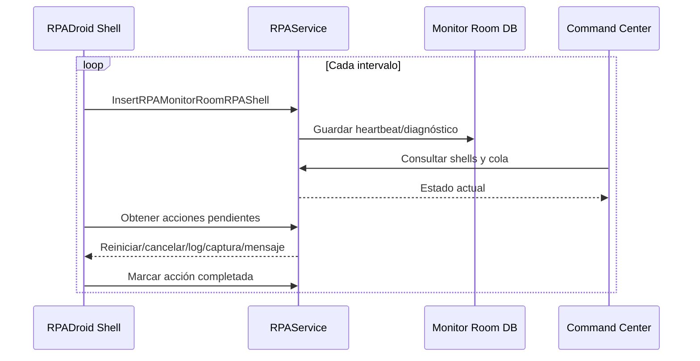

# Monitoreo y RPA Command Center

## Monitoreo, logs, heartbeat y Command Center

### Fuentes de observabilidad

| Fuente | Alcance |
|---|---|
| UI de RPADroid | Estado, tareas, keep-alive, navegadores, settings y logs. |
| `RPAShellGlobalLogs.txt` | Eventos generales del Shell. |
| `RPADroidLogs_<fecha>.txt` | Detalle operativo horario. |
| `RPATasksLogs.txt` | Eventos por tarea. |
| `[IDSERVICE]_ObjectRequest.txt` | Objeto/request de una instancia. |
| Logs de resultado | Archivo asociado a RequestId y XML result. |
| Log4Net | Servicios y componentes. |
| Watchman | Excepciones y configuración. |
| Correo | Alertas con contexto y diagnóstico. |
| Monitor Room | Heartbeat, estado, acciones e históricos. |

### Heartbeat y control remoto

Acciones observadas: `PREPARE_AND_RUN`, `RESTART`, `RESTART_MACHINE`, `KILL_SESSION`, `KILL_ALL_SESSIONS`, `CLOSE_RPA_DROID_SHELL`, envío de logs/captura y mensajes al escritorio.

**Implementación del Command Center.** La interfaz web del Command Center corresponde al controlador `RPAMonitorNEWController` (proyecto `Apptividad.OzonoStation.Web.UI`, carpeta `Controllers`) y sus vistas en `Views\RPAMonitorNEW`. El controlador consume el servicio a través del proxy `Apptividad.Ozono.RPAServiceProxy.RPA` —por ejemplo, `GetRPAMonitorRoomRPAShellResponse` para listar los Shells activos— y ofrece a los operadores las acciones `PREPARE_AND_RUN`, `RESTART`, `KILL_SESSION`, `KILL_ALL_SESSIONS`, `SEND_BY_EMAIL_LOGS` y `SEND_BY_EMAIL_SCREENSHOT`. Cada acción se registra en la tabla `RPA_MONITOR_ROOM_ACTIONS`, mientras que la lista de Shells y de servicios permitidos por usuario se obtiene de `RPA_MONITOR_ROOM_RPASHELL`.

### Trazabilidad mínima recomendada

- Timestamp con milisegundos.
- Ambiente y compañía.
- MachineName y usuario RPA.
- RPA, IdService, TaskId, RequestId y RowId.
- Workflow, estado y Activity.
- Acción, resultado y duración.
- UserMessage sanitizado.
- TechnicalMessage y stack trace.
- Estado de navegador, sitio y cola.
