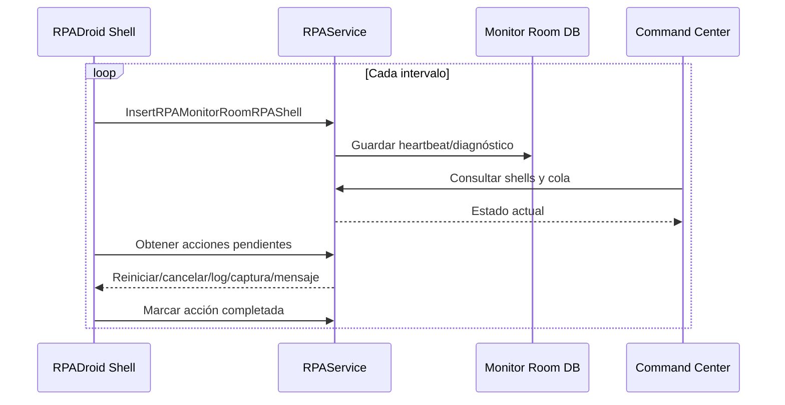

# Monitoreo y RPA Command Center

## Monitoreo, logs, heartbeat y Command Center

### Fuentes de observabilidad

| Fuente | Alcance |
|---|---|
| UI de RPADroid | Estado, tareas, keep-alive, navegadores, settings y logs. |
| `RPAShellGlobalLogs.txt` | Eventos generales del Shell. |
| `RPADroidLogs_<fecha>.txt` | Detalle operativo horario. |
| `RPATasksLogs.txt` | Eventos por tarea. |
| `[IDSERVICE]_ObjectRequest.txt` | Objeto/request de una instancia. |
| Logs de resultado | Archivo asociado a RequestId y XML result. |
| Log4Net | Servicios y componentes. |
| Watchman | Excepciones y configuración. |
| Correo | Alertas con contexto y diagnóstico. |
| Monitor Room | Heartbeat, estado, acciones e históricos. |

### Heartbeat y control remoto

**Mecanismo del latido.** El reloj del latido es un hilo de fondo del Shell, `RPADroid.RPAMonitorRoomRequestTask`, que se ejecuta cada `HeartBeatTimeOut` segundos (con un mínimo de 30 s) mientras el UDC `RPA_MONITOR_ROOM_ENABLE` esté activo. En cada ciclo, a través de la fachada WCF `RPAHeartBeat`, el Shell realiza tres acciones: escribe el estado de la instancia en `RPA` con `RPA_INSERT` (método `InsertRPAStatusByName`, valor `RUNNING`); registra el latido del Shell en `RPA_MONITOR_ROOM_RPASHELL` con `RPA_MONITOR_ROOM_RPASHELL_INSERT` (método `HeartBeatDroid`, que fija `HeartBeat` a la hora actual); y consulta y cierra las acciones remotas pendientes (tabla `RPA_MONITOR_ROOM_ACTIONS`, transición `PENDING` → `COMPLETED`). Durante el procesamiento de una solicitud, `UpdateProgressRPATask` se ejecuta además en cada actividad del workflow: refresca el estado de la instancia (`RUNNING`, o `BUSY` si hay una solicitud asignada) y verifica la cancelación cooperativa de la tarea. `RPAHeartBeat` es solo la fachada de cliente WCF; no tiene temporizador propio.

Acciones observadas: `PREPARE_AND_RUN`, `RESTART`, `RESTART_MACHINE`, `KILL_SESSION`, `KILL_ALL_SESSIONS`, `CLOSE_RPA_DROID_SHELL`, envío de logs/captura y mensajes al escritorio.

**Implementación del Command Center.** La interfaz web del Command Center corresponde al controlador `RPAMonitorNEWController` (proyecto `Apptividad.OzonoStation.Web.UI`, carpeta `Controllers`) y sus vistas en `Views\RPAMonitorNEW`. El controlador consume el servicio a través del proxy `Apptividad.Ozono.RPAServiceProxy.RPA` —por ejemplo, `GetRPAMonitorRoomRPAShellResponse` para listar los Shells activos— y ofrece a los operadores las acciones `PREPARE_AND_RUN`, `RESTART`, `KILL_SESSION`, `KILL_ALL_SESSIONS`, `SEND_BY_EMAIL_LOGS` y `SEND_BY_EMAIL_SCREENSHOT`. Cada acción se registra en la tabla `RPA_MONITOR_ROOM_ACTIONS`, mientras que la lista de Shells y de servicios permitidos por usuario se obtiene de `RPA_MONITOR_ROOM_RPASHELL`.

**Los dos controladores de monitoreo.** Coexisten dos controladores: `RPAMonitorController` (anterior) y `RPAMonitorNEWController` (actual). Ambos obtienen el estado de las **instancias** desde la tabla `RPA` mediante la operación `GetRPARunning` (procedimiento `RPA_RUNNING_LIST_GET`): el anterior presenta una lista plana de droids (`GetRPAMonitorDroid`) y el actual, un detalle por instancia (`GetRPARunningListByRpaShell`). La diferencia es que el controlador actual añade una vista superior agrupada por **Shell**, alimentada por el **latido** (`GetMonitorRoomShell` → `RPA_MONITOR_ROOM_RPASHELL_GET_PAGINATION` sobre `RPA_MONITOR_ROOM_RPASHELL`); ambas vistas se cruzan por la clave `UserName - UserPc - RpaVersion`. El estado de la instancia (`RPA`) y el latido del Shell (`RPA_MONITOR_ROOM_RPASHELL`) son ciclos distintos aunque compartan valores como `RUNNING`/`STOPPED`.

### Trazabilidad mínima recomendada

- Timestamp con milisegundos.
- Ambiente y compañía.
- MachineName y usuario RPA.
- RPA, IdService, TaskId, RequestId y RowId.
- Workflow, estado y Activity.
- Acción, resultado y duración.
- UserMessage sanitizado.
- TechnicalMessage y stack trace.
- Estado de navegador, sitio y cola.
