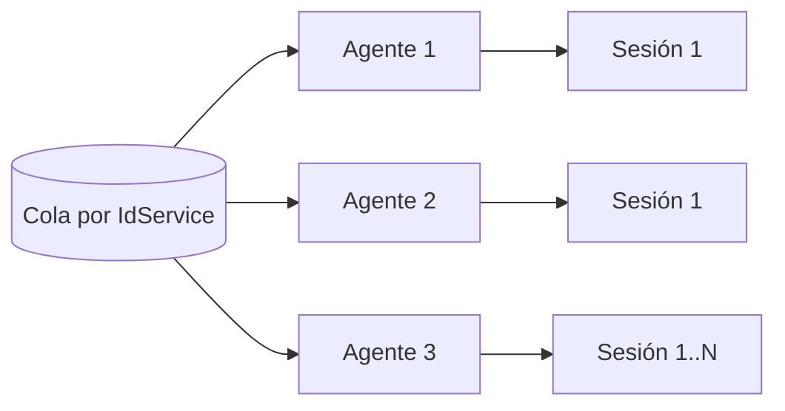

# Rendimiento y escalabilidad

## Rendimiento, concurrencia, capacidad y escalabilidad

### Modelo de escalamiento

La capacidad crece agregando agentes, incrementando `MAX_SESSIONS` cuando el robot lo permite o particionando usuarios por ExtendedProperties.

- Certificados/sesiones disponibles.
- Restricciones del sitio por usuario, IP o concurrencia.
- CPU/RAM/disco por navegador.
- Ancho de banda y tamaño de archivos.
- Límites WCF/IIS/SQL.
- Seguridad y licenciamiento de terceros.

### Polling, ancho de banda y métricas

Hay polling del Shell hacia la cola y polling de `RegisterRPARequest` hacia el resultado. Un intervalo corto aumenta carga WCF/SQL; uno largo aumenta latencia.

La documentación propone, como referencia, 10/15 Mbps para procesos estándar y 20/30 Mbps o más cuando se transfieren archivos, escalando con concurrencia. Debe validarse con métricas reales.

Métricas recomendadas:
- Requests recibidos/completados/error por IdService.
- Tiempo en cola, ejecución y total.
- Profundidad de cola y antigüedad del request más viejo.
- Disponibilidad y porcentaje BUSY.
- Reintentos por Activity/workflow.
- Errores por sitio, navegador, certificado, captcha y configuración.
- CPU/RAM/red por Shell y sesión.
- Tasa de clonación por expiración.
- Tamaño y tiempo de attachments.
