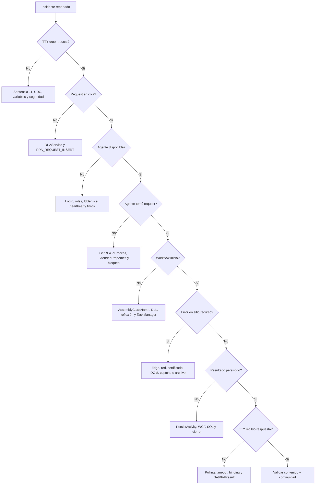

# Runbook de soporte y diagnóstico

## Runbook de soporte y diagnóstico

### Datos mínimos del incidente

- Cliente, ambiente y hora exacta.
- IdService.
- RequestId/OperationId y RowId.
- Usuario RPA y máquina.
- Estado del modelo TTY.
- Mensaje funcional y técnico.
- Captura del Shell y sitio.
- XML request/result sanitizado.
- Estado de Edge, driver, certificado/GAUDI y red.

### Árbol de diagnóstico

### Checklist por capa

| Capa | Validaciones |
|---|---|
| TTY | Sentencia, XML, parámetros, timeout y seguridad. |
| RPAService | Endpoint, logs, RegisterRPARequest y WCF. |
| Base de datos | Request, estado, agente, resultado, antigüedad y duplicados. |
| Shell | Login, roles, IdService, heartbeat, task y versión. |
| Workflow | AssemblyClassName, estado, retry, Recovery y mensajes. |
| Navegador | Edge, driver, procesos, URL, sesión, DOM y popup. |
| Externo | Sitio, VPN, certificado, GAUDI, captcha, correo o FTP. |
| Resultado | XML, éxito, mensajes, attachments y consumo TTY. |

### Síntomas frecuentes

| Síntoma | Causas probables | Primera acción |
|---|---|---|
| No hay RPAs disponibles | Shell cerrado, sin rol, IdService no iniciado o agentes ocupados. | Revisar heartbeat, tareas y cola. |
| Request pendiente | Filtro ExtendedProperties, agente detenido o error de servicio. | Comparar request con perfil. |
| Timeout TTY | Workflow lento, cola, sitio o timeout mal dimensionado. | Ver si sigue PROCESSING. |
| Edge no inicia | Driver incompatible, GPO, ruta o proceso huérfano. | Comparar versiones y logs. |
| Autenticación CIC falla | GAUDI, tarjeta, PIN, certificado o cambio externo. | Validar manualmente en la misma sesión. |
| Resultado vacío | Mapeo `_RPA_RESPONSE`, selector o extracción. | Revisar HTML y UDC. |
| Attachments faltantes | Tipo, extensión, tamaño, ruta o modelo. | Validar request y helper. |
| Correo no enviado | SMTP, TLS, credenciales, puerto o frecuencia. | Probar configuración. |
