<a id="inicio"></a>
# Arquitectura técnica integral del Core RPA de Apptividad

**Compendio profesional de arquitectura, ejecución, integración, configuración, operación, soporte y extensibilidad**

- **Fecha de consolidación:** 30 de junio de 2026
- **Última revisión técnica:** 14 de septiembre de 2026
- **Alcance:** Core RPA de Apptividad, integración TimeToYes, RPAService, RPADroid Shell, workflows XAML/Windows Workflow Foundation, Activities, persistencia, monitoreo y dependencias externas.
- **Formato:** Markdown estándar con diagramas Mermaid.
- **Base de la arquitectura:** la capa de persistencia y la selección de trabajo corresponden al esquema (DDL) de las tablas y a los procedimientos almacenados. El flujo integral opera de extremo a extremo, como ilustra una solicitud de análisis atendida por el RPA `CIC_AUTORIZACIONES` con resultado exitoso.
- **Tratamiento de seguridad:** se omiten o generalizan credenciales, PIN, service keys, direcciones internas, rutas compartidas específicas de clientes y valores operativos sensibles.

> **Nota de nomenclatura:** la documentación interna utiliza con frecuencia **WWF** para *Windows Workflow Foundation*. Microsoft suele abreviar esta tecnología como **WF**. En este documento ambas siglas se refieren a `System.Activities` y a los workflows declarados en XAML.

## Resumen ejecutivo

El Core RPA de Apptividad es una plataforma empresarial de automatización construida principalmente sobre **C# y .NET Framework 4.8**, con una arquitectura desacoplada basada en solicitudes persistentes, servicios **WCF**, ejecución local mediante una aplicación **Windows Forms** denominada **RPADroid Shell**, y lógica de robot declarada en **XAML** sobre **Windows Workflow Foundation**.

No es únicamente una colección de robots. Es un ecosistema integrado por:
- **TimeToYes (TTY)** como orquestador de modelos, sentencias, reglas y contexto de negocio.
- **RPAIntegrationCommand** como adaptador de la Sentencia 11 hacia el backend RPA.
- **RPAService** como frontera WCF para solicitudes, resultados, agentes, monitoreo, seguridad y versiones.
- **Base de datos de Ozono** como cola durable, repositorio de resultados, estado de agentes, histórico y Monitor Room.
- **RPADroid Shell** como host de ejecución en una máquina Windows cercana a los recursos del cliente.
- **Windows Workflow Foundation/XAML** como motor de orquestación interna de cada robot.
- **Activities Core** como biblioteca reutilizable de automatización web, escritorio, archivos, PDF, Excel, correo, captcha, UDC y persistencia.
- **Microsoft Edge, Edge WebDriver y Selenium** como mecanismo principal de automatización web actual.
- **Windows UI Automation** para certificados, diálogos nativos, Agente GAUDI y aplicaciones de escritorio.
- **UDC** como configuración dinámica por servicio, modelo, ambiente, categoría y perfil de usuario.
- **RPA Command Center/Monitor Room** como plano de observabilidad y control remoto.

El procesamiento es **asincrónico en el plano de ejecución**: la solicitud se registra en una cola y un agente disponible la toma. Sin embargo, `RegisterRPARequest` implementa una **espera síncrona con polling** para devolver el resultado al consumidor dentro del tiempo configurado. Esta dualidad explica gran parte del comportamiento de timeouts, saturación, concurrencia y capacidad.

## Tabla de contenido

- [1. Objetivo, alcance y límites](#1-objetivo-alcance-y-limites)
- [2. Fuentes analizadas y nivel de evidencia](#2-fuentes-analizadas-y-nivel-de-evidencia)
- [3. Glosario tecnológico y separación de responsabilidades](#3-glosario-tecnologico-y-separacion-de-responsabilidades)
- [4. Vista de contexto y arquitectura por capas](#4-vista-de-contexto-y-arquitectura-por-capas)
- [5. Inventario de la solución y componentes de código](#5-inventario-de-la-solucion-y-componentes-de-codigo)
- [6. Flujo end-to-end de una solicitud RPA](#6-flujo-end-to-end-de-una-solicitud-rpa)
- [7. Capa TimeToYes y RPAIntegrationCommand](#7-capa-timetoyes-y-rpaintegrationcommand)
- [8. Capa WCF: contratos, implementación, proxy y API](#8-capa-wcf-contratos-implementacion-proxy-y-api)
- [9. Persistencia, cola y procedimientos almacenados](#9-persistencia-cola-y-procedimientos-almacenados)
- [10. RPADroid Shell y gestor de tareas](#10-rpadroid-shell-y-gestor-de-tareas)
- [11. Windows Workflow Foundation, XAML y máquinas de estados](#11-windows-workflow-foundation-xaml-y-maquinas-de-estados)
- [12. Framework de Activities del Core](#12-framework-de-activities-del-core)
- [13. Automatización web y ciclo de vida del navegador](#13-automatizacion-web-y-ciclo-de-vida-del-navegador)
- [14. Modelo de datos y contexto de ejecución](#14-modelo-de-datos-y-contexto-de-ejecucion)
- [15. Configuración UDC](#15-configuracion-udc)
- [16. Attachments, documentos, PDF, Excel y archivos](#16-attachments-documentos-pdf-excel-y-archivos)
- [17. Captcha y aprovisionamiento](#17-captcha-y-aprovisionamiento)
- [18. Certificados, firma digital y Agente GAUDI](#18-certificados-firma-digital-y-agente-gaudi)
- [19. Monitoreo, logs, heartbeat y Command Center](#19-monitoreo-logs-heartbeat-y-command-center)
- [20. Errores, resiliencia, reintentos y recuperación](#20-errores-resiliencia-reintentos-y-recuperacion)
- [21. Seguridad](#21-seguridad)
- [22. Despliegue, instalación, actualización y compatibilidad](#22-despliegue-instalacion-actualizacion-y-compatibilidad)
- [23. Rendimiento, concurrencia, capacidad y escalabilidad](#23-rendimiento-concurrencia-capacidad-y-escalabilidad)
- [24. Sistemas de terceros y dependencias](#24-sistemas-de-terceros-y-dependencias)
- [25. Estándares de desarrollo, pruebas y liberación](#25-estandares-de-desarrollo-pruebas-y-liberacion)
- [26. Flujos de referencia incluidos en el paquete](#26-flujos-de-referencia-incluidos-en-el-paquete)
- [27. Runbook de soporte y diagnóstico](#27-runbook-de-soporte-y-diagnostico)
- [28. Riesgos, deuda técnica y vacíos documentales](#28-riesgos-deuda-tecnica-y-vacios-documentales)
- [A. Catálogo de operaciones WCF](#a-catalogo-de-operaciones-wcf)
- [B. Catálogo de procedimientos almacenados](#b-catalogo-de-procedimientos-almacenados)
- [C. Inventario de workflows XAML](#c-inventario-de-workflows-xaml)
- [D. Catálogo completo de Activities](#d-catalogo-completo-de-activities)

<a id="1-objetivo-alcance-y-limites"></a>
## 1. Objetivo, alcance y límites

El objetivo es explicar de forma integral cómo está construido y cómo opera el Core RPA de Apptividad, desde la invocación en un modelo TTY hasta la ejecución del robot, la interacción con aplicaciones externas, la persistencia del resultado y el monitoreo operativo.

El alcance incluye:
- Arquitectura lógica, física y de ejecución.
- Capas de software, proyectos, namespaces y responsabilidades.
- Diferencia entre lenguaje, runtime, framework, protocolos, formatos y librerías.
- Contratos WCF y flujo de servicios.
- Cola de solicitudes, persistencia y procedimientos almacenados.
- RPADroid Shell, administración de sesiones, tareas, heartbeat y comandos remotos.
- Workflows XAML, máquina de estados y Activities personalizadas.
- Configuración mediante UDC, seguridad, roles y perfiles de usuario.
- Automatización web con Edge/Selenium y automatización de escritorio con UI Automation.
- Archivos, attachments, PDF, Excel, correo, captcha, certificados y firma digital.
- Instalación, compatibilidad, soporte, observabilidad, rendimiento y riesgos.

Límites de la evidencia:
- La estructura de proyectos, el DDL de las tablas y el código de los procedimientos almacenados constituyen la base confirmada de esta arquitectura.
- Algunas versiones exactas de paquetes y ciertas opciones de compilación no se documentan en este archivo por no ser relevantes para la arquitectura.
- El proyecto de pruebas (`TestingActivities`) no forma parte del alcance revisado, por lo que la cobertura de pruebas no se verificó.
- Existen referencias históricas a Internet Explorer y a componentes Droid legados; el código vigente utiliza principalmente Edge/Selenium y RPADroid Shell.
- Las afirmaciones calificadas como **inferencia** se derivan del código y de la combinación de fuentes, no de un contrato formal completo.

<a id="2-fuentes-analizadas-y-nivel-de-evidencia"></a>
## 2. Fuentes analizadas y nivel de evidencia

| Nivel | Significado | Aplicación |
|---|---|---|
| **Confirmado por código** | Existe implementación observable en el código base. | Clases, métodos, argumentos, estados, llamadas, procedimientos y dependencias. |
| **Confirmado por documentación técnica** | Está descrito en la documentación técnica de la plataforma. | Requisitos, instalación, operación, convenciones y procesos. |
| **Inferencia técnica controlada** | Se deduce de nombres, llamadas y flujo. | Propósito de entidades no incluidas, hosting y clasificación arquitectónica. |

Resumen cuantitativo del código base:

| Métrica | Valor |
|---|---:|
| Archivos C# analizados | 180 |
| Líneas C# aproximadas | 50,143 |
| Workflows XAML analizados | 44 |
| Líneas XAML aproximadas | 190,740 |
| WebActivities encontradas | 31 |
| UtilsActivities encontradas | 37 |
| Operaciones del contrato WCF interno | 41 |
| Procedimientos almacenados invocados desde `RpaProcess` | 39 |

La estructura de las tablas `RPA_REQUEST`, `RPA_RESULT`, `RPA_TO_PROCESS`, `RPA_PROCESSING` y `RPA` corresponde al esquema (DDL) de la base de datos. La lógica de selección de trabajo se implementa en los procedimientos `RPA_TO_PROCESS_GET` y `RPA_TO_PROCESS_GET_ASYNC`.

<a id="3-glosario-tecnologico-y-separacion-de-responsabilidades"></a>
## 3. Glosario tecnológico y separación de responsabilidades

| Tecnología o concepto | Qué es | Papel en el Core | Qué no es |
|---|---|---|---|
| C# | Lenguaje de programación administrado. | Implementa servicios, Shell, Activities, utilidades, integración TTY y acceso a datos. | No es el runtime ni el motor de workflows. |
| .NET Framework 4.8 | Runtime y biblioteca de clases de Microsoft para Windows. | Ejecuta C#, WCF, WinForms, System.Activities, IO, networking y criptografía. | No es lo mismo que .NET moderno/.NET Core. |
| CLR 4.x | Máquina virtual administrada de .NET Framework. | Carga ensamblados, administra memoria, excepciones, hilos y tipos. | No contiene por sí sola la lógica RPA. |
| Windows Workflow Foundation (WF/WWF) | Framework de composición y ejecución de workflows. | Ejecuta Activities, argumentos, variables, secuencias, Try/Catch y máquinas de estados. | No es una aplicación independiente. |
| XAML | Formato XML declarativo. | Serializa workflows, Activities, argumentos, expresiones C# y diseño de estados. | No reemplaza el código C# de las Activities. |
| WCF | Windows Communication Foundation. | Expone contratos y operaciones del backend RPA mediante servicios `.svc` y proxies. | No es una API REST moderna, aunque puede ofrecer endpoints web. |
| Windows Forms | Framework de interfaz gráfica de escritorio. | Implementa RPADroid Shell, login, settings, tareas, logs y keep-alive. | No es el motor de automatización web. |
| Selenium WebDriver | API de automatización de navegadores. | Controla Edge Chromium, ventanas, DOM, JavaScript y navegación. | No controla por sí solo diálogos nativos. |
| Microsoft Edge WebDriver | Driver compatible con la versión mayor de Edge. | Intermedia entre Selenium y el navegador. | No pertenece a Apptividad. |
| Windows UI Automation | API de accesibilidad y automatización de controles nativos. | Opera certificados, carga de archivos, GAUDI y diálogos de escritorio. | No opera directamente el DOM web. |
| SQL Server y procedimientos almacenados | Motor y lógica de persistencia. | Implementan cola durable, requests, resultados, estados, históricos y monitoreo. | No ejecutan el workflow XAML. |
| UDC | Catálogo dinámico de parámetros de TimeToYes/Ozono. | Configura servicios y parámetros globales sin recompilar. | No es un archivo local tradicional. |
| XML/XPath/XSLT | Formatos y lenguajes de transformación/consulta. | Representan request, response, resultado, propiedades y validaciones. | No son una base de datos. |
| Regex | Expresiones regulares. | Localizan contenido, errores, nombres de archivos y condiciones. | No sustituyen selectores estables cuando estos existen. |

<a id="4-vista-de-contexto-y-arquitectura-por-capas"></a>
## 4. Vista de contexto y arquitectura por capas

### 4.1 Diagrama de contexto

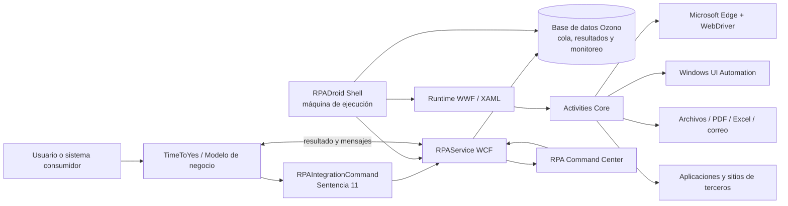

El ecosistema tiene dos planos:

1. **Plano de control y datos:** TTY, RPAService, base de datos, seguridad y monitoreo.
2. **Plano de ejecución:** RPADroid Shell, runtime WWF, workflows, Activities, navegador y aplicaciones externas.

### 4.2 Arquitectura por capas

| Capa | Componentes | Responsabilidad | Acoplamiento |
|---|---|---|---|
| Canal/negocio | UI TTY, procesos SQL, SOAP-UI u otros consumidores | Iniciar análisis o consumir un servicio RPA. | CQCommand y XML. |
| Orquestación TTY | Modelos, operaciones, sentencias y contexto | Controlar el proceso de negocio y decidir cuándo invocar RPA. | Configuración de modelo. |
| Adaptación RPA | `RPAIntegrationCommand` | Construir request, validar disponibilidad, aplicar expiración, llamar al servicio y normalizar respuesta. | WCF + UDC + XML. |
| Servicios | `IRPAService`, `RPAService`, proxy y API | Exponer request, resultado, agentes, seguridad, monitoreo y versionado. | Contratos WCF. |
| Dominio/persistencia | `RpaProcess`, DataContext, SPs | Implementar cola, polling, resultados, históricos y transacciones. | LINQ-to-SQL/SP. |
| Host de ejecución | RPADroid Shell WinForms | Autenticar, iniciar agentes, recuperar solicitudes y ejecutar workflows. | WCF + reflexión + hilos. |
| Workflow | XAML + `System.Activities` | Modelar estados, secuencias, decisiones, recuperación y subprocesos. | Arguments/Activities. |
| Activities | BaseActivities, WebActivities, UtilsActivities | Proveer capacidades técnicas reutilizables. | C# y contratos WWF. |
| Adaptadores externos | Selenium, UI Automation, correo, FTP, PDF, Excel | Interactuar con sistemas y recursos externos. | Protocolos/librerías. |
| Observabilidad | Logs, correo, heartbeat, Monitor Room e históricos | Diagnóstico, alertas, control remoto y trazabilidad. | Eventos, tablas y archivos. |

### 4.3 Principios arquitectónicos observados

- **Desacoplamiento mediante cola durable:** TTY no controla directamente el navegador.
- **Configuración sobre código:** gran parte del comportamiento se obtiene desde UDC y perfil de usuario.
- **Reutilización por composición:** los robots combinan Activities y subworkflows.
- **Host local cercano al recurso:** el robot se ejecuta donde existen navegador, certificado, red y aplicaciones.
- **Trazabilidad por RequestId, IdService, RPA y TaskId.**
- **Recuperación explícita:** los workflows modernos contienen un estado `Recovery` y políticas de reintento.
- **Compatibilidad progresiva:** conviven soporte actual Edge/Selenium y componentes heredados IE/MSHTML.

<a id="5-inventario-de-la-solucion-y-componentes-de-codigo"></a>

### 4.4 Topología física y fronteras de confianza

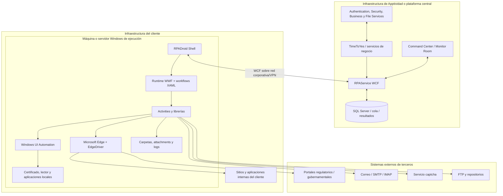

Las fronteras de confianza relevantes son:

- **Plataforma central ↔ máquina de ejecución:** autenticación, autorización, WCF, TLS/red corporativa y correlación del agente.
- **Máquina de ejecución ↔ sistema externo:** credenciales, certificado, sesión, navegador, VPN y políticas del tercero.
- **Workflow ↔ recursos locales:** permisos de carpetas, UI interactiva, procesos, certificados y secretos.
- **Command Center ↔ Shell:** acciones administrativas remotas que requieren auditoría y mínimo privilegio.

La ubicación de cada componente puede variar por cliente. La arquitectura funcional permanece: el backend central coordina y persiste; la máquina Windows ejecuta la interacción visual cerca del recurso automatizado.

## 5. Inventario de la solución y componentes de código

La solución está organizada en proyectos independientes con límites claros por namespace, verificados directamente en los archivos `.csproj` del código fuente. La siguiente tabla resume los componentes que participan en el flujo principal.

| Módulo/proyecto | Tipo | Responsabilidad |
|---|---|---|
| `Apptividad.TimeToYes.Command.APPTIVIDAD` | Integración TTY | `RPAIntegrationCommand`, adaptador de la Sentencia 11. |
| `Apptividad.Ozono.RPAServiceContracts` | Contrato WCF | Interfaz `IRPAService` con las 41 operaciones del dominio RPA. |
| `Apptividad.Ozono.RPAImpl` | Implementación WCF | Clase `RPAService : IRPAService`; delega en `RpaProcess`. |
| `Apptividad.Ozono.RPAService` | Host `.svc` | Publica el servicio WCF; contiene `RPAService.svc`, `Web.config` y transformaciones por ambiente. |
| `Apptividad.Ozono.RPAServiceProxy` | Cliente WCF | Clase `RPA`; encapsula el proxy y aborta el canal ante excepciones. |
| `Apptividad.Ozono.RPA.Api` | Fachada WCF/Web | Expone un subconjunto de operaciones y pruebas (`echo`, `TestConfiguration`) en JSON. |
| `Apptividad.Ozono.RPA` | Core compartido | Procesos (`RpaProcess`), modelos, excepciones, BaseActivities y utilidades. |
| `Apptividad.Ozono.RPA.UI` | Aplicación WinForms | RPADroid Shell: login, tareas, settings, logs, heartbeat y ejecución. |
| `Apptividad.Ozono.RPA.Updater` | Ejecutable de consola | Aplica la actualización de versión del RPADroid Shell (ver sección 22.2). |
| `Apptividad.Ozono.RPA.WebActivities` | Biblioteca WWF | Activities de navegador y DOM. Referenciada por los robots (uso intensivo). |
| `Apptividad.Ozono.RPA.UtilsActivities` | Biblioteca WWF | Activities de servicios, archivos, correo, PDF, UDC y captcha. Referenciada por los robots (uso intensivo). |
| `Apptividad.Ozono.RPA.DesktopActivities` | Biblioteca WWF | Activities de automatización de escritorio (UI Automation). Referenciada por los robots. |
| `Apptividad.Ozono.RPA.ExcelActivities` | Biblioteca WWF | Activities de lectura y generación de Excel. Referenciada por los robots. |
| `Apptividad.TimeToYes.RPAWorkFlows` | Workflows XAML | Robots y máquinas de estado por servicio. |
| `Apptividad.TimeToYes.RPAWorkFlows.Utils` | Workflows XAML | Subworkflows compartidos: `Init`, `Recovery`, `SetStatus`, `InitWebBrowser`, `LoadUrlBase`, `ValidateMaxRetry`, `ValidateWebSite`, `ResolveCaptcha`. |
| `Apptividad.TimeToYes.RPA.TTYActivities` | Biblioteca WWF | Activities de retorno hacia TTY: `CreateAnalysisActivity`, `CreateAttachmentActivity`, `ExecuteSentenceActivity`. |
| `Apptividad.OzonoStation.Web.UI` (`RPAMonitorNEWController`) | Web MVC | Implementa el RPA Command Center (ver sección 19). |
| `Apptividad.Ozono.RPA.Resources` | Recursos | Mensajes localizados y textos del Core. |

**Bibliotecas de Activities especializadas.** La solución incluye además `SATServicesActivities`, `TerminalActivities`, `IBMDataManagerActivities`, `ArtificialIntelligenceActivities` y `Workflow.Activities`. De estas, solo `SATServicesActivities` aparece referenciada por algunos robots (flujos SAT). Para las demás **no se evidencia participación** en los workflows de robots revisados; se consideran bibliotecas de capacidades específicas, no parte del flujo principal.

### 5.1 Dependencias internas relacionadas

El Core se apoya en un conjunto de proyectos y servicios internos. Los siguientes están presentes en la solución y fueron verificados en el código:

- `Apptividad.Ozono.DataContracts` (carpeta `RPA`): contratos que atraviesan las capas, entre ellos `RPAMessage`, `RPAInfoRequest`, `RPAInfoResponse`, `RPAWebModel`, `RPARequest`, `RPAResponse` y `RPARunningResponse`.
- `Apptividad.Ozono.DataModel`: `DataContext` (`OzonoProviderModelDataContext`) y clases generadas para los procedimientos almacenados.

Los siguientes se consumen a través de proxies o referencias y su implementación reside fuera del ámbito del Core:

- `Apptividad.Ozono.BusinessServiceProxy`: lectura y actualización de UDC.
- `AuthenticationServiceProxy` y `SecurityServiceProxy`: autenticación, SSO y autorización.
- `Apptividad.CrediQuick.*`: infraestructura de TimeToYes/CrediQuick, modelos, `CQCommand` y persistencia de análisis.
- `Apptividad.Ozono.FileService`: servicio de archivos usado indirectamente por paquetes y attachments.

<a id="6-flujo-end-to-end-de-una-solicitud-rpa"></a>
## 6. Flujo end-to-end de una solicitud RPA

### 6.1 Secuencia principal

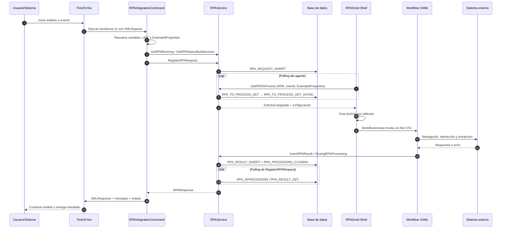

Puntos clave:
- `RegisterRPARequest` prepara el XML operativo desde UDC, inserta la solicitud y llama a `WaitAndGetRPAResponse`.
- `WaitAndGetRPAResponse` consulta aproximadamente cada cinco segundos si la solicitud sigue procesándose.
- El agente obtiene trabajo por polling; TTY no realiza una llamada directa al navegador.
- La selección de trabajo entra por el procedimiento `RPA_TO_PROCESS_GET`, que delega el algoritmo de selección en `RPA_TO_PROCESS_GET_ASYNC` (ver sección 9.2).
- El workflow se ejecuta en un hilo **STA**, relevante para COM, WinForms, WebDriver y UI Automation.
- El resultado se persiste en `RPA_RESULT` antes de ser retornado a TTY. Del lado de TimeToYes, el resultado se consume mediante los sinónimos `RPA_RESULT` (que apunta a la vista `VW_RPA_RESULT` de la base Ozono) y `SYNONYM_OZONO_RPA_RESULT`, lo que permite correlacionar el resultado con la operación de análisis sin acoplar ambas bases directamente.

### 6.2 Estructura lógica del request

El XML que viaja en la columna `XMLREQUEST` usa como raíz `CQCommandParameterList` con un bloque `RPAParameters`. Los procedimientos de cola y selección leen valores concretos mediante XPath sobre esta estructura, por lo que su forma es estable y verificable.

```xml
<CQCommandParameterList>
  <RPAParameters>
    <RPAConfiguration>
      <RPAIdService>SERVICIO_RPA</RPAIdService>
    </RPAConfiguration>
    <ProcessIdentifiers>
      <row IDOPERATION="..." BATCHID="..." BATCHTYPE="..."
           CUSTOMERID="..." CREATEDDATE="..." USERID="usuario.analista"
           MODELID="..." />
    </ProcessIdentifiers>
    <RPAQueryParameters>
      <row ID="..." TYPEID="..." USERID="usuario.analista"
           TIMEOUT_SECONDS="..." BATCHTYPE="..." />
    </RPAQueryParameters>
    <ExtendedProperties>
      <RpaRequestFilters>
        <ROW Path="(/CQCommandParameterList/RPAParameters/RPAConfiguration/RPAIdService/node())[1]"
             Operator="EQUALS" Value="SERVICIO_RPA" />
      </RpaRequestFilters>
    </ExtendedProperties>
  </RPAParameters>
</CQCommandParameterList>
```

- **RPAConfiguration/RPAIdService:** identifica el servicio RPA requerido; es la clave que usa el filtro de seguridad por roles.
- **ProcessIdentifiers/row:** correlación de negocio (operación, lote, cliente, usuario y modelo) como atributos de la fila.
- **RPAQueryParameters/row:** datos funcionales que el robot necesita, incluidos `TIMEOUT_SECONDS` y el identificador de proceso.
- **ExtendedProperties/RpaRequestFilters:** reglas dinámicas para que una instancia tome únicamente las solicitudes compatibles (ver sección 15.4).

> **Nota sobre `USERID`.** El atributo `USERID` aparece tanto en `ProcessIdentifiers/row` como en `RPAQueryParameters/row`. Su valor debe corresponder al usuario analista real de la operación, porque el filtro de seguridad por roles del procedimiento de selección deriva de él los roles autorizados para el servicio. Una solicitud con un `USERID` cuyos roles no incluyan el servicio no será tomada por ninguna instancia, aun cuando existan instancias en ejecución.

### 6.3 Ciclos de estados por tabla

No existe un único ciclo de estados global. En el dominio RPA intervienen cuatro tablas con **ciclos independientes**, cada uno con su propia responsabilidad. Algunas comparten el nombre de un valor —por ejemplo `RUNNING` o `PROCESSING`— pero ese nombre **no significa lo mismo** en cada tabla ni pertenece al mismo ciclo. Esta sección documenta los cuatro ciclos por separado y cierra con las relaciones que sí están demostradas entre ellos.

Cada ciclo se sustenta en la estructura (DDL) de su tabla, en los procedimientos almacenados que la modifican desde `RpaProcess` y en los valores realmente presentes en operación.

#### 6.3.1 `RPA` — ciclo de la instancia (agente)

La tabla `RPA` registra cada instancia de robot por nombre (`RPA_NAME`). Su estado reside en la columna `STATUS`.

- **Valores persistidos:** `RUNNING` (instancia activa y disponible), `BUSY` (instancia activa procesando una solicitud), `CLOSED` (cerrada) y `STOPPED` (detenida). Los cuatro son valores vigentes y en uso.
- **Quién lo escribe:** el estado lo mantiene el Shell mediante `RPA_INSERT`, que opera como *upsert* (alta o actualización por nombre). Lo invoca `RPAHeartBeat.InsertRPAStatusByName` desde dos orígenes: el hilo de latido del Shell (`RPADroid.RPAMonitorRoomRequestTask`, cada `HeartBeatTimeOut`, con un mínimo de 30 s) y `UpdateProgressRPATask`, que se ejecuta en cada actividad del workflow. El procedimiento `RPA_STATUSBYNAME_UPDATE` existe en el código pero no tiene invocadores. Las consultas de disponibilidad usan `RPA_RUNNING_LIST_GET`.
- **`BUSY` — instancia ocupada (estado vigente y en uso):** mientras la instancia tiene una solicitud asignada, `UpdateProgressRPATask` (clase `RPAUtils`) escribe `BUSY` en `dbo.RPA` a través de `RPA_INSERT`, en cada actividad del workflow; al quedar libre, el latido vuelve a `RUNNING`. Es un estado funcional del ciclo de la instancia: la verificación de disponibilidad previa al encolado considera disponibles tanto `RUNNING` como `BUSY` (UDC `RPA_STATUS_AVAILABLE`, por defecto `RUNNING,BUSY`), y el monitoreo por Shell lista las instancias en `RUNNING` o `BUSY`. Que un muestreo puntual capte `BUSY` depende de cuántas instancias estén procesando en ese instante.
- **Estado calculado (no persistido):** además del valor de `STATUS`, la capa de monitoreo deriva en memoria un estado de presentación (`STARTING`, `RUNNING`, `WARNING`, `CLOSED`) combinando `STATUS` con la antigüedad de `LAST_SEARCH_TO_PROCESS` frente al umbral del UDC `VALIDATE_SECONDS_TO_SHELL_RUN`. Estos valores **no se guardan** en la columna; son una lectura derivada para el Command Center. `WARNING` solo existe como valor calculado, mientras que `STARTING` es además el estado inicial que `RPA_INSERT` asigna en el primer alta (transitorio; pasa a `RUNNING` en el siguiente latido).

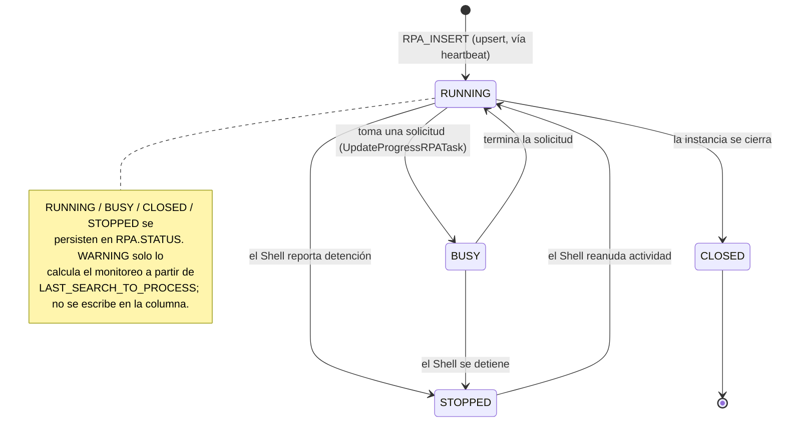

El Shell escribe `RUNNING`/`BUSY` mientras late y `STOPPED` al cerrarse. El procedimiento `RPA_INSERT` es un *upsert* por nombre que, además de fijar `STATUS`, actualiza `LAST_SEARCH_TO_PROCESS = GETDATE()` (la marca de actividad o *keepalive*); en el primer alta de una instancia asigna `STATUS = 'STARTING'` por defecto. El mismo procedimiento realiza mantenimiento de estado: marca `CLOSED` las instancias cuyo último sondeo superó el umbral del UDC `VALIDATE_SECONDS_TO_SHELL_RUN` y `RUNNING` las recientes. Por tanto, `CLOSED` es tanto un valor persistido (por ese mantenimiento) como un valor que el monitoreo puede rederivar.

#### 6.3.2 `RPA_MONITOR_ROOM_RPASHELL` — ciclo del latido (heartbeat) del Shell

Esta tabla registra el latido del RPADroid Shell. Cada latido inserta una fila mediante `RPA_MONITOR_ROOM_RPASHELL_INSERT`, con el usuario, el equipo, la IP, la versión, la lista de servicios y una columna `STATUS`. El Command Center la consulta con `RPA_MONITOR_ROOM_RPASHELL_GET` (por estado), `_GET_PAGINATION` y `_GET_HISTORICAL`.

- **Valores persistidos observados:** `RUNNING` (Shell vivo) y `STOPPED` (Shell detenido).
- **Naturaleza del ciclo:** es un registro por latido; el estado vigente de un Shell es el de su último latido. La sucesión de latidos refleja la vitalidad del proceso.
- **Caducidad automática (confirmada):** la consulta de paginación del Command Center (`RPA_MONITOR_ROOM_RPASHELL_GET_PAGINATION`) marca `STOPPED` los Shells cuyo último latido superó el tiempo de espera del UDC `RPA_MONITOR_ROOM_HEARTBEAT_TIMEOUT` (por defecto 30 s). El estado `STOPPED` no requiere un latido explícito de detención: se deriva por caducidad del latido.
- **Advertencia de nomenclatura:** `RUNNING`/`STOPPED` coinciden en nombre con los de la tabla `RPA`, pero pertenecen a un ciclo distinto. Aquí describen la vitalidad del **proceso Shell**; en `RPA` describen el estado del **agente lógico**. No deben tratarse como el mismo estado.

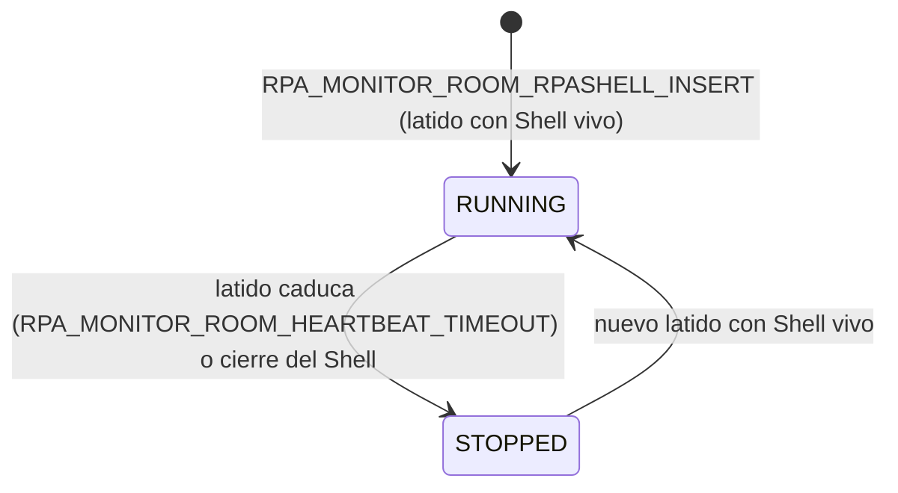

#### 6.3.3 `RPA_REQUEST` — ciclo de la solicitud

`RPA_REQUEST` es el registro maestro e histórico de cada solicitud. Su estado combina la columna de texto `STATUS_ROW` con la bandera booleana `PROCESSING`.

- **Valores de `STATUS_ROW` observados:** `WAITING_TO_PROCESS` (registrada), `PROCESSING` (en atención), `COMPLETE` (cerrada) y `CANCELED FROM RPA COMMAND CENTER BY <usuario>` (cancelada manualmente desde el Command Center).
- **Transiciones y procedimientos:** `RPA_REQUEST_INSERT` crea la solicitud en `WAITING_TO_PROCESS`; la asignación la lleva a `PROCESSING`; `RPA_PROCESSING_CLOSING` la cierra en `COMPLETE`. `RPA_REQUEST_RELEASE` y `RPA_REQUEST_REACTIVATE` devuelven a la cola las solicitudes retenidas.
- **Desenlace separado del estado:** la solicitud se cierra como `COMPLETE` con independencia del resultado del robot. El éxito o el error se guardan en `RPA_RESULT` (`ISSUCCESSFUL`, `USERMESSAGE`, `TECHNICALMESSAGE`), no en `STATUS_ROW`.
- **`PROCESSING` como bandera operativa:** es independiente de `STATUS_ROW` y sirve como control de toma. En operación puede quedar desincronizada; por ello el estado funcional de la solicitud debe leerse de `STATUS_ROW`.

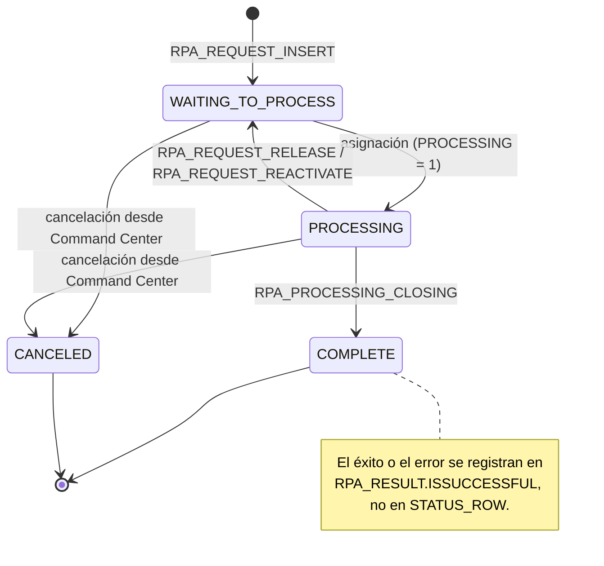

#### 6.3.4 `RPA_TO_PROCESS` — ciclo de la cola de trabajo

`RPA_TO_PROCESS` es la cola de trabajo pendiente. Comparte columnas con `RPA_REQUEST` (`STATUS_ROW`, `PROCESSING`), pero cada fila representa un elemento **de cola**, no el histórico de la solicitud.

- **Alta en la cola:** el trigger `TRG_RPA_REQUEST` copia cada solicitud nueva con `PROCESSING = 0` y `STATUS_ROW = 'WAITING_TO_PROCESS'`.
- **Toma:** `RPA_TO_PROCESS_GET` selecciona la siguiente fila y la marca `PROCESSING = 1` / `STATUS_ROW = 'PROCESSING'`. Al cerrar, `RPA_PROCESSING_CLOSING` elimina la fila de la cola.
- **Valores observados:** `WAITING_TO_PROCESS` y `PROCESSING`. En una base se observaron filas `COMPLETE` retenidas en la cola (política de purga distinta) y, en otras, filas atascadas en `PROCESSING` sin instancia activa que las drene. Son anomalías operativas, no estados adicionales del ciclo.

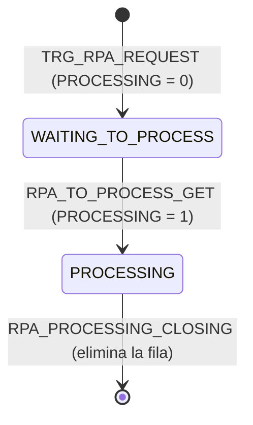

#### 6.3.5 Relaciones demostradas entre los ciclos

Los cuatro ciclos son independientes, pero participan en la misma operación. Solo se documentan las relaciones respaldadas por el trigger, los procedimientos y los registros.

- **Solicitud ↔ cola.** Cada fila de `RPA_REQUEST` origina, vía el trigger `TRG_RPA_REQUEST`, una fila en `RPA_TO_PROCESS`. La toma (`RPA_TO_PROCESS_GET`) marca `STATUS_ROW = 'PROCESSING'` en **ambas** tablas; el cierre (`RPA_PROCESSING_CLOSING`) elimina la fila de la cola y deja la solicitud en `COMPLETE`. La cola es transitoria; la solicitud permanece como histórico.
- **Solicitud ↔ resultado.** Al finalizar, `RPA_RESULT_INSERT` guarda el desenlace en `RPA_RESULT`. El estado `COMPLETE` de la solicitud es independiente del éxito (`ISSUCCESSFUL`).
- **Instancia ↔ latido.** Una misma máquina Shell actualiza `RPA` (agente) y `RPA_MONITOR_ROOM_RPASHELL` (latido). Ambos pueden mostrar `RUNNING` a la vez, pero describen cosas distintas: el agente lógico y la vitalidad del proceso.
- **Instancia ↔ latido y disponibilidad.** La vitalidad de la instancia (`RPA.STATUS` y `LAST_SEARCH_TO_PROCESS`) la mantiene el mecanismo de latido: el hilo `RPADroid.RPAMonitorRoomRequestTask` y `UpdateProgressRPATask` invocan `RPA_INSERT` (upsert). Ese estado es el que consultan las verificaciones de disponibilidad previas al encolado (`GetRPARunning` → `RPA_RUNNING_LIST_GET`). La actualización de `LAST_SEARCH_TO_PROCESS` sucede dentro del procedimiento (inferencia).

<a id="7-capa-timetoyes-y-rpaintegrationcommand"></a>
## 7. Capa TimeToYes y RPAIntegrationCommand

### 7.1 Responsabilidad

`RPAIntegrationCommand` hereda de `CQCommandDataSource` y adapta el motor TTY al servicio RPA. No opera el navegador; prepara, valida y consume.

- Obtener XML request desde la sentencia o configuración predeterminada.
- Resolver variables del contexto y propiedades dinámicas.
- Leer UDC de definición, seguridad, timeout, respuesta y notificaciones.
- Validar `IdService` y `EXECUTE_RPA_SERVICE`.
- Consultar agentes activos y cantidad de requests pendientes.
- Registrar solicitud mediante `RegisterRPARequest`.
- Aplicar expiración y clonación de resultados previos.
- Normalizar `XMLRESPONSE`, `UserMessage`, `TechnicalMessage` y estado.
- Enviar alertas cuando no hay agentes o falla el servicio.
- Registrar trazas cuando `RPA_SERVICE_DEBUG_ENABLE` está activo.

### 7.2 Disponibilidad y timeout

TTY verifica disponibilidad antes de registrar el request. Un agente `RUNNING` puede estar ocupado y la existencia de una instancia no garantiza atención inmediata.

| Capa | Parámetro | Efecto |
|---|---|---|
| Sentencia/TTY | `TIMEOUT_SECONDS` | Tiempo lógico de la operación de modelo. |
| RPAService | `WaitingInterval` | Cantidad de ciclos de polling; cada ciclo utiliza aproximadamente cinco segundos. |
| RPADroid | `TimeOutTimeSeconds` | Tiempo máximo del workflow en el hilo. |
| Activity | `WAIT_ACTIVITY_TIMEOUT_SECONDS` | Tiempo base de operaciones individuales. |
| Sitio externo | reintentos/esperas UDC | Tiempo de navegación, captcha, sesión o diálogo. |

Los timeouts deben dimensionarse de afuera hacia adentro: consumidor > servicio > workflow > Activity. Una configuración incoherente puede hacer que TTY expire mientras el robot continúa procesando.

### 7.3 Expiración y clonación

El Core puede reutilizar resultados exitosos existentes mediante UDC `[SERVICIO]_RPA_RESULTVALIDATION` y políticas de expiración.
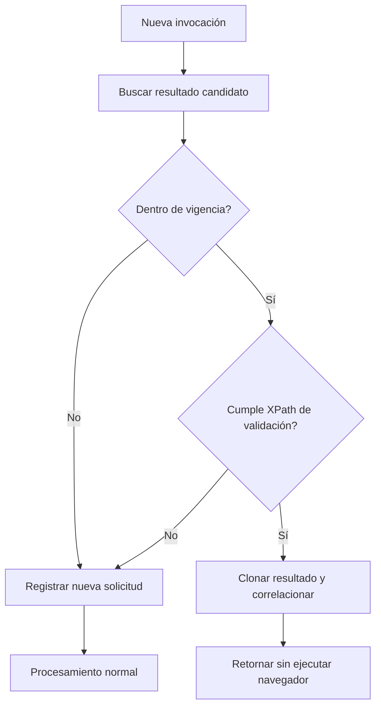

<a id="8-capa-wcf-contratos-implementacion-proxy-y-api"></a>
## 8. Capa WCF: contratos, implementación, proxy y API

### 8.1 Componentes

| Componente | Rol | Detalle |
|---|---|---|
| `IRPAService` (proyecto `RPAServiceContracts`) | Contrato interno | Define 41 operaciones con `[OperationContract]` en `IRPAService.cs`. |
| `RPAImpl.RPAService` (proyecto `RPAImpl`) | Implementación | Clase `Apptividad.Ozono.RPAImpl.RPAService : IRPAService` con `[ServiceBehavior(ConcurrencyMode.Multiple, InstanceContextMode.PerCall, IncludeExceptionDetailInFaults = true)]`. Delega toda la lógica en `Apptividad.Ozono.RPA.RpaProcess`. |
| `RPAService.svc` (proyecto `RPAService`) | Host WCF | Proyecto de publicación que activa la clase `RPAImpl.RPAService`. Incluye `Web.config` con el binding `WSHttpBinding_IRPAService` y transformaciones por ambiente. |
| `RPAServiceProxy.RPA` | Wrapper cliente | Clase `RPA` en `RPAServiceProxy\RPA.cs`; crea el cliente, invoca la operación y ejecuta `Abort()` ante excepción. Contrato `RPAServiceReference.IRPAService`. |
| `Apptividad.Ozono.RPA.Api.RPA` | Fachada reducida | Expone eco, pruebas, registro de request, agentes y respuestas. |

### 8.2 Concurrencia y estado

El servicio es por llamada y admite concurrencia múltiple. El código advierte que no deben mantenerse variables globales de estado en el servicio. La fuente de verdad es la base de datos y los objetos de request/response.

- Las operaciones deben ser reentrantes o aislar su estado.
- Los clientes WCF deben cerrar o abortar correctamente el canal.
- Los bindings, AppPool/IIS y SQL deben dimensionarse para llamadas largas.
- `IncludeExceptionDetailInFaults = true` facilita diagnóstico, pero debe revisarse en producción.

### 8.3 Agrupación funcional de operaciones

| Grupo | Cantidad | Propósito |
|---|---:|---|
| Catálogo, seguridad y estado de agentes | 5 | Resolver roles, privilegios, entidades y estado nominal. |
| Ciclo de vida de solicitudes y resultados | 12 | Registrar, tomar, cerrar, consultar, liberar, reactivar, expirar y clonar. |
| Diagnóstico y configuración | 2 | Validar endpoint, logging, Watchman y correo. |
| Histórico, paginación y administración de cola | 8 | Consultar históricos, paginar, contar y liberar. |
| Monitoreo, heartbeat y control remoto | 9 | Consultar agentes, heartbeat y acciones del Command Center. |
| Versionado de RPADroid Shell | 5 | Registrar, validar, actualizar y listar paquetes/versiones. |

<a id="9-persistencia-cola-y-procedimientos-almacenados"></a>

### 8.4 Diferencia entre servicio WCF interno, proxy y fachada API

El término **API** no representa una tecnología única dentro de esta solución:

| Elemento | Interfaz técnica | Consumidores principales | Observación |
|---|---|---|---|
| `IRPAService` / `RPAService.svc` | Contrato WCF con operaciones SOAP según el binding configurado | TTY, RPADroid Shell, Command Center y servicios internos | Es la superficie completa del dominio RPA. |
| `RPAServiceProxy` | Cliente WCF generado y encapsulado | Código .NET interno | Gestiona creación del canal y `Abort()` cuando la llamada falla. |
| `Apptividad.Ozono.RPA.Api.IRPA` | Servicio WCF con `WebInvoke` JSON para `echo` y `TestConfiguration`, más operaciones de contrato | Integradores o consumidores que requieren una fachada reducida | No debe asumirse que toda la solución sea REST; solo ciertas operaciones declaran URI y formato JSON. |
| Procedimientos almacenados | Interfaz SQL interna | `RpaProcess` y procesos autorizados | Constituyen una API de persistencia, no una API HTTP. |

Por tanto, **WCF** es el framework de comunicación, **SOAP/HTTP o WebInvoke/JSON** son posibles formas de transporte/exposición, y el **proxy** es el cliente .NET que abstrae el canal. Los archivos de configuración (`RPAServiceProxy\app.config` y `RPAService\Web.config` con sus transformaciones por ambiente) definen el binding `WSHttpBinding_IRPAService`; los protocolos, la seguridad de transporte y los tamaños máximos concretos dependen del ambiente y deben confirmarse en el `*.config` correspondiente.

## 9. Persistencia, cola y procedimientos almacenados

### 9.1 Modelo lógico de datos

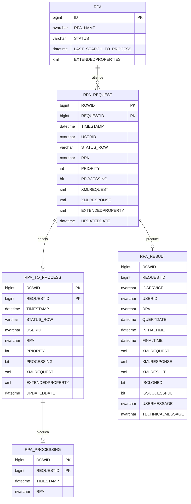

La estructura anterior corresponde al esquema (DDL) de las tablas. Cada tabla cumple un rol distinto y complementario:

- **`RPA_REQUEST`** conserva el registro maestro de cada solicitud. Su clave es la pareja `ROWID` (identidad autoincremental) y `REQUESTID` (identificador de la operación de negocio).
- **`RPA_TO_PROCESS`** es la cola de trabajo pendiente. Comparte clave con `RPA_REQUEST` y es la tabla que consultan las instancias para tomar trabajo.
- **`RPA_PROCESSING`** es una tabla de control que evita que dos instancias tomen la misma solicitud. Se inserta al asignar y se elimina al cerrar el procesamiento.
- **`RPA_RESULT`** almacena el resultado final: `ISSUCCESSFUL`, `XMLRESULT`, `USERMESSAGE`, `TECHNICALMESSAGE` y las marcas de tiempo `INITIALTIME`/`FINALTIME`. `ISCLONED` indica si el resultado se reutilizó de una ejecución previa.
- **`RPA`** es el registro de instancias. Cada fila representa una instancia por nombre (`RPA_NAME`), su `STATUS` y sus `EXTENDEDPROPERTIES` de filtrado.

> **Nota.** La tabla `RPA_REQUEST` no contiene una columna `IDSERVICE`; el servicio requerido viaja dentro de `XMLREQUEST`, en `RPAConfiguration/RPAIdService`. Solo `RPA_RESULT` materializa `IDSERVICE` como columna.

### 9.2 Funciones de la cola

- **Registro:** `RPA_REQUEST_INSERT` inserta la solicitud únicamente en `RPA_REQUEST` con prioridad, estado inicial `WAITING_TO_PROCESS`, XML de configuración y propiedades extendidas. El trigger `TRG_RPA_REQUEST` (AFTER INSERT sobre `RPA_REQUEST`) copia automáticamente la fila a la cola `RPA_TO_PROCESS` con `PROCESSING = 0`.
- **Selección:** la instancia llama a `RPA_TO_PROCESS_GET`, que recibe el nombre de la instancia, el usuario y sus `ExtendedProperties`, y delega la selección en `RPA_TO_PROCESS_GET_ASYNC` (descrito abajo).
- **Asignación:** al seleccionar una fila, el procedimiento la marca `PROCESSING = 1` y `STATUS_ROW = 'PROCESSING'` en `RPA_TO_PROCESS` y `RPA_REQUEST`, e inserta la pareja `ROWID`/`REQUESTID` en `RPA_PROCESSING` para impedir una segunda toma.
- **Finalización:** `RPA_RESULT_INSERT` guarda el resultado y `RPA_PROCESSING_CLOSING` actualiza el request y elimina el registro de `RPA_TO_PROCESS` y `RPA_PROCESSING`.
- **Liberación/reactivación:** `RPA_REQUEST_RELEASE` y `RPA_REQUEST_REACTIVATE` devuelven solicitudes bloqueadas o las reabren; existe además un job `REACTIVATE_RPA_REQUEST`.
- **Limpieza:** Command Center cancela solicitudes antiguas y conserva histórico en `RPA_REQUEST_HISTORICAL`.
- **Consulta:** filtros, paginación, conteos por servicio e histórico.

**Algoritmo de selección (`RPA_TO_PROCESS_GET_ASYNC`).** El procedimiento aplica, en orden, los siguientes criterios sobre `RPA_TO_PROCESS`:

1. **Estado y ventana temporal.** Considera únicamente filas con `STATUS_ROW = 'WAITING_TO_PROCESS'` y `TIMESTAMP` dentro de una ventana reciente. Ambos valores provienen del UDC `OZONO_RPA_CONFIG` (`PARAMETROS_RPA_TO_PROCESS` y `PARAMETROS_RPA_TO_PROCESS_FILTER`).
2. **Orden de atención.** Ordena por `TIMESTAMP DESC, PRIORITY DESC, ID ASC, TYPEID ASC`. La prioridad de una solicitud que superó su `TIMEOUT_SECONDS` se reduce a `-1`.
3. **Horario de masivos.** El procedimiento `GET_TYPE_TO_PROCESS_NEXTID` define si en ese momento solo se atienden solicitudes individuales o también lotes (`BATCHTYPE`).
4. **Filtros de la instancia (`ExtendedProperties`).** Convierte los `RpaRequestFilters` recibidos en condiciones sobre `XMLREQUEST`, evaluando `Path`, `Operator` (`EQUALS` → `IN`, `NOT_EQUALS` → `NOT IN`) y `Value`. También excluye las solicitudes que corresponden a los filtros de **otras** instancias en ejecución, para no tomar trabajo dirigido a ellas.
5. **Seguridad por roles.** A partir del usuario (`GET_ROLES_BY_USERNAME`), obtiene sus roles y exige que el `RPAIdService` de la solicitud figure entre los servicios permitidos para esos roles en el UDC `OZONO_RPA_SECURITY_CONFIG` (`UDCVALUEA` = servicio, `UDCVALUEB` = roles autorizados). El comodín `*` habilita todos los servicios.
6. **Anti-duplicado y concurrencia.** Descarta filas ya presentes en `RPA_PROCESSING` y protege la sección crítica con `sp_getapplock`. El número de hilos concurrentes lo define el UDC `RPA_TO_PROCESS_THREAD` (valor por defecto 4).
7. **Registro de la instancia.** Como último paso llama a `RPA_INSERT` para registrar o actualizar la instancia solicitante en la tabla `RPA`.

### 9.3 Idempotencia y correlación

- `RequestId`: operación o consumo de negocio.
- `RowId`: identificador interno de la cola.
- `IdService`: tipo de robot requerido.
- `RPA`: instancia que tomó el trabajo.
- `TaskId`: tarea local dentro del Shell.
- `UserId`, `ModelId`, `BatchId`, `BatchType` y `CustomerId`: dimensiones de negocio.

Para evitar duplicados, el consumidor debe usar un `RequestId` estable y el Core debe validar requests existentes, clonación y estados antes de insertar o reactivar.

<a id="10-rpadroid-shell-y-gestor-de-tareas"></a>
## 10. RPADroid Shell y gestor de tareas

### 10.1 Naturaleza del componente

`Apptividad.Ozono.RPA.UI.exe` es una aplicación Windows Forms que hospeda el runtime RPA en la máquina de ejecución.

- Login y validación de credenciales/SSO.
- Carga de privilegios, servicios y configuración del perfil.
- Inicio y detención de instancias por `IdService`.
- Gestión de tareas normales y KeepAlive.
- Visualización de logs, navegadores, settings y estado.
- Recuperación de requests pendientes.
- Ejecución de workflows por reflexión.
- Heartbeat hacia Monitor Room.
- Recepción de acciones remotas del Command Center.
- Envío de logs, capturas y mensajes.
- Validación y actualización de versión del Shell.

### 10.2 Inicio de una instancia

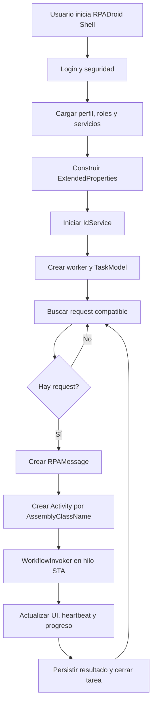

### 10.3 Reflexión y carga del workflow

`TaskManager` utiliza `ASSEMBLY_CLASS_NAME`:

1. Valida formato `Clase, Ensamblado`.
2. Usa `Activator.CreateInstance(assemblyName, typeName).Unwrap()`.
3. Confirma que el objeto sea `System.Activities.Activity`.
4. Busca la propiedad `rpaMessage` y le inyecta `InArgument<RPAMessage>`.
5. Invoca `WorkflowInvoker.Invoke` en un hilo STA.

Esto permite desplegar nuevos workflows sin modificar el Shell, siempre que el ensamblado exista y la UDC apunte a la clase correcta.

### 10.4 Modelo de tareas

| Tipo | Comportamiento | Uso |
|---|---|---|
| **Normal** | Toma un request, ejecuta, persiste y finaliza. | Consultas o transacciones independientes. |
| **KeepAlive** | Conserva navegador/sesión y atiende múltiples requests. | Autenticación costosa, certificado o sesión persistente. |
| **Acción Monitor Room** | Ejecuta una orden remota sobre Shell o tarea. | Reinicio, cancelación, logs, captura o mensaje. |

### 10.5 Hilos y cancelación

El Shell combina `BackgroundWorker`, `Thread`, `Task`, eventos de progreso y banderas de cancelación. El workflow se ejecuta en un hilo separado y el código puede usar abortado abrupto al exceder timeout.

- `Thread.Abort` puede dejar COM, archivos o sesiones inconsistentes.
- La mezcla de modelos de concurrencia aumenta la complejidad.
- WebDriver, COM y UI deben crearse y liberarse en contexto apropiado.
- Recovery debe cerrar navegador, liberar request y limpiar sesiones guardadas.

<a id="11-windows-workflow-foundation-xaml-y-maquinas-de-estados"></a>
## 11. Windows Workflow Foundation, XAML y máquinas de estados

### 11.1 Modelo de ejecución

Cada robot es una `Activity` raíz compilada desde XAML. Los XAML declaran:
- Argumentos `InArgument`, `OutArgument` e `InOutArgument`.
- Variables locales.
- Activities estándar: `Sequence`, `Assign`, `If`, `While`, `TryCatch`, `Throw`, `InvokeMethod` y `StateMachine`.
- Activities personalizadas del Core.
- Expresiones C# mediante `Microsoft.CSharp.Activities`.
- Referencias de ensamblado necesarias para compilación y diseño.

### 11.2 Convención de argumentos

| Dirección | Convención | Semántica |
|---|---|---|
| Entrada | `InNombre` | Consume un valor. |
| Salida | `OutNombre` | Produce un valor. |
| Entrada/salida | `InOutNombre` | Comparte y modifica un valor. |
| Opcional | sufijo `OPTIONAL` | Puede omitirse y requiere valor seguro. |

### 11.3 Patrón de máquina de estados

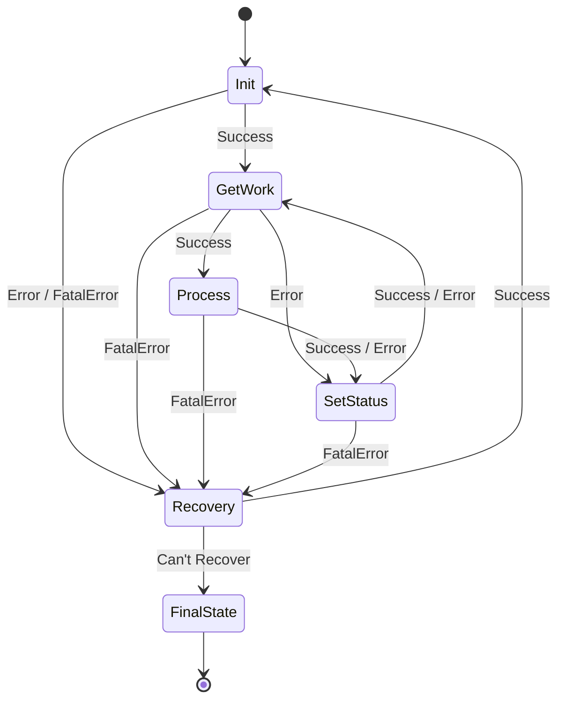

Las transiciones anteriores están confirmadas contra la implementación (por ejemplo, `ConsultaCCSS_SM\Main.xaml`) y contra el documento de diseño de robots. Cada transición lleva el nombre `Success`, `Error`, `FatalError` o `Can't Recover`. Conviene destacar tres reglas que suelen malinterpretarse:

- Un **error no fatal** en `GetWork` o `Process` no va a `Recovery`, sino a `SetStatus`. De esta forma el robot registra el desenlace de la transacción y vuelve a `GetWork` para continuar con la siguiente.
- Solo el **error fatal** (`FatalError`) escala a `Recovery`, que intenta recrear el contexto y, si lo logra (`Success`), regresa a `Init`.
- El estado final (`FinalState`) se alcanza únicamente desde `Recovery` cuando la recuperación no es posible (`Can't Recover`).

El sub-workflow `KeepAlive` opera dentro de `GetWork`: la instancia mantiene el navegador y la sesión mientras espera nuevas solicitudes, sin abandonar el estado. Algunos robots sencillos (por ejemplo, DOWNLOAD_FILES y EMAIL_ALERT) inician directamente en `GetWork`.

### 11.4 Responsabilidad de los estados

| Estado | Responsabilidad típica |
|---|---|
| Init | Cargar UDC, crear/reutilizar contexto, abrir navegador, autenticar y validar sitio. |
| GetWork | Keep-alive, consultar cola y cargar request en `RPAMessage`. |
| Process | Ejecutar negocio, extraer datos, cargar archivos y formar resultado. |
| SetStatus | Persistir resultado, cerrar request y decidir continuidad. |
| Recovery | Registrar excepción, limpiar/recrear contexto, reautenticar y reintentar. |
| FinalState | Liberar recursos y finalizar. |

<a id="12-framework-de-activities-del-core"></a>
## 12. Framework de Activities del Core

### 12.1 Jerarquía

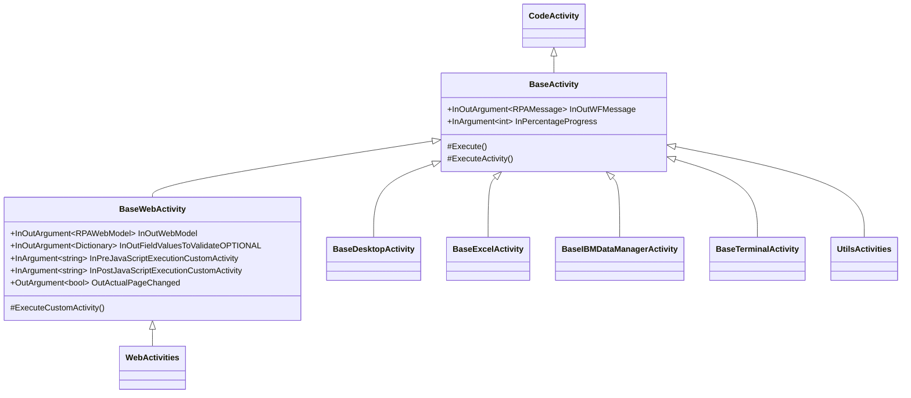

### 12.2 BaseActivity

- Obtiene y valida `RPAMessage`.
- Asigna `StepName` desde `DisplayName`.
- Registra inicio y fin.
- Configura timeout predeterminado.
- Valida y reporta progreso.
- Actualiza estado en Shell.
- Ejecuta lógica solo si `IsSuccessful` sigue verdadero.
- Mide tiempo por Activity en debug.
- Propaga error si el mensaje termina fallido.

La opción `IsStopActivityWhenTimeOut` intenta ejecutar la Activity en una tarea separada. En el código, llamadas de espera y propagación aparecen comentadas; el comportamiento debe verificarse con pruebas porque podría iniciar lógica asíncrona sin bloquear de forma correcta.

### 12.3 BaseWebActivity

- Contexto `RPAWebModel` con navegador y metadatos de sesión.
- Diccionario de validaciones opcionales.
- JavaScript previo y posterior.
- Foco opcional de ventana.
- Control de carga, forms/frames y cambio de página.
- Manejo diferenciado de excepciones COM.
- Creación, validación, reinicio y limpieza de Selenium Edge.
- Cierre de procesos `msedge` y `msedgedriver` cuando se fuerza limpieza.

### 12.4 Otras clases base

| Clase | Contexto | Capacidades |
|---|---|---|
| `BaseDesktopActivity` | `AutomationElement` | Búsqueda por Id/nombre/propiedades, click, lectura y escritura nativa. |
| `BaseExcelActivity` | `RPAExcelModel` | Workbook y cierre de instancia Excel. |
| `BaseIBMDataManagerActivity` | `RPAIBMDataModel` | Contexto de IBM Data Manager. |
| `BaseTerminalActivity` | `RPATerminalModel` | Contexto de terminal. |
| `BaseExternalWebActivity` | No implementado | Placeholder/compatibilidad. |

### 12.5 Patrón de una CustomActivity

```csharp
public sealed class ExampleActivity : BaseActivity
{
    public InArgument<string> InValue { get; set; }
    public OutArgument<bool> OutResult { get; set; }

    public ExampleActivity() : base() { }
    internal ExampleActivity(RPAMessage pMessage) : base(pMessage) { }

    protected override void ExecuteActivity(CodeActivityContext pContext)
    {
        RunContext(pContext.GetValue(InValue), out bool vResult);
        pContext.SetValue(OutResult, vResult);
    }

    internal void RunContext(string pValue, out bool pResult)
    {
        pResult = !string.IsNullOrWhiteSpace(pValue);
    }
}
```

El estándar separa la adaptación WWF (`ExecuteActivity`/`ExecuteCustomActivity`) de la lógica testeable (`RunContext`), con constructor público vacío y constructor `internal` para pruebas.

<a id="13-automatizacion-web-y-ciclo-de-vida-del-navegador"></a>
## 13. Automatización web y ciclo de vida del navegador

### 13.1 Modos de navegador

| Modo | Evidencia | Estado |
|---|---|---|
| Selenium Edge | `OpenQA.Selenium`, `WebDriver`, helpers Selenium y EdgeDriver | Mecanismo principal actual. |
| IE/MSHTML/SHDocVw | `mshtml`, `Interop.SHDocVw`, helpers y BAT heredados | Compatibilidad histórica. |
| Navegador interno | `RPAHelperBrowserInternal` | Disponible según UDC/robot. |

### 13.2 Creación y limpieza de Edge

1. Construir `RPAWebModel` con tipo Selenium Edge.
2. Invocar helper de creación y capturar IDs de procesos.
3. Reintentar y distinguir errores de driver.
4. Al limpiar: `Quit`, `Dispose`, liberar COM y eliminar procesos residuales.

El changelog confirma actualización automática de EdgeDriver y una fuente alternativa administrada. La versión mayor del driver debe coincidir con la versión mayor de Edge.

### 13.3 Interacción con el DOM

- Identificación por Id, atributo, XPath, regex y HTML/iframe.
- Click con espera, click sin espera y click con validación.
- Lectura y escritura de valores.
- Selección de checkbox.
- Extracción de tablas, imágenes, HTML, XML y regex.
- JavaScript antes y después de la Activity.
- Control de alertas, popups, campos dinámicos y título.
- Validación del documento y del sitio.

### 13.4 Cambios externos y robustez

Un cambio externo puede afectar identificadores, DOM, autenticación, sesión expirada, popups, formularios o reportes. La mitigación combina selectores configurables por UDC, regex tolerantes, errores conocidos, reintentos, recarga de URL y recuperación de sesión.

<a id="14-modelo-de-datos-y-contexto-de-ejecucion"></a>
## 14. Modelo de datos y contexto de ejecución

| Objeto | Papel | Datos observados |
|---|---|---|
| `RPAMessage` | Contexto mutable del workflow/tarea | RPAInfo, éxito, mensajes, step, debug, retries, timeout, keep-alive, cancelación, progreso y navegador. |
| `RPAInfoRequest` | DTO interno de solicitud | RowId, RequestId, IdService, prioridad, estado, XMLRequest, XMLResponse, XmlResult, ExtendedProperty, usuario y tiempos. |
| `RPAInfoResponse` | DTO de respuesta de cola | Correlación, estado, código y mensajes. |
| `RPARequest` | Contrato público de registro | IdService, RequestId, UserId, ProcessIdentifiers, QueryParameters, Priority y WaitingInterval. |
| `RPAResponse` | Respuesta pública | RowId, RequestId, IdService, XmlResult, IsSuccessful, Code, UserMessage y TechnicalMessage. |
| `RPAWebModel` | Contexto de navegador | Tipo, flag externo, WebDriver, procesos y estado. |
| `RPAContextModel` | Contenedor de contexto | TaskId, tipo y objeto para reutilización/limpieza. |
| `RPAUserShellInfo` | Identidad y diagnóstico | Usuario, certificado, custom credentials, ExtendedProperties, versión, equipo, IP, CPU, RAM, red, SO y ambiente. |

### 14.1 RPAMessage como bus de contexto

`RPAMessage` es un **context object** compartido. Las Activities lo reciben por `InOutArgument`, lo actualizan y permiten que el Shell observe progreso y errores sin acoplar cada Activity a la interfaz.

- No debe ser `null`.
- Mensajes funcionales y técnicos deben mantenerse separados.
- `IsSuccessful` controla la continuidad.
- Cancelación y working state deben ser consistentes.
- El XML result debe permanecer válido incluso ante error.
- Datos sensibles deben excluirse de logs.

<a id="15-configuracion-udc"></a>
## 15. Configuración UDC

### 15.1 Familias por servicio

| Familia | Visibilidad | Contenido |
|---|---|---|
| `[SERVICIO]_RPA_DEF` | Privada | Ejecución, workflow, navegador, URL, captcha, sesiones, reintentos y referencias. |
| `[SERVICIO]_RPA_RESPONSE` | Privada | Mapeo de datos: TargetId, SourceId y SourceType. |
| `[SERVICIO]_RPA_RESULTVALIDATION` | Pública/privada | XPath para reutilizar o clonar resultados. |
| `[SERVICIO]_RPA_TTY_CONFIG` | Pública/privada | Activación, request/response y tiempos. |
| `OZONO_RPA_SECURITY_CONFIG` | Pública/privada | Referencia de servicio, roles y seguridad. |
| `OZONO_RPA_CONFIG` | Global | Shell, Activities, monitor, logs, versiones, timeout y correo. |
| `COMMAND_CONFIGURATION` | Modelo/sentencia | Registro de `HTMLCommand` y correlativo. |
| `EXPIRATION` | Global/servicio | Vigencia para reutilizar resultados. |

### 15.2 Parámetros esenciales de `[SERVICIO]_RPA_DEF`

| UDCID | Función | Riesgo |
|---|---|---|
| `ASSEMBLY_CLASS_NAME` | Clase y ensamblado raíz. | No se puede crear el robot. |
| `ID_SERVICE` | Identificador funcional y de cola. | Enrutamiento incorrecto. |
| `URL` | Sitio objetivo. | Ambiente o endpoint incorrecto. |
| `CONTEXT_MODEL_TYPE` | Tipo de contexto/navegador. | Incompatibilidad con Activities. |
| `USE_EXTERNAL_BROWSER` | Navegador externo. | Comportamiento diferente. |
| `KEEP_ALIVE` | Sesión persistente. | Pérdida de sesión o consumo excesivo. |
| `MAX_SESSIONS` | Sesiones simultáneas. | Saturación o subutilización. |
| `MAX_RETRY_NUMBER` | Reintentos. | Bucles o poca resiliencia. |
| `RESTART_DELAY` | Espera entre ciclos. | Polling agresivo o latencia. |
| `TIMEOUT_TO_CLOSE_SESSION` | Expiración de sesión. | Sesiones caducadas o reinicios frecuentes. |
| `FOCUS_WEB_BROWSER` | Mantener navegador al frente. | Interferencia o fallo de UI Automation. |
| `CAPTCHA_ENABLED` | Presencia de captcha. | Bloqueo o consumo innecesario. |
| `CAPTCHA_AUTOMATIC` | Modo automático/manual. | Espera indefinida o uso no autorizado. |
| `CAPTCHA_RETRY` | Reintentos de captcha. | Bloqueos o costo excesivo. |
| `AUTOMATIC_WEB_CERTIFICATE` | Selección automática de certificado. | Selección errónea o intervención. |
| `UDC_CONFIG_XML_RESPONSE` | Mapeo de respuesta. | Resultado vacío/incompleto. |
| `UDC_CONFIG_RESULT_VALIDATION` | Validación de clonación. | Reutilización incorrecta. |

### 15.3 Parámetros globales relevantes

| UDCID | Función |
|---|---|
| `WAIT_ACTIVITY_TIMEOUT_SECONDS` | Timeout base de Activities. |
| `RETRIES_BY_ACTIVITY` | Reintentos por Activity. |
| `CHECK_WEBSITE_STATUS` | Validación de sitio. |
| `SEND_EMAIL_ERROR_NOTIFICATION` | Alertas y destinatarios. |
| `SAVE_LOG_RESULT` | Persistencia/retención de log. |
| `RPA_SERVICE_DEBUG_ENABLE` | Trazas del servicio. |
| `RPA_MONITOR_ROOM_ENABLE` | Heartbeat y control remoto. |
| `RPA_MONITOR_ROOM_HEARTBEAT_TIMEOUT` | Frecuencia/timeout de heartbeat. |
| `RPA_MONITOR_ROOM_LOG` | Adjuntar log/XML al heartbeat. |
| `RPA_MONITOR_ROOM_REQUEST_QUEUE` | Limpieza de requests antiguos. |
| `RPA_MONITOR_ROOM_ACTION_EXPIRATION` | Expiración de acciones. |
| `RPA_SHELL_RUNTIME_PATH` | Ruta raíz del runtime. |
| `RPA_SHELL_VERSION_ENABLE` | Gestor de versiones. |
| `RPA_SHELL_VERSION_ALLOWED_EXTENSIONS` | Extensiones permitidas. |
| `SCHEDULE_RESTART_BAT` | Reinicio programado. |
| `STOP_ACTIVITY_WHEN_TIMEOUT` | Control ante timeout. |
| `WAIT_SECONDS_TO_START_RPA_INSTANCE` | Espaciado al iniciar instancias. |
| `VALIDATE_SECONDS_TO_SHELL_RUN` | Ventana para determinar Shell activo. |

### 15.4 ExtendedProperties

Permiten que una instancia tome únicamente las solicitudes compatibles. Los filtros se declaran bajo `ExtendedProperties/RpaRequestFilters` como filas `ROW`. Cada fila define un `Path` (una expresión XPath completa sobre `XMLREQUEST`), un `Operator` y un `Value`. El procedimiento de selección traduce `EQUALS` a `IN` y `NOT_EQUALS` a `NOT IN`. Cuando el `Value` contiene una lista separada por comas, se evalúa como conjunto.

Sin filtros adicionales, el criterio predeterminado es el servicio (`RPAIdService`). Una configuración adicional puede restringir por usuario, cédula, modelo u otros valores presentes en `ProcessIdentifiers` o `RPAQueryParameters`.

```xml
<ExtendedProperties>
  <RpaRequestFilters>
    <ROW Path="(/CQCommandParameterList/RPAParameters/RPAConfiguration/RPAIdService/node())[1]"
         Operator="EQUALS" Value="SERVICIO_RPA" />
    <ROW Path="(/CQCommandParameterList/RPAParameters/RPAQueryParameters/row/@USERID)[1]"
         Operator="EQUALS" Value="usuario.analista" />
  </RpaRequestFilters>
</ExtendedProperties>
```

Estos filtros viajan en la columna `EXTENDEDPROPERTIES` de la tabla `RPA` (por instancia) y también se reciben como parámetro del procedimiento de selección. La combinación de los filtros propios y los de las demás instancias en ejecución determina qué solicitud toma cada instancia.

<a id="16-attachments-documentos-pdf-excel-y-archivos"></a>
## 16. Attachments, documentos, PDF, Excel y archivos

### 16.1 Attachments

- Descarga y validación de attachments de TTY/Ozono.
- Filtros por tipo, modelo, fecha, extensión y tamaño.
- Conversión bytes/Base64.
- Creación de documentos desde imágenes.
- Compresión de PDF/imágenes.
- Reportes y archivos temporales.
- Carga por HTML input o diálogo nativo.
- Logs y capturas como attachments técnicos.

### 16.2 PDF

| Librería | Uso |
|---|---|
| iTextSharp | Crear, firmar, combinar, copiar páginas y manipular PDF. |
| PdfPig | Extraer y analizar texto/layout. |
| ExpertPdf.HtmlToPdf | Convertir HTML a PDF. |
| BouncyCastle | Certificados X.509 y criptografía para firma. |

`SplitPDFActivity` identifica páginas iniciales por regex, crea documentos de destino y copia páginas hasta la siguiente coincidencia. Si solo genera un archivo, lo elimina porque no hubo división útil.

### 16.3 Excel

Los XAML y el código referencian FlexCel y modelos Excel. Las Activities obtienen plantillas, agregan datos y administran workbooks. `BaseExcelActivity` contiene cierre explícito para prevenir procesos huérfanos.

### 16.4 Sistema de archivos y rutas

- `C:\Apptividad\Runtime\` — raíz operativa.
- `C:\Apptividad\Runtime\RPADroid\` — instalación fija del Shell.
- `C:\Apptividad\Runtime\RPACacheFolder\` — caché.
- `C:\Apptividad\Runtime\Captcha\` — imágenes captcha.
- `C:\Apptividad\Runtime\Images\` — imágenes técnicas.
- `C:\Apptividad\Runtime\RPAResultHTML\` — HTML de resultados/errores.
- `C:\ApptividadAttachments\` — attachments predeterminados.

Las rutas absolutas reducen portabilidad. La guía advierte que mover `C:\Apptividad\Runtime\RPADroid` puede romper carga de librerías y scripts.

<a id="17-captcha-y-aprovisionamiento"></a>
## 17. Captcha y aprovisionamiento

### 17.1 Modos

| Modo | Componentes | Comportamiento |
|---|---|---|
| Manual | `WaitUntilCaptchaResolvedActivity` | El usuario resuelve y confirma; puede existir timeout o cierre automático. |
| Automático directo | `ResolveCaptchaActivity`, Decaptcha | Captura metadata/imagen, consume servicio y escribe solución. |
| Aprovisionado | Enqueue/Get/Process/SetProvisioning | Encola captcha, un proceso lo resuelve y el robot consulta/actualiza estado. |

### 17.2 Parámetros y seguridad

- Compañía/owner y service key.
- Reintentos y mayúsculas.
- OperationId y RPA.
- URL y site key obtenidos del DOM.
- Imagen Base64 y propiedades extendidas.
- Feedback de solución correcta/incorrecta.

Service keys y credenciales deben enmascararse y nunca aparecer en logs de texto plano.

<a id="18-certificados-firma-digital-y-agente-gaudi"></a>
## 18. Certificados, firma digital y Agente GAUDI

### 18.1 Componentes externos

Agente GAUDI es una aplicación del Banco Central de Costa Rica utilizada por los procesos CIC para autenticar mediante firma digital. No pertenece a Apptividad.

- Tarjeta o dispositivo de firma digital.
- Lector y controladores.
- Certificado personal visible en la sesión Windows.
- Ventanas de Windows Security.
- PIN asociado al usuario/certificado.
- Sitio CIC/SUGEF que solicita autenticación.

### 18.2 Relación usuario-máquina-certificado

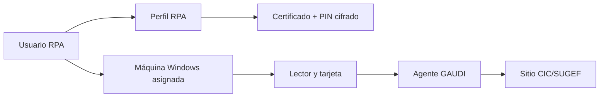

La capacitación describe un patrón de una máquina por usuario y por certificado. Ejecutar el perfil en otra máquina con otra tarjeta puede impedir la autenticación.

### 18.3 Automatización y PIN

- `LoadUrlAndCertificateSelectionActivity` carga URL y automatiza selección de certificado.
- `AuthenticateDigitalSignatureActivity` opera GAUDI con UI Automation.
- `UpdateWebCertificatePINActivity` actualiza el PIN cuando está permitido.
- `SignFileActivity` firma PDF con certificado.
- Subworkflows GAUDI validan conexión, autenticación y estado.

El changelog indica validación de cifrado de `RPA_WEBCERTIFICATE_PIN`: texto plano genera alerta, cifrado permite inicio y ausencia se trata como opcional.

<a id="19-monitoreo-logs-heartbeat-y-command-center"></a>
## 19. Monitoreo, logs, heartbeat y Command Center

### 19.1 Fuentes de observabilidad

| Fuente | Alcance |
|---|---|
| UI de RPADroid | Estado, tareas, keep-alive, navegadores, settings y logs. |
| `RPAShellGlobalLogs.txt` | Eventos generales del Shell. |
| `RPADroidLogs_<fecha>.txt` | Detalle operativo horario. |
| `RPATasksLogs.txt` | Eventos por tarea. |
| `[IDSERVICE]_ObjectRequest.txt` | Objeto/request de una instancia. |
| Logs de resultado | Archivo asociado a RequestId y XML result. |
| Log4Net | Servicios y componentes. |
| Watchman | Excepciones y configuración. |
| Correo | Alertas con contexto y diagnóstico. |
| Monitor Room | Heartbeat, estado, acciones e históricos. |

### 19.2 Heartbeat y control remoto

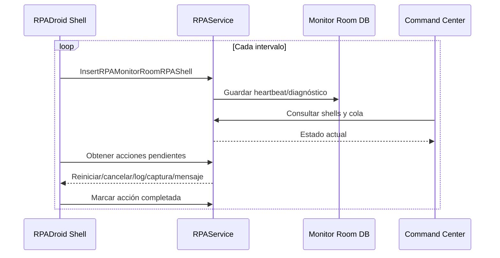

**Mecanismo del latido.** El reloj del latido es un hilo de fondo del Shell, `RPADroid.RPAMonitorRoomRequestTask`, que se ejecuta cada `HeartBeatTimeOut` segundos (con un mínimo de 30 s) mientras el UDC `RPA_MONITOR_ROOM_ENABLE` esté activo. En cada ciclo, a través de la fachada WCF `RPAHeartBeat`, el Shell realiza tres acciones: escribe el estado de la instancia en `RPA` con `RPA_INSERT` (método `InsertRPAStatusByName`, valor `RUNNING`); registra el latido del Shell en `RPA_MONITOR_ROOM_RPASHELL` con `RPA_MONITOR_ROOM_RPASHELL_INSERT` (método `HeartBeatDroid`, que fija `HeartBeat` a la hora actual); y consulta y cierra las acciones remotas pendientes (tabla `RPA_MONITOR_ROOM_ACTIONS`, transición `PENDING` → `COMPLETED`). Durante el procesamiento de una solicitud, `UpdateProgressRPATask` se ejecuta además en cada actividad del workflow: refresca el estado de la instancia (`RUNNING`, o `BUSY` si hay una solicitud asignada) y verifica la cancelación cooperativa de la tarea. `RPAHeartBeat` es solo la fachada de cliente WCF; no tiene temporizador propio.

Acciones observadas: `PREPARE_AND_RUN`, `RESTART`, `RESTART_MACHINE`, `KILL_SESSION`, `KILL_ALL_SESSIONS`, `CLOSE_RPA_DROID_SHELL`, envío de logs/captura y mensajes al escritorio.

**Implementación del Command Center.** La interfaz web del Command Center corresponde al controlador `RPAMonitorNEWController` (proyecto `Apptividad.OzonoStation.Web.UI`, carpeta `Controllers`) y sus vistas en `Views\RPAMonitorNEW`. El controlador consume el servicio a través del proxy `Apptividad.Ozono.RPAServiceProxy.RPA` —por ejemplo, `GetRPAMonitorRoomRPAShellResponse` para listar los Shells activos— y ofrece a los operadores las acciones `PREPARE_AND_RUN`, `RESTART`, `KILL_SESSION`, `KILL_ALL_SESSIONS`, `SEND_BY_EMAIL_LOGS` y `SEND_BY_EMAIL_SCREENSHOT`. Cada acción se registra en la tabla `RPA_MONITOR_ROOM_ACTIONS`, mientras que la lista de Shells y de servicios permitidos por usuario se obtiene de `RPA_MONITOR_ROOM_RPASHELL`.

**Los dos controladores de monitoreo.** Coexisten dos controladores: `RPAMonitorController` (anterior) y `RPAMonitorNEWController` (actual). Ambos obtienen el estado de las **instancias** desde la tabla `RPA` mediante la operación `GetRPARunning` (procedimiento `RPA_RUNNING_LIST_GET`): el anterior presenta una lista plana de droids (`GetRPAMonitorDroid`) y el actual, un detalle por instancia (`GetRPARunningListByRpaShell`). La diferencia es que el controlador actual añade una vista superior agrupada por **Shell**, alimentada por el **latido** (`GetMonitorRoomShell` → `RPA_MONITOR_ROOM_RPASHELL_GET_PAGINATION` sobre `RPA_MONITOR_ROOM_RPASHELL`); ambas vistas se cruzan por la clave `UserName - UserPc - RpaVersion`. El estado de la instancia (`RPA`) y el latido del Shell (`RPA_MONITOR_ROOM_RPASHELL`) son ciclos distintos aunque compartan valores como `RUNNING`/`STOPPED`.

### 19.3 Trazabilidad mínima recomendada

- Timestamp con milisegundos.
- Ambiente y compañía.
- MachineName y usuario RPA.
- RPA, IdService, TaskId, RequestId y RowId.
- Workflow, estado y Activity.
- Acción, resultado y duración.
- UserMessage sanitizado.
- TechnicalMessage y stack trace.
- Estado de navegador, sitio y cola.

<a id="20-errores-resiliencia-reintentos-y-recuperacion"></a>
## 20. Errores, resiliencia, reintentos y recuperación

### 20.1 Taxonomía

| Categoría | Ejemplos | Tratamiento |
|---|---|---|
| Configuración | UDC faltante, clase inválida, perfil sin rol | Fallar temprano y no tomar request. |
| Infraestructura | WCF, DNS, VPN, SQL o disco | Reintento limitado, alerta y diagnóstico. |
| Navegador/driver | Driver incompatible o proceso huérfano | Recrear, actualizar y limpiar. |
| Sitio externo | HTTP, DOM, indisponibilidad o sesión | Validar, recargar, reautenticar o detener. |
| Certificado/GAUDI | Tarjeta, PIN o certificado | Pausa asistida, detener y alertar. |
| Captcha | Servicio, solución o site key | Reintentar, feedback o modo manual. |
| Datos/attachments | Archivo, tamaño, extensión o ruta | Validación previa y error funcional. |
| Workflow | Excepción, timeout o IsSuccessful=false | Recovery, persistir y liberar. |
| Concurrencia | Duplicado, sesión compartida o lock | Correlación, filtros y límites. |

### 20.2 Excepciones especializadas

El Core define excepciones específicas para timeout, certificados, worker cancelado, negocio, desktop/excel/web activities, EdgeDriver, mensajes nulos, configuración crítica, captcha, sesiones, Shell, navegador, sitio no disponible, usuario no autorizado y workflow. Esto permite recuperación dirigida y mensajes más precisos.

### 20.3 Patrón de Recovery

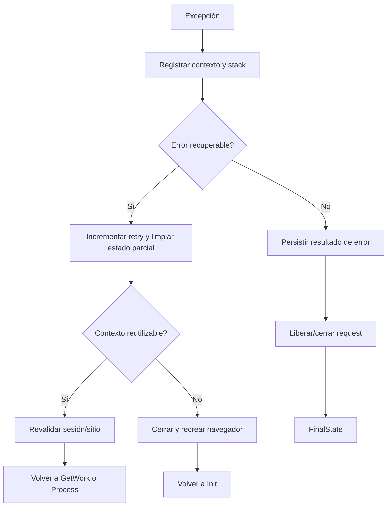

`ValidateWorkingCorrectly` conserva la hora inicial de un error repetitivo y envía alerta cuando supera `MaxTimeRetryErrors`. El changelog también contempla notificaciones de recuperación.

<a id="21-seguridad"></a>
## 21. Seguridad

### 21.1 Controles observados

- Autenticación de usuario Shell mediante servicios Apptividad.
- SSO/token en contexto de sesión.
- Autorización por roles para `ServiceReference`.
- UDC `OZONO_RPA_SECURITY_CONFIG`.
- Perfil por usuario con ExtendedProperties y certificado.
- Cifrado/validación del PIN.
- Ocultamiento de `USERNAME` y `PASSWORD` en logs de parámetros.
- Restricción de extensiones de paquetes.
- Validación de tamaño/extensión de attachments.
- Segregación de DLL por cliente.

### 21.2 Riesgos y recomendaciones

- Mover credenciales/PIN a un almacén de secretos o cifrado ligado a máquina/usuario.
- Enmascarar PII y secretos en logs, correo y heartbeat.
- Desactivar detalle de excepción WCF fuera de entornos controlados.
- Firmar paquetes y verificar hash antes de instalar.
- Aplicar mínimo privilegio a usuario Windows, carpetas, certificados y servicios.
- Auditar acciones remotas con actor, motivo y resultado.
- Mantener SBOM e inventario de vulnerabilidades.

<a id="22-despliegue-instalacion-actualizacion-y-compatibilidad"></a>
## 22. Despliegue, instalación, actualización y compatibilidad

### 22.1 Publicación y estructura

La guía describe un pipeline Jenkins para compilar y publicar RPADroid. El paquete base contiene archivos comunes y puede incluir ensamblados específicos de clientes, que deben eliminarse antes de entregar a otro cliente.
```text
C:\Apptividad\Runtime\
├── RPADroid\
│   ├── Apptividad.Ozono.RPA.UI.exe
│   ├── Apptividad.Ozono.RPA.UI.exe.config
│   ├── *.dll
│   ├── workflows y recursos
│   ├── @CloseRPAShellAndIE.bat
│   ├── @CloseIEAndRestartRPAShell.bat
│   └── utilidades
├── Backups\
├── Logs\
├── RPACacheFolder\
├── Captcha\
├── Images\
└── RPAResultHTML\
```

### 22.2 Proceso de actualización

1. Detener Shell y navegadores mediante BAT.
2. Respaldar versión actual.
3. Descargar/descomprimir nuevo paquete.
4. Copiar binarios a ruta fija.
5. Restaurar o crear `.exe.config` del cliente.
6. Configurar BAT con IdService requeridos.
7. Validar versión, login, seguridad y ejecución.
8. Mantener rollback con backup.

También se propone una tarea `RPA_RESTART` en Windows Task Scheduler para reinicio diario, además de UDC de programación diaria/semanal.

**Componente `Apptividad.Ozono.RPA.Updater`.** La aplicación de la actualización la realiza un ejecutable de consola independiente (`Apptividad.Ozono.RPA.Updater.exe`). Su punto de entrada distingue dos modos: en el modo normal ejecuta `UpdateRPAShellVersion.Run`, que descarga y prepara la nueva versión; en el modo aplicador (`RPAShellVersionApplier`) se ejecuta desde una carpeta temporal con un argumento específico y aplica los archivos sobre la instalación en uso, guiándose por un manifiesto (`RPAShellVersionUpdateManifest`). En el modo aplicador no consulta servicios ni configuraciones externas, lo que permite reemplazar los binarios del Shell mientras este está detenido. El control de versiones se apoya en los procedimientos `RPA_SHELL_VERSION_*`.

### 22.3 Compatibilidad

| Componente | Requisito/estado |
|---|---|
| Sistema operativo | Windows 10 o superior; factibilidad documentada en Windows Server 2025. |
| Runtime | .NET Framework 4.8 / CLR 4.x para la versión documentada 3.0.3.6. |
| Navegador | Microsoft Edge Chromium de 64 bits. |
| Driver | Misma versión mayor que Edge. |
| Hardware base | 4 núcleos ~3.5 GHz, 8 GB RAM y SSD 120 GB por una instancia. |
| Red | Servicios Apptividad, sitio objetivo, driver, SMTP/IMAP y VPN cuando aplique. |
| Sesión | Sesión Windows interactiva para UI Automation, certificado y navegador. |

Se identifican versiones de RPADroid como 3.0.3.8 y 3.0.3.6. El código contiene cambios de 2026, pero sin metadatos de ensamblado no se puede asignar una versión única.

<a id="23-rendimiento-concurrencia-capacidad-y-escalabilidad"></a>
## 23. Rendimiento, concurrencia, capacidad y escalabilidad

### 23.1 Modelo de escalamiento

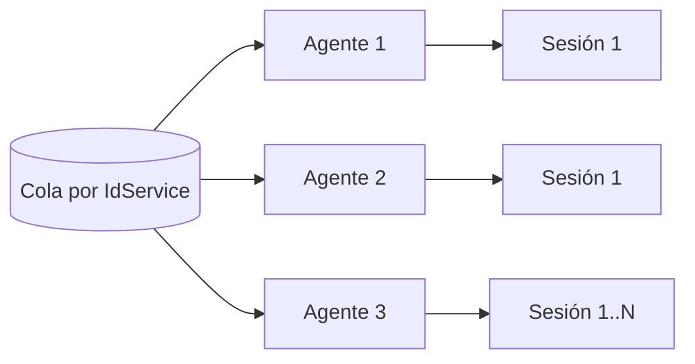

La capacidad crece agregando agentes, incrementando `MAX_SESSIONS` cuando el robot lo permite o particionando usuarios por ExtendedProperties.

- Certificados/sesiones disponibles.
- Restricciones del sitio por usuario, IP o concurrencia.
- CPU/RAM/disco por navegador.
- Ancho de banda y tamaño de archivos.
- Límites WCF/IIS/SQL.
- Seguridad y licenciamiento de terceros.

### 23.2 Polling, ancho de banda y métricas

Hay polling del Shell hacia la cola y polling de `RegisterRPARequest` hacia el resultado. Un intervalo corto aumenta carga WCF/SQL; uno largo aumenta latencia.

La documentación propone, como referencia, 10/15 Mbps para procesos estándar y 20/30 Mbps o más cuando se transfieren archivos, escalando con concurrencia. Debe validarse con métricas reales.

Métricas recomendadas:
- Requests recibidos/completados/error por IdService.
- Tiempo en cola, ejecución y total.
- Profundidad de cola y antigüedad del request más viejo.
- Disponibilidad y porcentaje BUSY.
- Reintentos por Activity/workflow.
- Errores por sitio, navegador, certificado, captcha y configuración.
- CPU/RAM/red por Shell y sesión.
- Tasa de clonación por expiración.
- Tamaño y tiempo de attachments.

<a id="24-sistemas-de-terceros-y-dependencias"></a>
## 24. Sistemas de terceros y dependencias

### 24.1 Aplicaciones y plataformas que no pertenecen a Apptividad

| Sistema | Propietario/tipo | Interacción | Impacto |
|---|---|---|---|
| Microsoft Windows | Microsoft | SO, sesiones, certificados, UI Automation y Task Scheduler. | Base obligatoria. |
| Microsoft Edge | Microsoft | Navegador Selenium. | Actualizaciones afectan driver/selectores. |
| Edge WebDriver | Microsoft | Puente WebDriver. | Debe alinearse con Edge. |
| SQL Server | Microsoft | Persistencia y SP. | Disponibilidad/rendimiento críticos. |
| IIS/WAS | Microsoft; hosting inferido | Alojamiento de `.svc`. | Bindings, timeouts y AppPool. |
| Agente GAUDI | Banco Central de Costa Rica | Autenticación/firma digital. | Aplicación, tarjeta, lector y sesión. |
| CIC/SUGEF | SUGEF/entidades regulatorias | Autorizaciones y reportes. | Cambios externos pueden detener robots. |
| SVI Tribunal Electoral Panamá | Tribunal Electoral | Validación de identidad. | Certificados, acceso y restricciones. |
| ETAX | Sistema tributario externo | Consulta de contribuyente. | Captcha y cambios de DOM. |
| SMTP/IMAP/Gmail | Proveedor de correo | Alertas y lectura de buzones. | TLS, credenciales y límites. |
| FTP | Servidor externo/cliente | Transferencia de archivos. | Red, credenciales y seguridad. |
| Sitios internos de clientes | Cliente | Procesos propios. | Disponibilidad y cambios externos. |

### 24.2 Librerías de terceros observadas

| Librería | Función |
|---|---|
| Selenium/WebDriver | Automatización Edge. |
| HtmlAgilityPack | Procesamiento HTML. |
| Newtonsoft.Json | JSON/JObject. |
| iTextSharp | PDF y firma. |
| UglyToad.PdfPig | Extracción/análisis PDF. |
| ExpertPdf.HtmlToPdf | HTML a PDF. |
| BouncyCastle | Certificados y criptografía. |
| FlexCel | Excel. |
| MailKit y S22.Imap | Correo/IMAP. |
| Telerik WinControls | Controles UI. |
| Microsoft.Win32.TaskScheduler | Tareas programadas. |
| DeathByCaptcha | Referencia heredada/alternativa de captcha. |

### 24.3 Servicios internos indirectos

- AuthenticationService y SecurityService.
- BusinessService para UDC.
- FileService para archivos y paquetes.
- Watchman y Logging.
- DecaptchaService.
- CrediQuick/TimeToYes BusinessProcessService.

<a id="25-estandares-de-desarrollo-pruebas-y-liberacion"></a>
## 25. Estándares de desarrollo, pruebas y liberación

### 25.1 Desarrollo

- Workflows desarrollados en Visual Studio dentro de la solución TimeToYes/Credit Quick.
- Reutilizar una base existente y no duplicar funcionalidad.
- Lógica de negocio de Activity en `RunContext`.
- Argumentos In/Out/InOut y sufijo OPTIONAL.
- Robots modernos con máquina de estados.
- `Main.xaml` centraliza transiciones y recuperación.
- Selectores y constantes variables en UDC.
- Respuesta XML y clonación documentadas.

### 25.2 Pruebas

El estándar define una clase `NombreActivityTest`, `[TestClass]`, herencia de `BaseTestingActivity`, métodos `[TestMethod]` y uso del constructor `internal`. El proyecto de pruebas no fue incluido, por lo que no se verificó cobertura ni ejecución.

### 25.3 Liberación

- Code review.
- Compilación/publicación Jenkins.
- ZIP por versión.
- Eliminar ensamblados de otros clientes.
- Conservar config del cliente.
- Backup y rollback.
- Validar versión del Shell.
- Smoke test de login, conexión, driver, workflow y resultado.

<a id="26-flujos-de-referencia-incluidos-en-el-paquete"></a>
## 26. Flujos de referencia incluidos en el paquete

### 26.1 SUGEF_CIC

Ejemplo más completo del patrón moderno. Incluye entradas `SUGEF_CIC_AUTORIZAR` y `SUGEF_CIC_CONSULTAR`, un `Main` común y subworkflows para Init, GetWork, KeepAlive, Process, consultar padrón, incluir autorización, generar reporte, validar sesión expirada y operar GAUDI.

### 26.2 VERIFICATE_BUREAU

Automatiza el SVI del Tribunal Electoral de Panamá: abre sitio, gestiona certificado/autenticación, consulta identidad, extrae información y retorna resultado. Requiere certificados raíz, intermedio y personal, además de conectividad específica.

### 26.3 ETAX_CONSULTA_CONTRIBUYENTE

Usa máquina de estados, navegador persistente y captcha aprovisionado. `Process.xaml` combina UDC, carga de datos, click, validación, extracción y actualización del captcha.

### 26.4 EMAIL_ALERT

Consulta buzones, interpreta mensajes, ejecuta sentencias TTY, actualiza XML/UDC, envía notificaciones y persiste resultados.

### 26.5 DOWNLOAD_FILES

Busca documentos en directorios, clasifica por regex, separa PDF, crea attachments y análisis TTY, copia archivos y notifica por correo.

### 26.6 Workflows heredados

`CICAutorizacionWF`, `Consulta_CIC_SUGEF`, `Consulta_CIC_SUGEFLogin`, `Consulta_CIC_SUGEFKeepAlive` y `VerificateWF` representan generaciones previas o alternativas. Deben distinguirse del patrón State Machine actual.

<a id="27-runbook-de-soporte-y-diagnostico"></a>
## 27. Runbook de soporte y diagnóstico

### 27.1 Datos mínimos del incidente

- Cliente, ambiente y hora exacta.
- IdService.
- RequestId/OperationId y RowId.
- Usuario RPA y máquina.
- Estado del modelo TTY.
- Mensaje funcional y técnico.
- Captura del Shell y sitio.
- XML request/result sanitizado.
- Estado de Edge, driver, certificado/GAUDI y red.

### 27.2 Árbol de diagnóstico

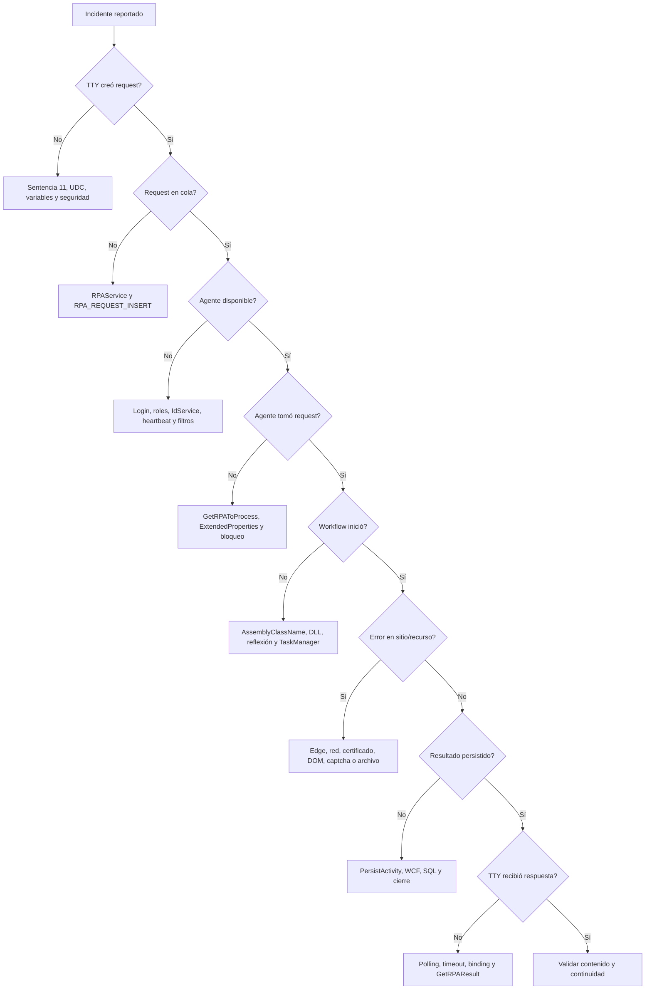

### 27.3 Checklist por capa

| Capa | Validaciones |
|---|---|
| TTY | Sentencia, XML, parámetros, timeout y seguridad. |
| RPAService | Endpoint, logs, RegisterRPARequest y WCF. |
| Base de datos | Request, estado, agente, resultado, antigüedad y duplicados. |
| Shell | Login, roles, IdService, heartbeat, task y versión. |
| Workflow | AssemblyClassName, estado, retry, Recovery y mensajes. |
| Navegador | Edge, driver, procesos, URL, sesión, DOM y popup. |
| Externo | Sitio, VPN, certificado, GAUDI, captcha, correo o FTP. |
| Resultado | XML, éxito, mensajes, attachments y consumo TTY. |

### 27.4 Síntomas frecuentes

| Síntoma | Causas probables | Primera acción |
|---|---|---|
| No hay RPAs disponibles | Shell cerrado, sin rol, IdService no iniciado o agentes ocupados. | Revisar heartbeat, tareas y cola. |
| Request pendiente | Filtro ExtendedProperties, agente detenido o error de servicio. | Comparar request con perfil. |
| Timeout TTY | Workflow lento, cola, sitio o timeout mal dimensionado. | Ver si sigue PROCESSING. |
| Edge no inicia | Driver incompatible, GPO, ruta o proceso huérfano. | Comparar versiones y logs. |
| Autenticación CIC falla | GAUDI, tarjeta, PIN, certificado o cambio externo. | Validar manualmente en la misma sesión. |
| Resultado vacío | Mapeo `_RPA_RESPONSE`, selector o extracción. | Revisar HTML y UDC. |
| Attachments faltantes | Tipo, extensión, tamaño, ruta o modelo. | Validar request y helper. |
| Correo no enviado | SMTP, TLS, credenciales, puerto o frecuencia. | Probar configuración. |

<a id="28-riesgos-deuda-tecnica-y-vacios-documentales"></a>
## 28. Riesgos, deuda técnica y vacíos documentales

### 28.1 Riesgos técnicos

- **Tecnologías maduras/legadas:** .NET Framework, WCF, WinForms y Thread.Abort.
- **Complejidad de concurrencia:** BackgroundWorker, Thread, Task, COM y UI.
- **Dependencia de UI externa:** DOM, idioma, resolución, ventanas y GPO.
- **Rutas absolutas:** menor portabilidad.
- **Configuración distribuida:** UDC, perfil, config, BAT, DB y sitio.
- **Polling síncrono prolongado:** consumo de threads/conexiones.
- **Detalle de excepciones:** posible exposición interna.
- **Paquetes sin metadatos de build:** no hay csproj, lockfiles ni SBOM.
- **Cobertura no verificable:** TestingActivities no incluidos.
- **Compatibilidad heredada:** referencias IE/MSHTML pueden confundir.

### 28.2 Hallazgos de consistencia

- El código contiene 31 WebActivities y 37 UtilsActivities.
- `EnqueueProvisioningCaptchaActivity.cs` está en WebActivities, pero declara namespace UtilsActivities.
- Dos archivos poseen un espacio antes de `.cs`, afectando convenciones/tooling.
- Conviven nombres históricos de navegador e implementación Selenium Edge.
- El mecanismo de timeout de `BaseActivity.ExecuteActivityWithTask` debe revisarse porque llamadas de espera aparecen comentadas.

### 28.3 Mejoras arquitectónicas recomendadas

- Arquitectura versionada junto al código y catálogo automático de assemblies/XAML.
- Incluir `.sln`, `.csproj`, versiones, SBOM y hashes.
- Centralizar secretos y eliminarlos de UDC/logs.
- Migrar gradualmente a APIs asincrónicas y evitar llamadas WCF bloqueadas durante todo el proceso.
- Formalizar cola con lease, visibilidad, retry y dead-letter.
- Reemplazar Thread.Abort por cancelación cooperativa.
- Unificar modelo de threading y aplicar async/await cuando sea seguro.
- Formalizar estados y transiciones en un contrato único.
- Health checks para WCF, SQL, EdgeDriver, sitios y certificados.
- Pruebas de contrato, integración y smoke tests por robot.
- Firma de código y validación de integridad de paquetes/driver.
- Métricas estructuradas y correlación distribuida.

<a id="a-catalogo-de-operaciones-wcf"></a>
## A. Catálogo de operaciones WCF

| Categoría | Operación | Retorno | Parámetros |
|---|---|---|---|
| Catálogo, seguridad y estado de agentes | `GetRPAByKey` | `RPAEntityResponse` | `RPAEntityRequest pRPAEntityRequest` |
| Catálogo, seguridad y estado de agentes | `GetRPAByRoles` | `List<RPAByRolesResponse>` | `RPAByRolesRequest pRPAByRolesRequest` |
| Catálogo, seguridad y estado de agentes | `GetUserRPAPrivileges` | `RPAUserPrivilegesResponse` | `RPARequest pRPARequest` |
| Catálogo, seguridad y estado de agentes | `RPAEntityInsert` | `MessageResponse` | `RPAEntityRequest pRPAEntityRequest` |
| Catálogo, seguridad y estado de agentes | `RPAStatusByNameUpdate` | `MessageResponse` | `RPAEntityRequest pRPAEntityRequest` |
| Ciclo de vida de solicitudes y resultados | `ClosingRPAProcessing` | `RPAInfoResponse` | `RPAInfoRequest pRPAInfoRequest` |
| Ciclo de vida de solicitudes y resultados | `GetRPAInfo` | `RPAInfoResponse` | `RPAInfoRequest pRPAInfoRequest` |
| Ciclo de vida de solicitudes y resultados | `GetRPAResponseByFilter` | `List<RPAResponse>` | `RPAByFilterRequest pRPAByFilterRequest` |
| Ciclo de vida de solicitudes y resultados | `GetRPAResultByFilter` | `List<RPAInfoResponse>` | `RPAByFilterRequest pRPAByFilterRequest` |
| Ciclo de vida de solicitudes y resultados | `GetRPAToProcess` | `RPAInfoResponse` | `RPAInfoRequest pRPAInfoRequest` |
| Ciclo de vida de solicitudes y resultados | `InsertRPAInfo` | `RPAInfoResponse` | `RPAInfoRequest pRPAInfoRequest` |
| Ciclo de vida de solicitudes y resultados | `InsertRPAResult` | `RPAInfoResponse` | `RPAInfoRequest pRPAInfoRequest` |
| Ciclo de vida de solicitudes y resultados | `RPAInfoValidateExpirationPolicy` | `RPAInfoResponse` | `RPAInfoRequest pRPAInfoRequest` |
| Ciclo de vida de solicitudes y resultados | `RPAResultClone` | `RPAInfoResponse` | `RPAInfoRequest pRPAInfoRequest` |
| Ciclo de vida de solicitudes y resultados | `ReactivateRPARequest` | `RPAInfoResponse` | `—` |
| Ciclo de vida de solicitudes y resultados | `RegisterRPARequest` | `RPAResponse` | `RPARequest pRPARequest` |
| Ciclo de vida de solicitudes y resultados | `ReleaseRPARequest` | `RPAInfoResponse` | `—` |
| Diagnóstico y configuración | `TestConfiguration` | `string` | `string pOption` |
| Diagnóstico y configuración | `echo` | `string` | `—` |
| Histórico, paginación y administración de cola | `GetRPAMonitorRoomActionsHistorical` | `RPAMonitorRoomActionsHistoricalResponse` | `RPAMonitorRoomActionsHistoricalRequest pRequest` |
| Histórico, paginación y administración de cola | `GetRPAMonitorRoomRPAShellHistorical` | `RPAMonitorRoomRPAShellHistoricalResponse` | `RPAMonitorRoomRPAShellHistoricalRequest pRequest` |
| Histórico, paginación y administración de cola | `GetRPAMonitorRoomRPAShellPagination` | `RPAMonitorRoomRPAShellPaginationResponse` | `RPAMonitorRoomRPAShellPaginationRequest pRequest` |
| Histórico, paginación y administración de cola | `GetRPARequestCountByServiceId` | `RPARequestCountByServiceIdResponse` | `RPARequestCountByServiceIdRequest pRequest` |
| Histórico, paginación y administración de cola | `GetRPARequestHistorical` | `RPARequestHistoricalResponse` | `RPARequestHistoricalRequest pRequest` |
| Histórico, paginación y administración de cola | `GetRPARequestPaginationByStatus` | `RPARequestPaginationByStatusResponse` | `RPARequestPaginationByStatusRequest pRequest` |
| Histórico, paginación y administración de cola | `GetRPARequestReleaseByServiceId` | `RPARequestReleaseByServiceIdResponse` | `RPARequestReleaseByServiceIdRequest pRequest` |
| Histórico, paginación y administración de cola | `GetRPARunningHistorical` | `RPARunningHistoricalResponse` | `RPARunningHistoricalRequest pRequest` |
| Monitoreo, heartbeat y control remoto | `GetRPAById` | `RPARunningResponse` | `RPAInfoRequest pRPAInfoRequest` |
| Monitoreo, heartbeat y control remoto | `GetRPAMonitorDetail` | `RPAMonitorResponse` | `RPAMonitorRequest pRPAMonitorRequest` |
| Monitoreo, heartbeat y control remoto | `GetRPAMonitorRoomActionsResponse` | `RPAMonitorRoomActionsResponse` | `RPAMonitorRoomActionsRequest vRPAMonitorRoomActionsRequest` |
| Monitoreo, heartbeat y control remoto | `GetRPAMonitorRoomRPAShellResponse` | `RPAMonitorRoomRPAShellResponse` | `string Status` |
| Monitoreo, heartbeat y control remoto | `GetRPARunning` | `RPARunningResponse` | `—` |
| Monitoreo, heartbeat y control remoto | `GetRPAStatusByIdServices` | `RPAStatusByIdServicesResponse` | `RPAStatusByIdServicesRequest pRPAMonitorRequest` |
| Monitoreo, heartbeat y control remoto | `InsertRPAMonitorRoomActionsResponse` | `RPAMonitorRoomActionsResponse` | `RPAMonitorRoomActionsRequest vRPAMonitorRoomActionsRequest` |
| Monitoreo, heartbeat y control remoto | `InsertRPAMonitorRoomRPAShellResponse` | `MessageResponse` | `RPAMonitorRoomRPAShellRequest vRPAMonitorRoomRPAShellRequest` |
| Monitoreo, heartbeat y control remoto | `UpdateRPAMonitorRoomActionsResponse` | `MessageResponse` | `RPAMonitorRoomActionsRequest vRPAMonitorRoomActionsRequest` |
| Versionado de RPADroid Shell | `CheckRPAShellVersion` | `RPAShellVersionResponse` | `RPAShellVersionRequest pRequest` |
| Versionado de RPADroid Shell | `GetPaginationRPAShellVersion` | `RPAShellVersionResponse` | `RPAShellVersionRequest pRequest` |
| Versionado de RPADroid Shell | `GetRPAShellVersion` | `RPAShellVersionResponse` | `RPAShellVersionRequest pRequest` |
| Versionado de RPADroid Shell | `InsertRPAShellVersion` | `RPAShellVersionResponse` | `RPAShellVersionRequest pRequest` |
| Versionado de RPADroid Shell | `UpdateRPAShellVersion` | `RPAShellVersionResponse` | `RPAShellVersionRequest pRequest` |

<a id="b-catalogo-de-procedimientos-almacenados"></a>
## B. Catálogo de procedimientos almacenados

Los propósitos se infieren del nombre y del contexto de llamada; deben validarse contra el SQL oficial.

| Categoría | Procedimiento | Propósito inferido |
|---|---|---|
| Monitoreo y Command Center | `GET_RPA_MONITOR_DATA` | Obtiene información agregada de monitor. |
| Catálogo y estado de agentes | `RPA_BYID_GET` | Obtiene un agente por identificador. |
| Catálogo y estado de agentes | `RPA_BYKEY_GET` | Obtiene entidad RPA por clave. |
| Histórico, consulta y métricas | `RPA_GET_HISTORICAL` | Consulta histórico de agentes. |
| Solicitudes y procesamiento | `RPA_INSERT` | Registra entidad/agente RPA. |
| Solicitudes y procesamiento | `RPA_ISPROCESSING` | Determina si un request continúa procesándose. |
| Monitoreo y Command Center | `RPA_MONITOR_ROOM_ACTIONS_GETBYSTATUS` | Obtiene acciones por estado. |
| Monitoreo y Command Center | `RPA_MONITOR_ROOM_ACTIONS_GET_HISTORICAL` | Consulta histórico de acciones. |
| Monitoreo y Command Center | `RPA_MONITOR_ROOM_ACTIONS_INSERT` | Registra acción remota. |
| Monitoreo y Command Center | `RPA_MONITOR_ROOM_ACTIONS_UPDATESTATUS` | Actualiza estado de acción. |
| Monitoreo y Command Center | `RPA_MONITOR_ROOM_RPASHELL_GET` | Consulta heartbeats/Shells. |
| Monitoreo y Command Center | `RPA_MONITOR_ROOM_RPASHELL_GET_HISTORICAL` | Consulta histórico de heartbeats. |
| Monitoreo y Command Center | `RPA_MONITOR_ROOM_RPASHELL_GET_PAGINATION` | Pagina Shells. |
| Monitoreo y Command Center | `RPA_MONITOR_ROOM_RPASHELL_INSERT` | Inserta heartbeat/diagnóstico. |
| Solicitudes y procesamiento | `RPA_PROCESSING_CLOSING` | Cierra procesamiento. |
| Histórico, consulta y métricas | `RPA_REQUEST_COUNT_BY_SERVICEID` | Cuenta requests por servicio/estado. |
| Solicitudes y procesamiento | `RPA_REQUEST_GET` | Obtiene request. |
| Histórico, consulta y métricas | `RPA_REQUEST_GET_HISTORICAL` | Consulta histórico de requests. |
| Solicitudes y procesamiento | `RPA_REQUEST_INSERT` | Inserta solicitud en cola. |
| Histórico, consulta y métricas | `RPA_REQUEST_PAGINATION_GET_BY_STATUS` | Pagina requests por estado. |
| Solicitudes y procesamiento | `RPA_REQUEST_REACTIVATE` | Reactiva solicitudes. |
| Solicitudes y procesamiento | `RPA_REQUEST_RELEASE` | Libera solicitudes. |
| Solicitudes y procesamiento | `RPA_REQUEST_RELEASE_BY_SERVICEID` | Libera solicitudes antiguas por servicio. |
| Solicitudes y procesamiento | `RPA_REQUEST_VALIDATE_EXPIRATION_POLICY` | Evalúa expiración/clonación. |
| Resultados | `RPA_RESULT_BYFILTER_GET` | Obtiene resultados por filtro. |
| Resultados | `RPA_RESULT_CLONE` | Clona resultado previo. |
| Resultados | `RPA_RESULT_GET` | Obtiene resultado. |
| Resultados | `RPA_RESULT_INSERT` | Inserta resultado. |
| Catálogo y estado de agentes | `RPA_RUNNING_LIST_GET` | Lista agentes activos. |
| Versionado | `RPA_SHELL_VERSION_CHECK` | Valida versión disponible/activa. |
| Versionado | `RPA_SHELL_VERSION_GET` | Obtiene detalle de versión. |
| Versionado | `RPA_SHELL_VERSION_GET_PAGINATION` | Pagina versiones. |
| Versionado | `RPA_SHELL_VERSION_INSERT` | Registra paquete/versión. |
| Versionado | `RPA_SHELL_VERSION_UPDATE` | Actualiza estado/metadatos de versión. |
| Catálogo y estado de agentes | `RPA_STATUSBYNAME_UPDATE` | Actualiza estado por nombre. |
| Catálogo y estado de agentes | `RPA_STATUS_BY_IDSERVICES` | Obtiene estados por IdService. |
| Solicitudes y procesamiento | `RPA_TO_PROCESS_GET` | Punto de entrada de la selección; delega en `RPA_TO_PROCESS_GET_ASYNC`. |
| Solicitudes y procesamiento | `RPA_TO_PROCESS_GET_ASYNC` | Implementa el algoritmo de selección: estado, ventana, filtros, roles, anti-duplicado y registro de instancia. |
| Monitoreo y Command Center | `RPA_VERIFY_MONITOR_CONFIGURATION` | Valida configuración de monitor. |
| Catálogo y estado de agentes | `RPA_WFS_BY_ROLES_GET` | Obtiene servicios permitidos por roles. |

<a id="c-inventario-de-workflows-xaml"></a>
## C. Inventario de workflows XAML

| Archivo | Clase XAML | Argumentos | Estados | Activities/subworkflows frecuentes | Líneas |
|---|---|---|---|---|---:|
| `Apptividad.TimeToYes.RPAWorkFlows/CICAutorizacionWF.xaml` | `Apptividad.TimeToYes.RPAWorkFlows.CICAutorizacionWF` | `rpaMessage: InArgument(aodr:RPAMessage)` | — | `WaitUntilConditionActivity` (11), `ClickElementActivity` (10), `GetValueFromUDCActivity` (7), `SetValueToElementActivity` (5), `ExtractDataActivity` (5), `ValidateElementActivity` (3), `GetNextRPARequestActivity` (2), `UploadFileActivity` (2) | 5146 |
| `Apptividad.TimeToYes.RPAWorkFlows/Consulta_CIC_SUGEF.xaml` | `Apptividad.TimeToYes.RPAWorkFlows.Consulta_CIC_SUGEF` | `rpaMessage: InArgument(aodr:RPAMessage)` | — | `GetValueFromUDCActivity` (20), `WaitUntilConditionActivity` (8), `ClickElementActivity` (6), `ValidateRegexMatchWithHTMLActivity` (5), `SetValueToElementActivity` (4), `ExtractDataActivity` (4), `Consulta_CIC_SUGEFKeepAlive` (2), `GetNextRPARequestActivity` (2) | 5941 |
| `Apptividad.TimeToYes.RPAWorkFlows/Consulta_CIC_SUGEFKeepAlive.xaml` | `Apptividad.TimeToYes.RPAWorkFlows.Consulta_CIC_SUGEFKeepAlive` | `rpaMessage: InArgument(aodr:RPAMessage)`<br>`webModel: InArgument(aodr:RPAWebModel)`<br>`InOutValidateExpiredSessionCountRetry: InOutArgument(x:Int32)` | — | `GetValueFromUDCActivity` (9), `ValidateRegexMatchWithHTMLActivity` (4), `WaitUntilConditionActivity` (3), `ClickElementActivity` (3), `SetValueToUDCActivity` (2), `LoadUrlActivity` (1), `SetValueToElementActivity` (1), `GetAutomationElementByConditionsActivity` (1) | 2173 |
| `Apptividad.TimeToYes.RPAWorkFlows/Consulta_CIC_SUGEFLogin.xaml` | `Apptividad.TimeToYes.RPAWorkFlows.Consulta_CIC_SUGEFLogin` | `InOutRPAMessage: InOutArgument(aodr:RPAMessage)`<br>`InOutWebModel: InOutArgument(aodr:RPAWebModel)`<br>`OutLoginTime: OutArgument(s:DateTime)` | — | `GetValueFromUDCActivity` (3), `ValidateRegexMatchWithHTMLActivity` (2), `LoadUrlActivity` (1), `WaitUntilConditionActivity` (1), `LoadUrlAndCertificateSelectionActivity` (1), `ExtractDataActivity` (1), `PersistActivity` (1), `CloseWebForm` (1) | 1007 |
| `Apptividad.TimeToYes.RPAWorkFlows/DOWNLOAD_FILES.xaml` | `Apptividad.TimeToYes.RPAWorkFlows.DOWNLOAD_FILES` | `rpaMessage: InArgument(aodr:RPAMessage)` | — | `Main` (1) | 4207 |
| `Apptividad.TimeToYes.RPAWorkFlows/DOWNLOAD_FILES_SM/GetWork.xaml` | `Apptividad.TimeToYes.RPAWorkFlows.DOWNLOAD_FILES_SM.GetWork` | `InOutRPAConstants: InOutArgument(scg:Dictionary(x:String, x:String))`<br>`InOutRpaMessage: InOutArgument(aodr:RPAMessage)`<br>`InIsPreviouslyCreatedAnalysis: InArgument(x:Boolean)`<br>`OutWorkflowErrorMessage: OutArgument(x:String)`<br>`OutDownloadFileInfoList: OutArgument(scg:List(local:DownloadFileInfo))`<br>`OutRegexByDocumentList: OutArgument(scg:Dictionary(x:String, x:String))` | — | `FileCopyToActivity` (3), `GetUDCDetailListActivity` (2), `CreateFolderByDateActivity` (2), `DelayActivity` (2), `GetConstantsFromUdc` (1), `GetFileFromDirectoryActivity` (1), `SendMailActivity` (1), `Recovery` (1) | 2920 |
| `Apptividad.TimeToYes.RPAWorkFlows/DOWNLOAD_FILES_SM/Helpers/GetConstantsFromUdc.xaml` | `Apptividad.TimeToYes.RPAWorkFlows.DOWNLOAD_FILES_SM.Helpers.GetConstantsFromUdc` | `InOutRpaMessage: InOutArgument(aodr:RPAMessage)`<br>`InOutRPAConstants: InOutArgument(scg:Dictionary(x:String, x:String))`<br>`InIdService: InArgument(x:String)` | — | `GetUDCValueFromDetailListActivity` (10), `GetValueFromUDCActivity` (10), `GetUDCDetailListActivity` (1) | 827 |
| `Apptividad.TimeToYes.RPAWorkFlows/DOWNLOAD_FILES_SM/Main.xaml` | `Apptividad.TimeToYes.RPAWorkFlows.DOWNLOAD_FILES_SM.Main` | `InOutRpaMessage: InOutArgument(aodr:RPAMessage)` | `GetWork`, `Recovery`, `FinalState`, `SetStatus`, `Process` | `GetWork` (1), `Recovery` (1), `SetStatus` (1), `Process` (1) | 5954 |
| `Apptividad.TimeToYes.RPAWorkFlows/DOWNLOAD_FILES_SM/Process.xaml` | `Apptividad.TimeToYes.RPAWorkFlows.DOWNLOAD_FILES_SM.Process` | `InRPAConstants: InArgument(scg:Dictionary(x:String, x:String))`<br>`InDownloadFileInfoList: InArgument(scg:List(local:DownloadFileInfo))`<br>`InRegexByDocumentList: InArgument(scg:Dictionary(x:String, x:String))`<br>`InOutRpaMessage: InOutArgument(aodr:RPAMessage)`<br>`OutWorkflowErrorMessage: OutArgument(x:String)`<br>`OutIsCreatedAnalysis: OutArgument(x:Boolean)` | — | `FileCopyToActivity` (2), `SendMailActivity` (2), `SplitPDFActivity` (1), `CreateAttachmentActivity` (1), `CreateAnalysisActivity` (1), `InsertRPAInfoActivity` (1), `PersistActivity` (1), `Recovery` (1) | 2572 |
| `Apptividad.TimeToYes.RPAWorkFlows/EMAIL_ALERT.xaml` | `Apptividad.TimeToYes.RPAWorkFlows.EMAIL_ALERT` | `rpaMessage: InArgument(aodr:RPAMessage)` | — | `Main` (1) | 4207 |
| `Apptividad.TimeToYes.RPAWorkFlows/EMAIL_ALERT_SM/GetWork.xaml` | `Apptividad.TimeToYes.RPAWorkFlows.EMAIL_ALERT_SM.GetWork` | `InOutRPAConstants: InOutArgument(scg:Dictionary(x:String, x:String))`<br>`OutWorkflowErrorMessage: OutArgument(x:String)`<br>`InOutRpaMessage: InOutArgument(aodr:RPAMessage)`<br>`OutEmailAlertInfoList: OutArgument(scg:List(local:EmailAlertInfo))` | — | `GetConstantsFromUDC` (1), `GetUDCDetailListActivity` (1), `ReceiveMailActivity` (1), `Recovery` (1) | 1114 |
| `Apptividad.TimeToYes.RPAWorkFlows/EMAIL_ALERT_SM/Helpers/GetConstantsFromUDC_EA.xaml` | `Apptividad.TimeToYes.RPAWorkFlows.EMAIL_ALERT_SM.Helpers.GetConstantsFromUDC` | `InIdService: InArgument(x:String)`<br>`InOutRPAConstants: InOutArgument(scg:Dictionary(x:String, x:String))`<br>`InOutRpaMessage: InOutArgument(aodr:RPAMessage)` | — | `GetValueFromUDCActivity` (13) | 527 |
| `Apptividad.TimeToYes.RPAWorkFlows/EMAIL_ALERT_SM/Helpers/GetLastDateTimeFromXml.xaml` | `Apptividad.TimeToYes.RPAWorkFlows.EMAIL_ALERT_SM.Helpers.GetLastDateTimeFromXml` | `InOutRpaMessage: InOutArgument(aodr:RPAMessage)`<br>`InParametersToUdc: InArgument(scg:Dictionary(x:String, x:String))`<br>`InOutXmlDocument: InOutArgument(sx:XmlDocument)`<br>`InXmlPath: InArgument(x:String)`<br>`InTimerType: InArgument(x:String)`<br>`InTimerValue: InArgument(x:String)`<br>`OutLastDateTime: OutArgument(s:DateTime)`<br>`OutTimer: OutArgument(x:TimeSpan)` | — | `GetValueFromUDCActivity` (1), `GetValueFromXml` (1) | 258 |
| `Apptividad.TimeToYes.RPAWorkFlows/EMAIL_ALERT_SM/Helpers/GetValueFromXml.xaml` | `Apptividad.TimeToYes.RPAWorkFlows.EMAIL_ALERT_SM.Helpers.GetValueFromXml` | `InXml: InArgument(x:String)`<br>`InOutXmlDocument: InOutArgument(sx:XmlDocument)`<br>`InXmlPath: InArgument(x:String)`<br>`OutValue: OutArgument(x:String)` | — | — | 228 |
| `Apptividad.TimeToYes.RPAWorkFlows/EMAIL_ALERT_SM/Helpers/UpdateXml.xaml` | `Apptividad.TimeToYes.RPAWorkFlows.EMAIL_ALERT_SM.Helpers.UpdateXml` | `InXmlPath: InArgument(x:String)`<br>`InXmlDocument: InArgument(sx:XmlDocument)`<br>`InElementsToUpdateList: InArgument(scg:Dictionary(x:String, x:String))`<br>`InOutRpaMessage: InOutArgument(aodr:RPAMessage)`<br>`InParametersToUdc: InArgument(scg:Dictionary(x:String, x:String))` | — | `SetValueToUDCActivity` (1) | 503 |
| `Apptividad.TimeToYes.RPAWorkFlows/EMAIL_ALERT_SM/Main.xaml` | `Apptividad.TimeToYes.RPAWorkFlows.EMAIL_ALERT_SM.Main` | `InOutRpaMessage: InOutArgument(aodr:RPAMessage)` | `GetWork`, `Recovery`, `FinalState`, `SetStatus`, `Process` | `GetWork` (1), `Recovery` (1), `SetStatus` (1), `Process` (1) | 5859 |
| `Apptividad.TimeToYes.RPAWorkFlows/EMAIL_ALERT_SM/Process.xaml` | `Apptividad.TimeToYes.RPAWorkFlows.EMAIL_ALERT_SM.Process` | `InOutRpaMessage: InOutArgument(aodr:RPAMessage)`<br>`OutWorkflowErrorMessage: OutArgument(x:String)`<br>`InEmailAlertInfo: InArgument(local:EmailAlertInfo)`<br>`InMailMessage: InArgument(snm:MailMessage)`<br>`InRPAConstants: InArgument(scg:Dictionary(x:String, x:String))` | — | `GetLastDateTimeFromXml` (2), `UpdateXml` (2), `GetValueFromUDCActivity` (1), `ExecuteSentenceActivity` (1), `GetValueFromXml` (1), `SendMailActivity` (1), `InsertRPAInfoActivity` (1), `PersistActivity` (1) | 3570 |
| `Apptividad.TimeToYes.RPAWorkFlows/ETAX_CONSULTA_CONTRIBUYENTE.xaml` | `Apptividad.TimeToYes.RPAWorkFlows.ETAX_CONSULTA_CONTRIBUYENTE` | `rpaMessage: InArgument(aodr:RPAMessage)` | — | `Main` (1) | 10650 |
| `Apptividad.TimeToYes.RPAWorkFlows/ETAX_CONSULTA_CONTRIBUYENTE_SM/GetWork.xaml` | `Apptividad.TimeToYes.RPAWorkFlows.ETAX_CONSULTA_CONTRIBUYENTE_SM.GetWork` | `InOutRpaMessage: InOutArgument(aodr:RPAMessage)`<br>`InOutWebModel: InOutArgument(aodr:RPAWebModel)`<br>`InOutRPAConstants: InOutArgument(scg:Dictionary(x:String, x:String))`<br>`OutWorkflowErrorMessage: OutArgument(x:String)` | — | `GetConstantsFromUdc` (1), `KeepAlive` (1), `GetNextRPARequestActivity` (1), `Recovery` (1) | 3241 |
| `Apptividad.TimeToYes.RPAWorkFlows/ETAX_CONSULTA_CONTRIBUYENTE_SM/Helpers/GetConstantsFromUdc.xaml` | `Apptividad.TimeToYes.RPAWorkFlows.ETAX_CONSULTA_CONTRIBUYENTE_SM.Helpers.GetConstantsFromUdc` | `InOutRpaMessage: InOutArgument(aodr:RPAMessage)`<br>`InOutRPAConstants: InOutArgument(scg:Dictionary(x:String, x:String))`<br>`InIdService: InArgument(x:String)` | — | `GetUDCValueFromDetailListActivity` (33), `GetUDCDetailListActivity` (1) | 1366 |
| `Apptividad.TimeToYes.RPAWorkFlows/ETAX_CONSULTA_CONTRIBUYENTE_SM/Helpers/GetRegexByFiled.xaml` | `Apptividad.TimeToYes.RPAWorkFlows.ETAX_CONSULTA_CONTRIBUYENTE_SM.Helpers.GetRegexByFiled` | `InOutRpaMessage: InOutArgument(aodr:RPAMessage)`<br>`InFiled: InArgument(x:String)`<br>`InXmlValidationRegexList: InArgument(x:String)`<br>`OutRegex: OutArgument(x:String)` | — | — | 304 |
| `Apptividad.TimeToYes.RPAWorkFlows/ETAX_CONSULTA_CONTRIBUYENTE_SM/Helpers/RealizarConsultaYObtenerRespuesta.xaml` | `Apptividad.TimeToYes.RPAWorkFlows.ETAX_CONSULTA_CONTRIBUYENTE_SM.Helpers.RealizarConsultaYObtenerRespuesta` | `InOutRpaMessage: InOutArgument(aodr:RPAMessage)`<br>`InOutWebModel: InOutArgument(aodr:RPAWebModel)`<br>`InRPAConstants: InArgument(scg:Dictionary(x:String, x:String))`<br>`InIsResolveCaptcha: InArgument(x:Boolean)`<br>`InButtonId: InArgument(x:String)`<br>`InWorkflowSequence: InArgument(x:String)`<br>`OutWebSiteError: OutArgument(x:String)` | — | `ResolveCaptcha` (1), `ClickElementActivity` (1), `ValidateMaxRetry` (1), `ExtractDataActivity` (1) | 884 |
| `Apptividad.TimeToYes.RPAWorkFlows/ETAX_CONSULTA_CONTRIBUYENTE_SM/Init.xaml` | `Apptividad.TimeToYes.RPAWorkFlows.ETAX_CONSULTA_CONTRIBUYENTE_SM.Init` | `InOutRpaMessage: InOutArgument(aodr:RPAMessage)`<br>`InOutWebModel: InOutArgument(aodr:RPAWebModel)`<br>`OutWorkflowErrorMessage: OutArgument(x:String)`<br>`InRPAConstants: InArgument(scg:Dictionary(x:String, x:String))` | — | `InitWebBrowser` (1) | 1373 |
| `Apptividad.TimeToYes.RPAWorkFlows/ETAX_CONSULTA_CONTRIBUYENTE_SM/KeepAlive.xaml` | `Apptividad.TimeToYes.RPAWorkFlows.ETAX_CONSULTA_CONTRIBUYENTE_SM.KeepAlive` | `InOutRpaMessage: InOutArgument(aodr:RPAMessage)`<br>`InOutWebModel: InOutArgument(aodr:RPAWebModel)`<br>`InRPAConstants: InArgument(scg:Dictionary(x:String, x:String))`<br>`InOutLastDateKeepAlive: InOutArgument(s:DateTime)` | — | `SetValueToUDCActivity` (2), `ValidatingAfterClick` (2), `LoadUrlActivity` (1), `ClickElementByRegexExpressionActivity` (1), `DelayActivity` (1), `ValidateMaxRetry` (1), `Recovery` (1), `Init` (1) | 2677 |
| `Apptividad.TimeToYes.RPAWorkFlows/ETAX_CONSULTA_CONTRIBUYENTE_SM/Main.xaml` | `Apptividad.TimeToYes.RPAWorkFlows.ETAX_CONSULTA_CONTRIBUYENTE_SM.Main` | `InOutRpaMessage: InOutArgument(aodr:RPAMessage)` | `Init`, `Recovery`, `FinalState`, `GetWork`, `SetStatus`, `Process` | `GetConstantsFromUdc` (1), `Init` (1), `Recovery` (1), `GetWork` (1), `SetStatus` (1), `Process` (1) | 13679 |
| `Apptividad.TimeToYes.RPAWorkFlows/ETAX_CONSULTA_CONTRIBUYENTE_SM/Process.xaml` | `Apptividad.TimeToYes.RPAWorkFlows.ETAX_CONSULTA_CONTRIBUYENTE_SM.Process` | `InOutRpaMessage: InOutArgument(aodr:RPAMessage)`<br>`InOutWebModel: InOutArgument(aodr:RPAWebModel)`<br>`InRPAConstants: InArgument(scg:Dictionary(x:String, x:String))`<br>`InOutCaptchaExtendedProperties: InOutArgument(sxl:XElement)`<br>`OutWorkflowErrorMessage: OutArgument(x:String)` | — | `SetValueToElementActivity` (12), `GetRegexByFiled` (11), `SetValueToUDCActivity` (4), `EnqueueProvisioningCaptchaActivity` (3), `ValidateMaxRetry` (3), `ClickElementActivity` (3), `GetElementValueActivity` (3), `LoadUrlActivity` (2) | 6436 |
| `Apptividad.TimeToYes.RPAWorkFlows/SUGEF_CIC/GetWork.xaml` | `Apptividad.TimeToYes.RPAWorkFlows.SUGEF_CIC.GetWork` | `InOutRpaMessage: InOutArgument(aodr:RPAMessage)`<br>`InOutWebModel: InOutArgument(aodr:RPAWebModel)`<br>`InOutLoginTime: InOutArgument(s:DateTime)`<br>`InOutRPAConstants: InOutArgument(scg:Dictionary(x:String, x:String))`<br>`OutWorkflowErrorMessage: OutArgument(x:String)` | — | `GetConstantsFromUdc` (1), `KeepAlive` (1), `GetNextRPARequestActivity` (1) | 6269 |
| `Apptividad.TimeToYes.RPAWorkFlows/SUGEF_CIC/Helpers/AgenteGAUDIAuthentication.xaml` | `Apptividad.TimeToYes.RPAWorkFlows.SUGEF_CIC.Helpers.AgenteGAUDIAuthentication` | `InIsValidateSignatureMatchCertificate: InArgument(x:Boolean)`<br>`InUDCDigitalSigner: InArgument(x:String)`<br>`InButtonParams: InArgument(scg:Dictionary(x:String, x:String))`<br>`InRPAConstants: InArgument(scg:Dictionary(x:String, x:String))`<br>`InOutRpaMessage: InOutArgument(aodr:RPAMessage)`<br>`InOutWebModel: InOutArgument(aodr:RPAWebModel)`<br>`OutWorkflowErrorMessage: OutArgument(x:String)`<br>`OutIsSignerSuccessfully: OutArgument(x:Boolean)` | — | `ValidateMaxRetry` (4), `EvaluateRegex` (2), `ClickElementWithoutLoadingActivity` (1), `ClickElementByAttributeValueActivity` (1), `ValidatingAfterClick` (1), `ValidateRegexMatchWithHTMLActivity` (1), `AuthenticateDigitalSignatureActivity` (1), `WaitUntilConditionActivity` (1) | 2523 |
| `Apptividad.TimeToYes.RPAWorkFlows/SUGEF_CIC/Helpers/AgenteGAUDIValidateConnected.xaml` | `Apptividad.TimeToYes.RPAWorkFlows.SUGEF_CIC.Helpers.AgenteGAUDIValidateConnected` | `InOutRpaMessage: InOutArgument(aodr:RPAMessage)`<br>`InRPAConstants: InArgument(scg:Dictionary(x:String, x:String))`<br>`InOutLastDateAgenteGAUDIValidateConnected: InArgument(s:DateTime)` | — | `ConnectDigitalSignatureIfNotAlreadyActivity` (2), `WaitUntilUserReadyActivity` (1) | 434 |
| `Apptividad.TimeToYes.RPAWorkFlows/SUGEF_CIC/Helpers/ConsultarPadron.xaml` | `Apptividad.TimeToYes.RPAWorkFlows.SUGEF_CIC.Helpers.ConsultarPadron` | `InOutRpaMessage: InOutArgument(aodr:RPAMessage)`<br>`InOutWebModel: InOutArgument(aodr:RPAWebModel)`<br>`InRPAConstants: InArgument(scg:Dictionary(x:String, x:String))`<br>`InCustomerId: InArgument(x:String)`<br>`InPersonType: InArgument(x:String)`<br>`OutIsAuthorized: OutArgument(x:Boolean)`<br>`OutCustomerName: OutArgument(x:String)`<br>`OutMessageError: OutArgument(x:String)` | — | `ValidatingAfterClick` (3), `SetValueToElementActivity` (2), `ValidateElementActivity` (2), `LoadUrlActivity` (1), `ClickElementByRegexExpressionActivity` (1), `ClickElementActivity` (1) | 2052 |
| `Apptividad.TimeToYes.RPAWorkFlows/SUGEF_CIC/Helpers/EvaluateRegex.xaml` | `Apptividad.TimeToYes.RPAWorkFlows.SUGEF_CIC.Helpers.EvaluateRegex` | `InOutRpaMessage: InOutArgument(aodr:RPAMessage)`<br>`InRegex: InArgument(x:String)`<br>`InHTMLBaseElementIdentifierOPTIONAL: InArgument(x:String)`<br>`OutMatchResult: OutArgument(x:Boolean)`<br>`InOutWebModel: InOutArgument(aodr:RPAWebModel)` | — | — | 362 |
| `Apptividad.TimeToYes.RPAWorkFlows/SUGEF_CIC/Helpers/GenerarReporte.xaml` | `Apptividad.TimeToYes.RPAWorkFlows.SUGEF_CIC.Helpers.GenerarReporte` | `InOutRpaMessage: InOutArgument(aodr:RPAMessage)`<br>`InOutWebModel: InOutArgument(aodr:RPAWebModel)`<br>`InRPAConstants: InArgument(scg:Dictionary(x:String, x:String))`<br>`InCustomerId: InArgument(x:String)`<br>`InPersonType: InArgument(x:String)`<br>`InIsAuthorized: InArgument(x:Boolean)`<br>`OutMessageSuccess: OutArgument(x:String)`<br>`OutMessageError: OutArgument(x:String)` | — | `ValidatingAfterClick` (3), `SetValueToElementActivity` (3), `ClickElementByRegexExpressionActivity` (2), `LoadUrlActivity` (1) | 2127 |
| `Apptividad.TimeToYes.RPAWorkFlows/SUGEF_CIC/Helpers/GetConstantsFromUdc.xaml` | `Apptividad.TimeToYes.RPAWorkFlows.SUGEF_CIC.Helpers.GetConstantsFromUdc` | `InOutRpaMessage: InOutArgument(aodr:RPAMessage)`<br>`InOutRPAConstants: InOutArgument(scg:Dictionary(x:String, x:String))`<br>`InIdService: InArgument(x:String)` | — | `GetUDCValueFromDetailListActivity` (122), `GetUDCDetailListActivity` (1) | 4598 |
| `Apptividad.TimeToYes.RPAWorkFlows/SUGEF_CIC/Helpers/IncluirAutorizacion.xaml` | `Apptividad.TimeToYes.RPAWorkFlows.SUGEF_CIC.Helpers.IncluirAutorizacion` | `InOutRpaMessage: InOutArgument(aodr:RPAMessage)`<br>`InOutWebModel: InOutArgument(aodr:RPAWebModel)`<br>`InRPAConstants: InArgument(scg:Dictionary(x:String, x:String))`<br>`InCustomerName: InArgument(x:String)`<br>`InCustomerId: InArgument(x:String)`<br>`InCustomerIdType: InArgument(x:String)`<br>`InPersonType: InArgument(x:String)`<br>`InAttachmentPathFromRequest: InArgument(x:String)`<br>`InIsBatch: InArgument(x:Boolean)`<br>`InIsAuthorized: InArgument(x:Boolean)`<br>`InOutIsAuthorizationCompletedByRPA: InOutArgument(x:Boolean)`<br>`OutIsAuthorizedByRPA: OutArgument(x:Boolean)`<br>`OutMessageSuccess: OutArgument(x:String)`<br>`OutMessageError: OutArgument(x:String)` | — | `DelayActivity` (5), `ValidatingAfterClick` (4), `ClickElementByRegexExpressionActivity` (3), `SetValueToElementActivity` (3), `ValidateRequiredAttachmentsActivity` (2), `UploadFileActivity` (2), `CreateAttachmentActivity` (1), `LoadUrlActivity` (1) | 5659 |
| `Apptividad.TimeToYes.RPAWorkFlows/SUGEF_CIC/Helpers/Login.xaml` | `Apptividad.TimeToYes.RPAWorkFlows.SUGEF_CIC.Helpers.Login` | `InOutRpaMessage: InOutArgument(aodr:RPAMessage)`<br>`InOutWebModel: InOutArgument(aodr:RPAWebModel)`<br>`InRPAConstants: InArgument(scg:Dictionary(x:String, x:String))` | — | `ValidatingAfterClick` (3), `LoadUrlActivity` (1), `AgenteGAUDIValidateConnected` (1), `ClickElementByAttributeValueActivity` (1), `ClickElementActivity` (1), `SetValueToElementByRegexExpressionActivity` (1), `AgenteGAUDIAuthentication` (1), `LoadUrlAndCertificateSelectionActivity` (1) | 4447 |
| `Apptividad.TimeToYes.RPAWorkFlows/SUGEF_CIC/Helpers/ValidatingExpiredSession.xaml` | `Apptividad.TimeToYes.RPAWorkFlows.SUGEF_CIC.Helpers.ValidatingExpiredSession` | `InOutRpaMessage: InOutArgument(aodr:RPAMessage)`<br>`InOutWebModel: InOutArgument(aodr:RPAWebModel)`<br>`InRPAConstants: InArgument(scg:Dictionary(x:String, x:String))`<br>`OutIsSessionExpired: OutArgument(x:Boolean)`<br>`OutIsSessionReactivated: OutArgument(x:Boolean)` | — | `ValidateRegexMatchWithHTMLActivity` (3), `ClickElementByRegexExpressionActivity` (2), `WaitUntilConditionActivity` (1), `Login` (1), `ValidateMaxRetry` (1) | 3521 |
| `Apptividad.TimeToYes.RPAWorkFlows/SUGEF_CIC/Init.xaml` | `Apptividad.TimeToYes.RPAWorkFlows.SUGEF_CIC.Init` | `InOutRpaMessage: InOutArgument(aodr:RPAMessage)`<br>`InOutWebModel: InOutArgument(aodr:RPAWebModel)`<br>`OutWorkflowErrorMessage: OutArgument(x:String)`<br>`InRPAConstants: InArgument(scg:Dictionary(x:String, x:String))` | — | `InitWebBrowser` (1), `Login` (1) | 1798 |
| `Apptividad.TimeToYes.RPAWorkFlows/SUGEF_CIC/KeepAlive.xaml` | `Apptividad.TimeToYes.RPAWorkFlows.SUGEF_CIC.KeepAlive` | `InOutRpaMessage: InOutArgument(aodr:RPAMessage)`<br>`InOutWebModel: InOutArgument(aodr:RPAWebModel)`<br>`InRPAConstants: InArgument(scg:Dictionary(x:String, x:String))`<br>`InIsMakesAlternateFlow: InArgument(x:Boolean)`<br>`InOutLastDateKeepAlive: InOutArgument(s:DateTime)`<br>`InOutLastDateAgenteGAUDIValidateConnected: InOutArgument(s:DateTime)` | — | `ValidatingAfterClick` (3), `AgenteGAUDIValidateConnected` (2), `ValidateMaxRetry` (2), `ClickElementByRegexExpressionActivity` (1), `LoadUrlActivity` (1), `ConsultarPadron` (1), `ValidatingExpiredSession` (1), `DelayActivity` (1) | 8145 |
| `Apptividad.TimeToYes.RPAWorkFlows/SUGEF_CIC/Main.xaml` | `Apptividad.TimeToYes.RPAWorkFlows.SUGEF_CIC.Main` | `InOutRpaMessage: InOutArgument(aodr:RPAMessage)` | `Init`, `Recovery`, `FinalState`, `GetWork`, `SetStatus`, `Process` | `GetConstantsFromUdc` (1), `Init` (1), `Recovery` (1), `GetWork` (1), `SetStatus` (1), `Process` (1) | 17895 |
| `Apptividad.TimeToYes.RPAWorkFlows/SUGEF_CIC/Process.xaml` | `Apptividad.TimeToYes.RPAWorkFlows.SUGEF_CIC.Process` | `InOutRpaMessage: InOutArgument(aodr:RPAMessage)`<br>`InOutWebModel: InOutArgument(aodr:RPAWebModel)`<br>`InRPAConstants: InArgument(scg:Dictionary(x:String, x:String))`<br>`OutWorkflowErrorMessage: OutArgument(x:String)` | — | `ConsultarPadron` (2), `ValidatingExpiredSession` (2), `ValidateMaxRetry` (2), `IncluirAutorizacion` (1), `GenerarReporte` (1), `ExtractDataActivity` (1) | 16837 |
| `Apptividad.TimeToYes.RPAWorkFlows/SUGEF_CIC/SUGEF_CIC_AUTORIZAR.xaml` | `Apptividad.TimeToYes.RPAWorkFlows.SUGEF_CIC.SUGEF_CIC_AUTORIZAR` | `rpaMessage: InArgument(aodr:RPAMessage)` | — | `Main` (1) | 10650 |
| `Apptividad.TimeToYes.RPAWorkFlows/SUGEF_CIC/SUGEF_CIC_CONSULTAR.xaml` | `Apptividad.TimeToYes.RPAWorkFlows.SUGEF_CIC.SUGEF_CIC_CONSULTAR` | `rpaMessage: InArgument(aodr:RPAMessage)` | — | `Main` (1) | 10650 |
| `Apptividad.TimeToYes.RPAWorkFlows/VerificateKeepAlive.xaml` | `Apptividad.TimeToYes.RPAWorkFlows.VerificateKeepAlive` | `rpaMessage: InArgument(aodr:RPAMessage)`<br>`webModel: InArgument(aodr:RPAWebModel)` | — | `ClickElementActivity` (3), `LoadUrlActivity` (2), `SetValueToElementActivity` (2), `WaitUntilConditionActivity` (1) | 419 |
| `Apptividad.TimeToYes.RPAWorkFlows/VerificateWF.xaml` | `Apptividad.TimeToYes.RPAWorkFlows.VerificateWF` | `rpaMessage: InArgument(aodr:RPAMessage)` | — | `GetValueFromUDCActivity` (30), `ValidateRegexMatchWithHTMLActivity` (8), `ClickElementActivity` (7), `WaitUntilConditionActivity` (5), `ExtractDataActivity` (4), `SetValueToElementActivity` (4), `LoadUrlActivity` (3), `PersistActivity` (2) | 4731 |

<a id="d-catalogo-completo-de-activities"></a>
## D. Catálogo completo de Activities

Los argumentos son los declarados directamente por cada clase. Además heredan argumentos y comportamiento de su BaseActivity.

### D.1 WebActivities

#### AuthenticateDigitalSignatureActivity

- **Archivo:** `AuthenticateDigitalSignatureActivity.cs`
- **Namespace:** `Apptividad.Ozono.RPA.WebActivities`
- **Clase base:** `BaseWebActivity`
- **Tamaño aproximado:** 695 líneas
- **Propósito:** Autenticarse en firma digital. Utilizado en el RPA de CICOC_REPORTE_CREDITICIO (clientes: MONIFAICR, UNICOMERCR), para firmar la declaración jurada en la aplicación de escritorio de “Agente GAUDI” del BCCR.
- **Argumentos declarados:**

  | Dirección | Tipo | Nombre |
  |---|---|---|
  | `OutArgument` | `bool` | `OutIsSuccessDigitalSignature` |
  | `OutArgument` | `string` | `OutErrorMessage` |

#### ClickElementActivity

- **Archivo:** `ClickElementActivity.cs`
- **Namespace:** `Apptividad.Ozono.RPA.WebActivities`
- **Clase base:** `BaseWebActivity`
- **Tamaño aproximado:** 94 líneas
- **Propósito:** Hacer click a un elemento HTML por identificador y esperar que recargue la página.
- **Argumentos declarados:**

  | Dirección | Tipo | Nombre |
  |---|---|---|
  | `InArgument` | `string` | `InElementIdentifier` |
  | `InArgument` | `Boolean?` | `InNewWindowsAvailableOPTIONAL` |

#### ClickElementByAttributeValueActivity

- **Archivo:** `ClickElementByAttributeValueActivity.cs`
- **Namespace:** `Apptividad.Ozono.RPA.WebActivities`
- **Clase base:** `BaseWebActivity`
- **Tamaño aproximado:** 97 líneas
- **Propósito:** Hacer click a un elemento HTML por nombre atributo y valor de atributo.
- **Argumentos declarados:**

  | Dirección | Tipo | Nombre |
  |---|---|---|
  | `InArgument` | `string` | `InAttributeIdentifier` |
  | `InArgument` | `string` | `InValueIdentifier` |
  | `InArgument` | `string` | `InTagIdentifier` |
  | `InArgument` | `Boolean?` | `InWithoutLoadingOPTIONAL` |

#### ClickElementByRegexExpressionActivity

- **Archivo:** `ClickElementByRegexExpressionActivity.cs`
- **Namespace:** `Apptividad.Ozono.RPA.WebActivities`
- **Clase base:** `BaseWebActivity`
- **Tamaño aproximado:** 106 líneas
- **Propósito:** Hace click al primer elemento que coincida con la expresión regular establecida en el argumento de InElementRegexExpression.
- **Argumentos declarados:**

  | Dirección | Tipo | Nombre |
  |---|---|---|
  | `InArgument` | `string` | `InElementRegexExpression` |
  | `InArgument` | `string` | `InTagElementOPTIONAL` |
  | `InArgument` | `string` | `InHTMLBaseElementIdentifierOPTIONAL` |
  | `InArgument` | `Boolean?` | `InWithoutLoadingOPTIONAL` |

#### ClickElementWithoutLoadingActivity

- **Archivo:** `ClickElementWithoutLoadingActivity.cs`
- **Namespace:** `Apptividad.Ozono.RPA.WebActivities`
- **Clase base:** `BaseWebActivity`
- **Tamaño aproximado:** 70 líneas
- **Propósito:** Hacer click a un elemento HTML por identificador y no esperar que recargue la página.
- **Argumentos declarados:**

  | Dirección | Tipo | Nombre |
  |---|---|---|
  | `InArgument` | `string` | `InElementIdentifier` |

#### ClickValidatingElementsActivity

- **Archivo:** `ClickValidatingElementsActivity.cs`
- **Namespace:** `Apptividad.Ozono.RPA.WebActivities`
- **Clase base:** `BaseWebActivity`
- **Tamaño aproximado:** 183 líneas
- **Propósito:** Hacer click a un elemento HTML por identificador y para los casos donde la página no recarga, pero si se actualiza algún elemento.
- **Argumentos declarados:**

  | Dirección | Tipo | Nombre |
  |---|---|---|
  | `InArgument` | `string` | `InElementIdentifier` |
  | `InArgument` | `string` | `InExistingElementsComparisonOperatorOPTIONAL` |
  | `InArgument` | `int?` | `InWaitSecondsToCloseOPTIONAL` |

#### CloseWebForm

- **Archivo:** `CloseWebForm.cs`
- **Namespace:** `Apptividad.Ozono.RPA.WebActivities`
- **Clase base:** `BaseWebActivity`
- **Tamaño aproximado:** 91 líneas
- **Propósito:** Cerrar navegador web, de la referencia del contexto que contiene la propiedad WebModel de BaseWebActivity.
- **Argumentos declarados:**

  | Dirección | Tipo | Nombre |
  |---|---|---|
  | `InArgument` | `Boolean?` | `InIsRecycleWebModelOPTIONAL` |

#### ConvertHtmlToPdfActivity

- **Archivo:** `ConvertHtmlToPdfActivity.cs`
- **Namespace:** `Apptividad.Ozono.RPA.WebActivities`
- **Clase base:** `BaseWebActivity`
- **Tamaño aproximado:** 261 líneas
- **Propósito:** Crear un archivo PDF a partir de un elemento HTML.
- **Argumentos declarados:**

  | Dirección | Tipo | Nombre |
  |---|---|---|
  | `InArgument` | `string` | `InHtmlOPTIONAL` |
  | `OutArgument` | `string` | `OutFilePath` |

#### DownloadFileActivity

- **Archivo:** `DownloadFileActivity.cs`
- **Namespace:** `Apptividad.Ozono.RPA.WebActivities`
- **Clase base:** `BaseWebActivity`
- **Tamaño aproximado:** 590 líneas
- **Propósito:** Descargar un archivo, haciendo click a un elemento HTML.
- **Argumentos declarados:**

  | Dirección | Tipo | Nombre |
  |---|---|---|
  | `OutArgument` | `string` | `OutDownloadedFilePathOPTIONAL` |
  | `OutArgument` | `string` | `OutDownloadedFileExtensionOPTIONAL` |

#### EnqueueProvisioningCaptchaActivity

- **Archivo:** `EnqueueProvisioningCaptchaActivity.cs`
- **Namespace:** `Apptividad.Ozono.RPA.UtilsActivities`
- **Clase base:** `BaseWebActivity`
- **Tamaño aproximado:** 175 líneas
- **Propósito:** Construye las propiedades extendidas de un captcha desde el DOM y registra una solicitud de aprovisionamiento en el servicio Decaptcha para resolución desacoplada.
- **Argumentos declarados:**

  | Dirección | Tipo | Nombre |
  |---|---|---|
  | `InArgument` | `string` | `InHTMLBaseElementIdentifierOPTIONAL` |
  | `OutArgument` | `bool` | `OutIsSuccessful` |
  | `OutArgument` | `string` | `OutMessageResult` |
  | `InOutArgument` | `XElement` | `InOutCaptchaExtendedPropertiesOPTIONAL` |

#### ExtractDataActivity

- **Archivo:** `ExtractDataActivity.cs`
- **Namespace:** `Apptividad.Ozono.RPA.WebActivities`
- **Clase base:** `BaseWebActivity`
- **Tamaño aproximado:** 379 líneas
- **Propósito:** Extraer del navegador web, los datos (que se hayan configurado) del resultado del sitio web. Todos los datos extraídos se almacenan en la propiedad WFMessage.RPAInfo.XmlResult.
- **Argumentos declarados:**

  | Dirección | Tipo | Nombre |
  |---|---|---|
  | `InArgument` | `string` | `InPersistTypes` |
  | `InArgument` | `string` | `InElementIdentifierOPTIONAL` |
  | `InArgument` | `string` | `InHTMLBaseElementIdentifierOPTIONAL` |
  | `InArgument` | `Boolean?` | `InUseRegexToExtractTablesOPTIONAL` |

#### GenerateReportActivity

- **Archivo:** `GenerateReportActivity.cs`
- **Namespace:** `Apptividad.Ozono.RPA.WebActivities`
- **Clase base:** `BaseWebActivity`
- **Tamaño aproximado:** 514 líneas
- **Propósito:** Genera un reporte (según configuración en UDC), se almacena en un archivo y se sube a una página web, haciendo click en un elemento HTML.
- **Argumentos declarados:**

  | Dirección | Tipo | Nombre |
  |---|---|---|
  | `InArgument` | `string` | `InCustomerName` |

#### GetElementValueActivity

- **Archivo:** `GetElementValueActivity.cs`
- **Namespace:** `Apptividad.Ozono.RPA.WebActivities`
- **Clase base:** `BaseWebActivity`
- **Tamaño aproximado:** 131 líneas
- **Propósito:** Obtener el contenido de un elemento HTML.
- **Argumentos declarados:**

  | Dirección | Tipo | Nombre |
  |---|---|---|
  | `InArgument` | `string` | `InIdentifierType` |
  | `InArgument` | `string` | `InElementIdentifier` |
  | `OutArgument` | `string` | `OutElementValue` |
  | `InArgument` | `string` | `InHTMLBaseElementIdentifierOPTIONAL` |

#### GetPopUpUrlActivity

- **Archivo:** `GetPopUpUrlActivity.cs`
- **Namespace:** `Apptividad.Ozono.RPA.WebActivities`
- **Clase base:** `BaseWebActivity`
- **Tamaño aproximado:** 201 líneas
- **Propósito:** Obtener la dirección URL de una ventana emergente. El activity hace click en un elemento HTML que invoca una ventana emergente, para obtener la dirección la URL de la ventana emergente.
- **Argumentos declarados:**

  | Dirección | Tipo | Nombre |
  |---|---|---|
  | `InArgument` | `string` | `InActionType` |
  | `InArgument` | `string` | `InValue` |
  | `OutArgument` | `string` | `OutURL` |
  | `InArgument` | `string` | `InElementIdentifier` |
  | `InArgument` | `int?` | `InWaitSecondsToCloseOPTIONAL` |

#### InitializeWebForm

- **Archivo:** `InitializeWebForm.cs`
- **Namespace:** `Apptividad.Ozono.RPA.WebActivities`
- **Clase base:** `BaseWebActivity`
- **Tamaño aproximado:** 173 líneas
- **Propósito:** Inicializa una nueva instancia de navegador web (según configuración de UDC).
- **Argumentos declarados:**

  | Dirección | Tipo | Nombre |
  |---|---|---|
  | `InArgument` | `Boolean` | `InTryToGetRecycledWebModel` |
  | `InArgument` | `Boolean` | `InIsExternalWebModel` |
  | `InArgument` | `string` | `InTypeWebModelOPTIONAL` |
  | `OutArgument` | `Boolean` | `OutIsRecycleWebModel` |

#### LoadUrlActivity

- **Archivo:** `LoadUrlActivity.cs`
- **Namespace:** `Apptividad.Ozono.RPA.WebActivities`
- **Clase base:** `BaseWebActivity`
- **Tamaño aproximado:** 148 líneas
- **Propósito:** Cargar una dirección URL en el navegador web.
- **Argumentos declarados:**

  | Dirección | Tipo | Nombre |
  |---|---|---|
  | `InArgument` | `string` | `InURL` |
  | `InArgument` | `bool?` | `InClearCache` |
  | `InArgument` | `bool` | `InGetUrlFromActivity` |
  | `InArgument` | `bool?` | `InScriptErrorsSuppressedOPTIONAL` |
  | `InArgument` | `bool?` | `InWaitUntilPageLoadedOPTIONAL` |
  | `InArgument` | `string` | `InIsOnlyRefreshOPTIONAL` |

#### LoadUrlAndCertificateSelectionActivity

- **Archivo:** `LoadUrlAndCertificateSelectionActivity.cs`
- **Namespace:** `Apptividad.Ozono.RPA.WebActivities`
- **Clase base:** `BaseWebActivity`
- **Tamaño aproximado:** 921 líneas
- **Propósito:** Cargar una dirección URL en el navegador web y autenticarse en el certificado (ventana de Windows Security) de una firma digital.
- **Argumentos declarados:**

  | Dirección | Tipo | Nombre |
  |---|---|---|
  | `InArgument` | `string` | `InURL` |
  | `InArgument` | `bool?` | `InScriptErrorsSuppressedOPTIONAL` |
  | `InArgument` | `string` | `InUserCertificateNameValue` |
  | `InArgument` | `string` | `InUserCertificatePINValueOPTIONAL` |
  | `InArgument` | `string` | `InUserCertificateDeviceValueOPTIONAL` |
  | `InArgument` | `Boolean?` | `InIsEnabledSelectDeviceOPTIONAL` |
  | `InArgument` | `Boolean?` | `InIsMustSetPinOPTIONAL` |
  | `InArgument` | `string` | `InSuccessPageRegexOPTIONAL` |
  | `InArgument` | `string` | `InSuccessPageIdentifierOPTIONAL` |
  | `InArgument` | `int?` | `InTimeOutSecondsOPTIONAL` |
  | `OutArgument` | `Boolean` | `OutSuccessSelection` |
  | `OutArgument` | `Boolean` | `OutIncorrectPin` |

#### MergeAndUpLoadFileActivity

- **Archivo:** `MergeAndUpLoadFileActivity.cs`
- **Namespace:** `Apptividad.Ozono.RPA.WebActivities`
- **Clase base:** `BaseWebActivity`
- **Tamaño aproximado:** 446 líneas
- **Propósito:** Genera un reporte (según configuración de UDC), a partir de los archivos adjuntos en TTY de un análisis, se almacena en un archivo y se sube a una página web, haciendo click en un elemento HTML. Utilizado en los RPAs de CIC_AUTORIZACIONES (clientes: DAVICR, SBCR, BCR, BACCR) y CICOC_REPORTE_CREDITICIO (clientes: MONIFAICR, UNICOMERCR).
- **Argumentos declarados:**

  | Dirección | Tipo | Nombre |
  |---|---|---|
  | `OutArgument` | `string` | `OutErrorMessage` |
  | `InArgument` | `string` | `InCustomerName` |

#### ResolveCaptchaActivity

- **Archivo:** `ResolveCaptchaActivity.cs`
- **Namespace:** `Apptividad.Ozono.RPA.WebActivities`
- **Clase base:** `BaseWebActivity`
- **Tamaño aproximado:** 819 líneas
- **Propósito:** Resolver captchas de seguridad.
- **Argumentos declarados:**

  | Dirección | Tipo | Nombre |
  |---|---|---|
  | `InArgument` | `string` | `InImgCaptchaIdentifier` |
  | `InArgument` | `string` | `InTbCptchaIdentifier` |
  | `InArgument` | `string` | `InGetHTMLElementTypeOPTIONAL` |
  | `InArgument` | `string` | `InGetHTMLElementTagNameOPTIONAL` |
  | `InArgument` | `string` | `InGetHTMLElementAtributeNameOPTIONAL` |
  | `InArgument` | `string` | `InHTMLBaseElementIdentifierOPTIONAL` |
  | `InArgument` | `Boolean?` | `InGetImgCaptchaByCacheOPTIONAL` |
  | `InArgument` | `Boolean?` | `InUseCQCommandOPTIONAL` |
  | `OutArgument` | `int` | `OutCaptcha_Id` |
  | `OutArgument` | `String` | `OutInCaptcha_TaskId_ServiceKey` |
  | `OutArgument` | `String` | `OutInCaptcha_ServiceSolved` |
  | `InArgument` | `string` | `InCaptchaTypeIdentifierOPTIONAL` |
  | `InArgument` | `int?` | `InWaitSecondsToCloseOPTIONAL` |

#### RestartExternalBrowserActivity

- **Archivo:** `RestartExternalBrowserActivity.cs`
- **Namespace:** `Apptividad.Ozono.RPA.WebActivities`
- **Clase base:** `BaseWebActivity`
- **Tamaño aproximado:** 40 líneas
- **Propósito:** Reiniciar el navegador web de la referencia del contexto en la propiedad de WebModel.
- **Argumentos declarados:**

  | Dirección | Tipo | Nombre |
  |---|---|---|
  | `OutArgument` | `Boolean` | `InSuccessAction` |

#### SelectCheckboxActivity

- **Archivo:** `SelectCheckboxActivity.cs`
- **Namespace:** `Apptividad.Ozono.RPA.WebActivities`
- **Clase base:** `BaseWebActivity`
- **Tamaño aproximado:** 86 líneas
- **Propósito:** Seleccionar o marcar una caja de verificación de un elemento HTML por identificador.
- **Argumentos declarados:**

  | Dirección | Tipo | Nombre |
  |---|---|---|
  | `InArgument` | `string` | `InElementIdentifier` |
  | `InArgument` | `Boolean?` | `InIsCheckedOPTIONAL` |

#### SelectCheckboxByRegexActivity

- **Archivo:** `SelectCheckboxByRegexActivity.cs`
- **Namespace:** `Apptividad.Ozono.RPA.WebActivities`
- **Clase base:** `BaseWebActivity`
- **Tamaño aproximado:** 98 líneas
- **Propósito:** Seleccionar o marcar una caja de verificación de un elemento HTML al primer elemento que coincida con la expresión regular establecida en el argumento de InElementRegexExpression.
- **Argumentos declarados:**

  | Dirección | Tipo | Nombre |
  |---|---|---|
  | `InArgument` | `string` | `InElementRegexExpression` |
  | `InArgument` | `string` | `InTagElementOPTIONAL` |
  | `InArgument` | `Boolean?` | `InIsCheckedOPTIONAL` |
  | `InArgument` | `string` | `InHTMLBaseElementIdentifierOPTIONAL` |

#### SetValueToElementActivity

- **Archivo:** `SetValueToElementActivity.cs`
- **Namespace:** `Apptividad.Ozono.RPA.WebActivities`
- **Clase base:** `BaseWebActivity`
- **Tamaño aproximado:** 136 líneas
- **Propósito:** Establecer un valor a un elemento HTML por identificador.
- **Argumentos declarados:**

  | Dirección | Tipo | Nombre |
  |---|---|---|
  | `InArgument` | `string` | `InValue` |
  | `InArgument` | `Boolean` | `InIsEncrypted` |
  | `InArgument` | `string` | `InElementIdentifier` |

#### SetValueToElementByRegexExpressionActivity

- **Archivo:** `SetValueToElementByRegexExpressionActivity.cs`
- **Namespace:** `Apptividad.Ozono.RPA.WebActivities`
- **Clase base:** `BaseWebActivity`
- **Tamaño aproximado:** 161 líneas
- **Propósito:** Establecer un valor al primer elemento HTML que coincida con la expresión regular establecida en el argumento de InElementRegexExpression.
- **Argumentos declarados:**

  | Dirección | Tipo | Nombre |
  |---|---|---|
  | `InArgument` | `string` | `InValue` |
  | `InArgument` | `string` | `InElementRegexExpression` |
  | `InArgument` | `string` | `InTagElementOPTIONAL` |
  | `InArgument` | `Boolean?` | `InIsEncryptedOPTIONAL` |
  | `InArgument` | `string` | `InHTMLBaseElementIdentifierOPTIONAL` |

#### SignFileActivity

- **Archivo:** `SignFileActivity.cs`
- **Namespace:** `Apptividad.Ozono.RPA.WebActivities`
- **Clase base:** `BaseWebActivity`
- **Tamaño aproximado:** 521 líneas
- **Propósito:** Firmar un documento, usando un certificado de firma digital.
- **Argumentos declarados:**

  | Dirección | Tipo | Nombre |
  |---|---|---|
  | `InArgument` | `Boolean?` | `InIsAddTimeStamp` |

#### UpLoadIdActivity

- **Archivo:** `UpLoadIdActivity.cs`
- **Namespace:** `Apptividad.Ozono.RPA.WebActivities`
- **Clase base:** `BaseWebActivity`
- **Tamaño aproximado:** 374 líneas
- **Propósito:** A partir de los archivos adjuntos en TTY de una cédula (con imágenes de frente y de atrás de la cédula), se genera un documento y se sube a una página web, haciendo click en un elemento HTML. Utilizado en los RPAs de CIC_AUTORIZACIONES (clientes: DAVICR, SBCR, BCR, BACCR) y CICOC_REPORTE_CREDITICIO (clientes: MONIFAICR, UNICOMERCR).
- **Argumentos declarados:**

  | Dirección | Tipo | Nombre |
  |---|---|---|
  | `InArgument` | `string` | `InCustomerName` |

#### UploadFileActivity

- **Archivo:** `UploadFileActivity.cs`
- **Namespace:** `Apptividad.Ozono.RPA.WebActivities`
- **Clase base:** `BaseWebActivity`
- **Tamaño aproximado:** 237 líneas
- **Propósito:** Subir un archivo adjunto a una página web, haciendo click en un elemento HTM.
- **Argumentos declarados:**
  - No se detectaron propiedades de argumento declaradas directamente; utiliza contexto heredado o configuración.

#### ValidateElementActivity

- **Archivo:** `ValidateElementActivity.cs`
- **Namespace:** `Apptividad.Ozono.RPA.WebActivities`
- **Clase base:** `BaseWebActivity`
- **Tamaño aproximado:** 184 líneas
- **Propósito:** Evalúa si existe un elemento HTML.
- **Argumentos declarados:**

  | Dirección | Tipo | Nombre |
  |---|---|---|
  | `InArgument` | `Boolean?` | `InUseRegexToExtractTables` |
  | `OutArgument` | `bool` | `OutResult` |
  | `OutArgument` | `string` | `OutValueResult` |

#### ValidateRegexMatchWithHTMLActivity

- **Archivo:** `ValidateRegexMatchWithHTMLActivity.cs`
- **Namespace:** `Apptividad.Ozono.RPA.WebActivities`
- **Clase base:** `BaseWebActivity`
- **Tamaño aproximado:** 198 líneas
- **Propósito:** Evaluar una expresión regular en el HTML de una página web.
- **Argumentos declarados:**

  | Dirección | Tipo | Nombre |
  |---|---|---|
  | `InArgument` | `String` | `InExpressionToValidate` |
  | `InArgument` | `string` | `InHTMLBaseElementIdentifierOPTIONAL` |
  | `InArgument` | `bool?` | `InWaitToLoadPageOPTIONAL` |
  | `InArgument` | `bool?` | `InRemoveHTMLTagsToResultOPTIONAL` |
  | `InArgument` | `bool?` | `InMultiMatchOPTIONAL` |
  | `InArgument` | `bool?` | `InGetValueFromGroup` |
  | `OutArgument` | `String` | `OutExpressionMatchedResult` |
  | `OutArgument` | `Boolean` | `OutIsExpressionMatched` |

#### WaitUntilCaptchaResolvedActivity

- **Archivo:** `WaitUntilCaptchaResolvedActivity.cs`
- **Namespace:** `Apptividad.Ozono.RPA.WebActivities`
- **Clase base:** `BaseWebActivity`
- **Tamaño aproximado:** 340 líneas
- **Propósito:** Esperar hasta que el usuario resuelva manualmente el captcha.
- **Argumentos declarados:**

  | Dirección | Tipo | Nombre |
  |---|---|---|
  | `InArgument` | `string` | `InCaptchaIdentifier` |
  | `InArgument` | `int?` | `InWaitSecondsToCloseOPTIONAL` |
  | `InArgument` | `string` | `InMessageToWaitReadyOPTIONAL` |
  | `InArgument` | `string` | `InMessageToTimeOutOPTIONAL` |
  | `InArgument` | `string` | `InRegexToCloseOPTIONAL` |
  | `InArgument` | `string` | `InHTMLBaseElementIdentifierOPTIONAL` |
  | `InArgument` | `int?` | `InXPositionOPTIONAL` |
  | `InArgument` | `int?` | `InYPositionOPTIONAL` |

#### WaitUntilConditionActivity

- **Archivo:** `WaitUntilConditionActivity.cs`
- **Namespace:** `Apptividad.Ozono.RPA.WebActivities`
- **Clase base:** `BaseWebActivity`
- **Tamaño aproximado:** 149 líneas
- **Propósito:** Esperar hasta que se cumpla una condición. Con `InIsCompleteWhenNoMatchOPTIONAL` en `true`, el resultado se considera exitoso cuando ninguna de las expresiones configuradas aparece en el HTML.
- **Argumentos declarados:**

  | Dirección | Tipo | Nombre |
  |---|---|---|
  | `InArgument` | `string` | `InHTMLBaseElementIdentifierOPTIONAL` |
  | `InArgument` | `int?` | `InWaitSecondsToCloseOPTIONAL` |
  | `InArgument` | `bool?` | `InThrowTimeOutExceptionOPTIONAL` |
  | `InArgument` | `bool?` | `InIsCompleteWhenNoMatchOPTIONAL` |
  | `OutArgument` | `bool` | `OutConditionFound` |

### D.2 UtilsActivities

#### AppendAUXILIARBillExcelActivity

- **Archivo:** `AppendAUXILIARBillExcelActivity.cs`
- **Namespace:** `Apptividad.Ozono.RPA.UtilsActivities`
- **Clase base:** `BaseActivity`
- **Tamaño aproximado:** 314 líneas
- **Propósito:** Agrega datos de facturación auxiliar a un libro de Excel conforme a la estructura esperada por los procesos fiscales integrados.
- **Argumentos declarados:**

  | Dirección | Tipo | Nombre |
  |---|---|---|
  | `InArgument` | `string` | `InBillPath` |
  | `InArgument` | `string` | `InExcelFilePath` |
  | `InArgument` | `string` | `InExcelSheetName` |
  | `InArgument` | `string` | `InReceptorCompany` |
  | `InArgument` | `int` | `InAppendRow` |
  | `InArgument` | `string` | `InTypeFile` |
  | `InArgument` | `string` | `InDelimiterOptional` |
  | `OutArgument` | `bool` | `OutIsSuccessful` |
  | `OutArgument` | `string` | `OutTechnicalMessage` |
  | `OutArgument` | `string` | `OutUserMessage` |

#### AppendSATBillExcelActivity

- **Archivo:** `AppendSATBillExcelActivity.cs`
- **Namespace:** `Apptividad.Ozono.RPA.UtilsActivities`
- **Clase base:** `BaseActivity`
- **Tamaño aproximado:** 269 líneas
- **Propósito:** Agrega datos de una factura SAT a un libro de Excel y devuelve el resultado del procesamiento.
- **Argumentos declarados:**

  | Dirección | Tipo | Nombre |
  |---|---|---|
  | `InArgument` | `string` | `InBillPath` |
  | `InArgument` | `string` | `InExcelFilePath` |
  | `InArgument` | `string` | `InExcelSheetName` |
  | `InArgument` | `int` | `InAppendRow` |
  | `InArgument` | `string` | `InRFCReceptorFilter` |
  | `OutArgument` | `bool` | `OutIsSuccessful` |
  | `OutArgument` | `string` | `OutTechnicalMessage` |
  | `OutArgument` | `string` | `OutUserMessage` |

#### CallPostWebServiceMethodActivity

- **Archivo:** `CallPostWebServiceMethodActivity.cs`
- **Namespace:** `Apptividad.Ozono.RPA.UtilsActivities`
- **Clase base:** `BaseActivity`
- **Tamaño aproximado:** 90 líneas
- **Propósito:** Devolver el resultado al consumir un servicio web.
- **Argumentos declarados:**

  | Dirección | Tipo | Nombre |
  |---|---|---|
  | `InArgument` | `string` | `InUrl` |
  | `InArgument` | `Object` | `InObjectParameter` |
  | `OutArgument` | `bool` | `OutIsSuccessful` |
  | `OutArgument` | `string` | `OutTechnicalMessage` |
  | `OutArgument` | `string` | `OutUserMessage` |
  | `OutArgument` | `string` | `OutStringJsonResult` |

#### ConvertFileFromBase64Activity

- **Archivo:** `ConvertFileFromBase64Activity.cs`
- **Namespace:** `Apptividad.Ozono.RPA.UtilsActivities`
- **Clase base:** `BaseActivity`
- **Tamaño aproximado:** 101 líneas
- **Propósito:** Crear un archivo a partir de una cadena de caracteres en formato de Base64.
- **Argumentos declarados:**

  | Dirección | Tipo | Nombre |
  |---|---|---|
  | `InArgument` | `string` | `InUrlFileOPTIONAL` |
  | `InOutArgument` | `string` | `InOutBase64File` |
  | `InArgument` | `string` | `InPathToSave` |
  | `OutArgument` | `bool` | `OutResult` |

#### ConvertStringHTMLTablesToDataTablesActivity

- **Archivo:** `ConvertStringHTMLTablesToDataTablesActivity.cs`
- **Namespace:** `Apptividad.Ozono.RPA.UtilsActivities`
- **Clase base:** `BaseActivity`
- **Tamaño aproximado:** 107 líneas
- **Propósito:** Devuelve un objeto de tipo DataTable a partir del HTML de una tabla.
- **Argumentos declarados:**

  | Dirección | Tipo | Nombre |
  |---|---|---|
  | `InArgument` | `string` | `InHTML` |
  | `InArgument` | `string` | `InXPathRootToSearchOPTIONAL` |

#### CreateFolderByDateActivity

- **Archivo:** `CreateFolderByDateActivity.cs`
- **Namespace:** `Apptividad.Ozono.RPA.UtilsActivities`
- **Clase base:** `BaseActivity`
- **Tamaño aproximado:** 52 líneas
- **Propósito:** Cree una estructura de carpetas para un directorio a partir de una fecha.
- **Argumentos declarados:**

  | Dirección | Tipo | Nombre |
  |---|---|---|
  | `InArgument` | `DateTime` | `InDate` |
  | `InArgument` | `string` | `InInitPath` |
  | `OutArgument` | `string` | `OutResultPath` |

#### DelayActivity

- **Archivo:** `DelayActivity.cs`
- **Namespace:** `Apptividad.Ozono.RPA.UtilsActivities`
- **Clase base:** `BaseActivities.BaseActivity`
- **Tamaño aproximado:** 23 líneas
- **Propósito:** Introduce una espera controlada integrada con el contexto del workflow, logging y validación de cancelación.
- **Argumentos declarados:**

  | Dirección | Tipo | Nombre |
  |---|---|---|
  | `InArgument` | `double?` | `InWaitMillisecondsOPTIONAL` |

#### DownloadFileByWebRequestActivity

- **Archivo:** `DownloadFileByWebRequestActivity.cs`
- **Namespace:** `Apptividad.Ozono.RPA.UtilsActivities`
- **Clase base:** `BaseActivity`
- **Tamaño aproximado:** 98 líneas
- **Propósito:** Descargar un archivo a partir de una dirección URL..
- **Argumentos declarados:**

  | Dirección | Tipo | Nombre |
  |---|---|---|
  | `InArgument` | `string` | `InFileURL` |
  | `InArgument` | `string` | `InPathToSave` |
  | `InArgument` | `bool` | `InGetByteArrayResult` |
  | `OutArgument` | `bool` | `OutResult` |
  | `OutArgument` | `string` | `OutBase64File` |
  | `OutArgument` | `byte[]` | `OutByteArrayFile` |

#### DownloadWebPageActivity

- **Archivo:** `DownloadWebPageActivity.cs`
- **Namespace:** `Apptividad.Ozono.RPA.UtilsActivities`
- **Clase base:** `BaseActivities.BaseActivity`
- **Tamaño aproximado:** 32 líneas
- **Propósito:** Obtener el HTML de una página web a partir de una dirección URL.
- **Argumentos declarados:**

  | Dirección | Tipo | Nombre |
  |---|---|---|
  | `InArgument` | `string` | `InURL` |
  | `OutArgument` | `string` | `OutStringHTML` |

#### FileCopyToActivity

- **Archivo:** `FileCopyToActivity.cs`
- **Namespace:** `Apptividad.Ozono.RPA.UtilsActivities`
- **Clase base:** `BaseActivity`
- **Tamaño aproximado:** 174 líneas
- **Propósito:** Copia archivos desde una ruta de origen hacia un destino, con validaciones, reemplazo opcional y trazabilidad.
- **Argumentos declarados:**

  | Dirección | Tipo | Nombre |
  |---|---|---|
  | `InArgument` | `string` | `InSourceDirectoryPath` |
  | `InArgument` | `string` | `InSourceFileNameOPTIONAL` |
  | `InArgument` | `string` | `InDestinationDirectoryPath` |
  | `InArgument` | `string` | `InDestinationFileNameOPTIONAL` |
  | `InArgument` | `bool?` | `InIsOverwriteOPTIONAL` |
  | `InArgument` | `bool?` | `InIsDeleteSourceFileOPTIONAL` |
  | `OutArgument` | `string` | `OutDestinationFilePath` |

#### FindContentInReceivedMailActivity

- **Archivo:** `FindContentInReceivedMailActivity.cs`
- **Namespace:** `Apptividad.Ozono.RPA.UtilsActivities`
- **Clase base:** `BaseActivity`
- **Tamaño aproximado:** 134 líneas
- **Propósito:** Buscar correo electrónico por subject y devolver lista de valores que coincidan con lista de expresiones regulares..
- **Argumentos declarados:**

  | Dirección | Tipo | Nombre |
  |---|---|---|
  | `InArgument` | `string` | `InTargetSubject` |
  | `InArgument` | `string` | `InEmailAccount` |
  | `InArgument` | `int` | `InPort` |
  | `InArgument` | `string` | `InPassword` |
  | `InArgument` | `bool` | `InSSL` |
  | `InArgument` | `string` | `InEmailServer` |
  | `InArgument` | `string` | `InReferenceTextInBodyOPTIONAL` |
  | `InArgument` | `bool` | `InMarkAsReadAfterExtraction` |

#### GetAndSaveExcelFileActivity

- **Archivo:** `GetAndSaveExcelFileActivity.cs`
- **Namespace:** `Apptividad.Ozono.RPA.UtilsActivities`
- **Clase base:** `BaseActivity`
- **Tamaño aproximado:** 79 líneas
- **Propósito:** Descargar plantilla de archivo de Excel desde TTY.
- **Argumentos declarados:**

  | Dirección | Tipo | Nombre |
  |---|---|---|
  | `InArgument` | `string` | `InFileId` |
  | `InArgument` | `string` | `InApplicationId` |
  | `InArgument` | `bool` | `InIsPublic` |
  | `InArgument` | `string` | `InPathAndFileNameToSave` |
  | `OutArgument` | `bool` | `OutIsSuccessful` |
  | `OutArgument` | `string` | `OutTechnicalMessage` |
  | `OutArgument` | `string` | `OutUserMessage` |

#### GetContentFileActivity

- **Archivo:** `GetContentFileActivity.cs`
- **Namespace:** `Apptividad.Ozono.RPA.UtilsActivities`
- **Clase base:** `BaseActivity`
- **Tamaño aproximado:** 58 líneas
- **Propósito:** Obtener el contenido de un archivo con formato de texto plano (txt, html, json, xml, etc). Se debe de usar solo un argumento a la vez: InFilePathOPTIONAL o InFileDataOPTIONAL o InFileBase64OPTIONAL.
- **Argumentos declarados:**

  | Dirección | Tipo | Nombre |
  |---|---|---|
  | `InArgument` | `string` | `InFilePathOPTIONAL` |
  | `InArgument` | `byte[]` | `InFileDataOPTIONAL` |
  | `InArgument` | `string` | `InFileBase64OPTIONAL` |
  | `OutArgument` | `string` | `OutFileContent` |

#### GetEnqueueProvisioningActivity

- **Archivo:** `GetEnqueueProvisioningActivity.cs`
- **Namespace:** `Apptividad.Ozono.RPA.UtilsActivities`
- **Clase base:** `BaseActivity`
- **Tamaño aproximado:** 113 líneas
- **Propósito:** Obtener aprovisionamiento en cola de captchas. Consume el servicio de GetEnqueueProvisioningList para obtener los registros en estado Provisioning.
- **Argumentos declarados:**

  | Dirección | Tipo | Nombre |
  |---|---|---|
  | `InArgument` | `int?` | `InMaxRowsRequest` |
  | `InArgument` | `int?` | `InMaxTimeRequest` |
  | `InArgument` | `string` | `InIdSolved` |
  | `OutArgument` | `bool` | `OutHasException` |
  | `OutArgument` | `Exception` | `OutException` |

#### GetFileFromDirectoryActivity

- **Archivo:** `GetFileFromDirectoryActivity.cs`
- **Namespace:** `Apptividad.Ozono.RPA.UtilsActivities`
- **Clase base:** `BaseActivity`
- **Tamaño aproximado:** 205 líneas
- **Propósito:** Buscar un archivo en el directorio de una carpeta.
- **Argumentos declarados:**

  | Dirección | Tipo | Nombre |
  |---|---|---|
  | `InArgument` | `string` | `InDirectoryPath` |
  | `InArgument` | `string` | `InFileSearchPattern` |
  | `InArgument` | `string` | `InFileRegexFormat` |
  | `InArgument` | `int?` | `InWaitSecondsToSearchOPTIONAL` |
  | `InArgument` | `string` | `InIgnoredFilePathOPTIONAL` |
  | `InArgument` | `bool?` | `InIsGetFileContentOPTIONAL` |
  | `OutArgument` | `byte[]` | `OutFileData` |
  | `OutArgument` | `string` | `OutFileBase64` |
  | `OutArgument` | `string` | `OutFileContent` |
  | `OutArgument` | `string` | `OutFilePath` |

#### GetFileSizeByWebRequestActivity

- **Archivo:** `GetFileSizeByWebRequestActivity.cs`
- **Namespace:** `Apptividad.Ozono.RPA.UtilsActivities`
- **Clase base:** `BaseActivity`
- **Tamaño aproximado:** 44 líneas
- **Propósito:** Devuelve el tamaño de un archivo.
- **Argumentos declarados:**

  | Dirección | Tipo | Nombre |
  |---|---|---|
  | `InArgument` | `string` | `InFileURL` |
  | `OutArgument` | `long` | `OutFileSize` |
  | `OutArgument` | `string` | `OutContentDispositionHeader` |

#### GetNextRPARequestActivity

- **Archivo:** `GetNextRPARequestActivity.cs`
- **Namespace:** `Apptividad.Ozono.RPA.UtilsActivities`
- **Clase base:** `BaseActivity`
- **Tamaño aproximado:** 478 líneas
- **Propósito:** Buscar la nueva solicitud de RPA pendiente de ser atendida. Toda la información de la solicitud de RPA se almacena en la propiedad WFMessage.RPAInfo.
- **Argumentos declarados:**

  | Dirección | Tipo | Nombre |
  |---|---|---|
  | `InArgument` | `string` | `InExtendedProperty` |
  | `OutArgument` | `Boolean` | `OutGotNewRequest` |

#### GetPDFContentActivity

- **Archivo:** `GetPDFContentActivity.cs`
- **Namespace:** `Apptividad.Ozono.RPA.UtilsActivities`
- **Clase base:** `BaseActivity`
- **Tamaño aproximado:** 390 líneas
- **Propósito:** Obtener el contenido de un archivo PDF.
- **Argumentos declarados:**

  | Dirección | Tipo | Nombre |
  |---|---|---|
  | `InArgument` | `string` | `InPdfFilePath` |
  | `OutArgument` | `string` | `OutPdfContent` |

#### GetUDCDetailListActivity

- **Archivo:** `GetUDCDetailListActivity.cs`
- **Namespace:** `Apptividad.Ozono.RPA.UtilsActivities`
- **Clase base:** `BaseActivity`
- **Tamaño aproximado:** 114 líneas
- **Propósito:** Devuelve la lista de UDCID de un UDCCODE.
- **Argumentos declarados:**

  | Dirección | Tipo | Nombre |
  |---|---|---|
  | `OutArgument` | `SettingsUdcDetailList` | `OutUDCDetailList` |

#### GetUDCValueFromDetailListActivity

- **Archivo:** `GetUDCValueFromDetailListActivity.cs`
- **Namespace:** `Apptividad.Ozono.RPA.UtilsActivities`
- **Clase base:** `BaseActivity`
- **Tamaño aproximado:** 81 líneas
- **Propósito:** Obtiene un valor específico desde una lista de detalles UDC previamente cargada, evitando una consulta adicional al backend.
- **Argumentos declarados:**

  | Dirección | Tipo | Nombre |
  |---|---|---|
  | `InArgument` | `string` | `InDefaultValueOPTIONAL` |
  | `InArgument` | `SettingsUdcDetailList` | `InUDCDetailList` |
  | `OutArgument` | `string` | `OutResult` |

#### GetValueFromUDCActivity

- **Archivo:** `GetValueFromUDCActivity.cs`
- **Namespace:** `Apptividad.Ozono.RPA.UtilsActivities`
- **Clase base:** `BaseActivity`
- **Tamaño aproximado:** 128 líneas
- **Propósito:** Devuelve el valor de un UDCID.
- **Argumentos declarados:**

  | Dirección | Tipo | Nombre |
  |---|---|---|
  | `OutArgument` | `string` | `OutResult` |
  | `InArgument` | `string` | `InDefaultValueOPTIONAL` |

#### InsertRPAInfoActivity

- **Archivo:** `InsertRPAInfoActivity.cs`
- **Namespace:** `Apptividad.Ozono.RPA.UtilsActivities`
- **Clase base:** `BaseActivity`
- **Tamaño aproximado:** 167 líneas
- **Propósito:** Agregar un nuevo registro a la tabla RPA_REQUEST en la base de datos de Ozono.
- **Argumentos declarados:**

  | Dirección | Tipo | Nombre |
  |---|---|---|
  | `InArgument` | `bool?` | `InProcessingOPTIONAL` |
  | `InArgument` | `int?` | `InPriorityOPTIONAL` |
  | `InArgument` | `long?` | `InRequestIdOPTIONAL` |
  | `InArgument` | `string` | `InExtendedPropertyOPTIONAL` |
  | `InArgument` | `string` | `InStatusRowOPTIONAL` |
  | `InArgument` | `string` | `InXmlRequestOPTIONAL` |
  | `InArgument` | `string` | `InXmlResponseOPTIONAL` |
  | `OutArgument` | `RPAMessage` | `OutWFMessageResponse` |

#### JObjectListToDataTableActivity

- **Archivo:** `JObjectListToDataTableActivity.cs`
- **Namespace:** `Apptividad.Ozono.RPA.UtilsActivities`
- **Clase base:** `BaseActivity`
- **Tamaño aproximado:** 59 líneas
- **Propósito:** Convierte una lista de elementos de tipo JObject a un DataTable.
- **Argumentos declarados:**

  | Dirección | Tipo | Nombre |
  |---|---|---|
  | `OutArgument` | `DataTable` | `OutDataTableResult` |

#### PersistActivity

- **Archivo:** `PersistActivity.cs`
- **Namespace:** `Apptividad.Ozono.RPA.UtilsActivities`
- **Clase base:** `BaseActivity`
- **Tamaño aproximado:** 27 líneas
- **Propósito:** El resultado de un RPA se almacena en un nuevo registro en la tabla RPA_RESULT, en la base de datos de Ozono y se actualizan los registros del RPA de las tablas RPA_REQUEST y RPA_TO_PROCESS.
- **Argumentos declarados:**

  | Dirección | Tipo | Nombre |
  |---|---|---|
  | `InArgument` | `bool?` | `InIsSuccessfulOPTIONAL` |

#### ProcessProvisioningCaptchaActivity

- **Archivo:** `ProcessProvisioningCaptchaActivity .cs`
- **Namespace:** `Apptividad.Ozono.RPA.UtilsActivities`
- **Clase base:** `BaseActivity`
- **Tamaño aproximado:** 158 líneas
- **Propósito:** Procesa una solicitud de captcha aprovisionada y recupera su solución y estado desde el servicio Decaptcha.
- **Argumentos declarados:**

  | Dirección | Tipo | Nombre |
  |---|---|---|
  | `InArgument` | `string` | `InCompanyAssigned` |
  | `InArgument` | `string` | `InServiceKeyAssigned` |
  | `InArgument` | `string` | `InOperationidAssigned` |
  | `InArgument` | `string` | `InDroidIdAssigned` |
  | `InArgument` | `string` | `InCaptchaImageBase64` |
  | `InArgument` | `System.Xml.Linq.XElement` | `InExtendedProperty` |
  | `InOutArgument` | `Apptividad.Ozono.DataContracts.Decaptcha.DecaptchaServiceResponse` | `OutDecapchaServiceResponse` |
  | `InOutArgument` | `Apptividad.Ozono.DataContracts.Decaptcha.DecaptchaServiceResult` | `OutDecaptchaServiceResult` |
  | `OutArgument` | `bool` | `OutHasException` |
  | `OutArgument` | `System.Exception` | `OutException` |
  | `OutArgument` | `string` | `OutProvisioningCaptchaMessageResult` |

#### ReceiveMailActivity

- **Archivo:** `ReceiveMailActivity.cs`
- **Namespace:** `Apptividad.Ozono.RPA.UtilsActivities`
- **Clase base:** `BaseActivity`
- **Tamaño aproximado:** 179 líneas
- **Propósito:** Obtener lista de mensajes de correo de una cuenta de correo.
- **Argumentos declarados:**

  | Dirección | Tipo | Nombre |
  |---|---|---|
  | `InArgument` | `string` | `InUserName` |
  | `InArgument` | `string` | `InUserPassword` |
  | `InArgument` | `string` | `InImapClientHost` |
  | `InArgument` | `int` | `InPort` |
  | `InArgument` | `bool?` | `InEnableSslOPTIONAL` |
  | `InArgument` | `string` | `InCriteriaBySearchMail` |

#### RegexMatchFromStringActivity

- **Archivo:** `RegexMatchFromStringActivity.cs`
- **Namespace:** `Apptividad.Ozono.RPA.UtilsActivities`
- **Clase base:** `BaseActivity`
- **Tamaño aproximado:** 92 líneas
- **Propósito:** Evaluar una expresión regular a una cadena de caracteres.
- **Argumentos declarados:**

  | Dirección | Tipo | Nombre |
  |---|---|---|
  | `InArgument` | `string` | `InStringToEvaluate` |
  | `InArgument` | `string` | `InExpressionToValidate` |
  | `InArgument` | `bool` | `InMultiMatchResultOPTIONAL` |
  | `InArgument` | `bool` | `InUseGroupValueOPTIONAL` |
  | `OutArgument` | `string` | `OutMatchedResult` |
  | `OutArgument` | `bool` | `OutIsExpressionMatched` |

#### SendCaptchaServiceFeedback

- **Archivo:** `SendCaptchaServiceFeedback.cs`
- **Namespace:** `Apptividad.Ozono.RPA.UtilsActivities`
- **Clase base:** `BaseActivity`
- **Tamaño aproximado:** 77 líneas
- **Propósito:** Consumir el servicio de DecaptchaServiceFeedBack.
- **Argumentos declarados:**

  | Dirección | Tipo | Nombre |
  |---|---|---|
  | `InArgument` | `int` | `InCaptcha_Id` |
  | `InArgument` | `String` | `InCaptcha_TaskId_ServiceKey` |
  | `InArgument` | `String` | `InCaptcha_ServiceSolved` |
  | `InArgument` | `Boolean` | `InCaptcha_WorksCorrectly` |

#### SendMailActivity

- **Archivo:** `SendMailActivity.cs`
- **Namespace:** `Apptividad.Ozono.RPA.UtilsActivities`
- **Clase base:** `BaseActivity`
- **Tamaño aproximado:** 167 líneas
- **Propósito:** Enviar un mensaje de correo.
- **Argumentos declarados:**

  | Dirección | Tipo | Nombre |
  |---|---|---|
  | `InArgument` | `string` | `InUserEmail` |
  | `InArgument` | `string` | `InUserName` |
  | `InArgument` | `string` | `InUserPassword` |
  | `InArgument` | `string` | `InTo` |
  | `InArgument` | `string` | `InSubject` |
  | `InArgument` | `string` | `InBody` |
  | `InArgument` | `string` | `InSmtpClient` |
  | `InArgument` | `int` | `InPort` |
  | `InArgument` | `Boolean?` | `InBodyHTMLOPTIONAL` |
  | `InArgument` | `Boolean?` | `InEnableSslOPTIONAL` |
  | `InArgument` | `string` | `InCcOPTIONAL` |
  | `InArgument` | `string` | `InBccOPTIONAL` |

#### SetProvisioningSolvedActivity

- **Archivo:** `SetProvisioningSolvedActivity .cs`
- **Namespace:** `Apptividad.Ozono.RPA.UtilsActivities`
- **Clase base:** `BaseActivity`
- **Tamaño aproximado:** 134 líneas
- **Propósito:** Marca como resuelta una solicitud de captcha aprovisionada e informa el resultado al servicio Decaptcha.
- **Argumentos declarados:**

  | Dirección | Tipo | Nombre |
  |---|---|---|
  | `InArgument` | `int?` | `InId` |
  | `InArgument` | `string` | `InIdSolved` |
  | `InArgument` | `string` | `InServiceSolved` |
  | `InArgument` | `bool?` | `InIsSuccess` |
  | `InArgument` | `bool?` | `InIsCorrect` |
  | `InArgument` | `string` | `InCaptchaText` |
  | `InArgument` | `string` | `InUserMessage` |
  | `InArgument` | `string` | `InTecnicalMessage` |
  | `InArgument` | `DateTime` | `InBeginServiceSolved` |
  | `InArgument` | `DateTime` | `InEndServiceSolved` |
  | `InArgument` | `double?` | `InSolvedIn` |
  | `InArgument` | `System.Xml.Linq.XElement` | `InXMLDetail` |
  | `OutArgument` | `ProvisioningDecaptchaServiceResponse` | `OutProvisioningDecaptchaResponse` |
  | `OutArgument` | `bool` | `OutHasException` |
  | `OutArgument` | `Exception` | `OutException` |

#### SetValueToUDCActivity

- **Archivo:** `SetValueToUDCActivity.cs`
- **Namespace:** `Apptividad.Ozono.RPA.UtilsActivities`
- **Clase base:** `BaseActivity`
- **Tamaño aproximado:** 49 líneas
- **Propósito:** Actualizar el valor de un UDCID.
- **Argumentos declarados:**

  | Dirección | Tipo | Nombre |
  |---|---|---|
  | `InArgument` | `String` | `InValue` |

#### SplitPDFActivity

- **Archivo:** `SplitPDFActivity.cs`
- **Namespace:** `Apptividad.Ozono.RPA.UtilsActivities`
- **Clase base:** `BaseActivity`
- **Tamaño aproximado:** 260 líneas
- **Propósito:** Separa un PDF en documentos lógicos mediante coincidencias de texto por página y copia de rangos con iTextSharp.
- **Argumentos declarados:**

  | Dirección | Tipo | Nombre |
  |---|---|---|
  | `InArgument` | `string` | `InPdfFilePath` |
  | `InArgument` | `string` | `InDestinationDirectoryPath` |

#### ThrowExceptionActivity

- **Archivo:** `ThrowExceptionActivity.cs`
- **Namespace:** `Apptividad.Ozono.RPA.UtilsActivities`
- **Clase base:** `BaseActivity`
- **Tamaño aproximado:** 134 líneas
- **Propósito:** Registra en WFMessage la excepción recibida y realiza acciones diferentes, dependiendo de excepciones conocidas.
- **Argumentos declarados:**

  | Dirección | Tipo | Nombre |
  |---|---|---|
  | `InArgument` | `Exception` | `InException` |

#### UpdateWebCertificatePINActivity

- **Archivo:** `UpdateWebCertificatePINActivity.cs`
- **Namespace:** `Apptividad.Ozono.RPA.UtilsActivities`
- **Clase base:** `BaseActivities.BaseActivity`
- **Tamaño aproximado:** 70 líneas
- **Propósito:** Ventana emergente para ingresar y actualizar el nuevo PIN del certificado web de una firma digital.
- **Argumentos declarados:**

  | Dirección | Tipo | Nombre |
  |---|---|---|
  | `InArgument` | `string` | `InMessageToUpdatePinOPTIONAL` |

#### UploadFtpActivity

- **Archivo:** `UploadFtpActivity.cs`
- **Namespace:** `Apptividad.Ozono.RPA.UtilsActivities`
- **Clase base:** `BaseActivity`
- **Tamaño aproximado:** 289 líneas
- **Propósito:** Subir archivos a un servidor FTP, según configuración de UDC.
- **Argumentos declarados:**

  | Dirección | Tipo | Nombre |
  |---|---|---|
  | `OutArgument` | `bool` | `OutUploadSuccessful` |
  | `OutArgument` | `string` | `OutMessageFtp` |

#### ValidateRequiredAttachmentsActivity

- **Archivo:** `ValidateRequiredAttachmentsActivity.cs`
- **Namespace:** `Apptividad.Ozono.RPA.UtilsActivities`
- **Clase base:** `BaseActivity`
- **Tamaño aproximado:** 160 líneas
- **Propósito:** Valida si un análisis de TTY contiene los archivos adjuntos requeridos de la cédula del cliente. Utilizado en los RPAs de CIC_AUTORIZACIONES (clientes: DAVICR, SBCR, BCR, BACCR) y CICOC_REPORTE_CREDITICIO (clientes: MONIFAICR, UNICOMERCR).
- **Argumentos declarados:**

  | Dirección | Tipo | Nombre |
  |---|---|---|
  | `OutArgument` | `string` | `OutResult` |

#### WaitUntilUserReadyActivity

- **Archivo:** `WaitUntilUserReadyActivity.cs`
- **Namespace:** `Apptividad.Ozono.RPA.UtilsActivities`
- **Clase base:** `BaseActivity`
- **Tamaño aproximado:** 105 líneas
- **Propósito:** Muestra ventana emergente para poner en pausa el flujo de un RPA mientras se espera hasta que el usuario esté listo para continuar.
- **Argumentos declarados:**

  | Dirección | Tipo | Nombre |
  |---|---|---|
  | `InArgument` | `Action` | `InActionToDoWhileWaitingOPTIONAL` |
  | `InArgument` | `int?` | `InWaitSecondsToCloseOPTIONAL` |
  | `InArgument` | `bool?` | `InThrowTimeOutExceptionOPTIONAL` |
  | `InArgument` | `string` | `InMessageToWaitReadyOPTIONAL` |
  | `InArgument` | `int?` | `InXPositionOPTIONAL` |
  | `InArgument` | `int?` | `InYPositionOPTIONAL` |

## Conclusión

El Core RPA de Apptividad es una plataforma completa de orquestación y ejecución, no un simple scraper. Combina TTY, WCF, SQL, RPADroid Shell, WWF/XAML, Activities reutilizables y adaptadores a navegadores y aplicaciones externas. Proporciona configurabilidad, trazabilidad y escalabilidad horizontal, pero exige disciplina sobre versiones, sesiones Windows, certificados, UDC, timeouts, cola y observabilidad.

La separación conceptual esencial es:

1. **TTY decide y solicita.**
2. **RPAService registra, coordina y persiste.**
3. **RPADroid Shell hospeda y supervisa.**
4. **WWF/XAML orquesta el robot.**
5. **Activities ejecutan acciones técnicas sobre recursos internos y sistemas de terceros.**

[Volver al inicio](#inicio)